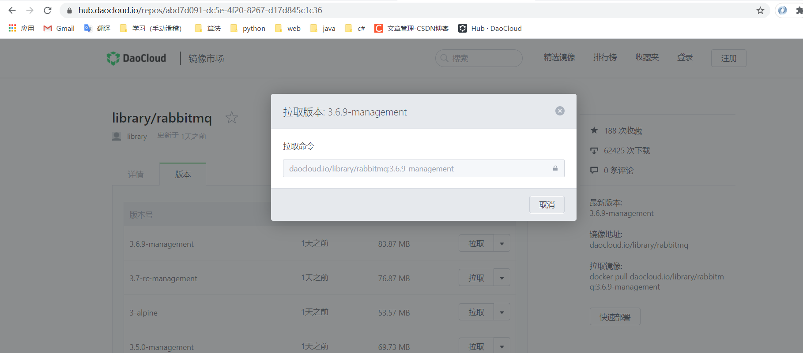
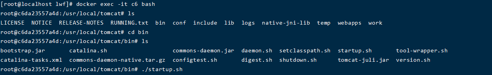

# docker

## 安装

```
curl -sSL https://get.daocloud.io/docker | sh
```

## 修改镜像

修改/etc/docker/daemon.json(没有新建)

> {
>   "registry-mirrors": ["https://almtd3fa.mirror.aliyuncs.com"]
> }

## 开启docker

```
#开启
systemctl start docker
##设置开机自启
systemctl enable docker
```


## 下载镜像

https://hub.daocloud.io/：<a href="https://hub.daocloud.io/">国内仓库</a>



复制命令：拉取

```
docker pull daocloud.io/library/rabbitmq:3.6.9-management
```

## 改名

```
#docker tag [镜像id，可写前几位，能唯一区分镜像即可]  镜像名：版本号
docker tag b8 tomcat:8.5

```


虽然改名，但是还是同一个镜像

## 删除

```
docker rmi resp:tag
```


## 首次运行容器

参数说明：

- **-i**: 交互式操作。
- **-t**: 终端。

要退出终端，直接输入 **exit**:

-d：后台运行容器

-it：启动并进入容器

-itd：后台运行并链接进容器shell

-p：主机端口：容器端口  ，映射端口

```
docker run -d -p 主机端口:容器端口 --name 名字 容器id
```

## 进入容器

```
docker exec -it 容器id bash
```



## 文件拷贝到容器

```
docker cp 文件名  容器id：目录
```

## 容器生命周期管理

**docker ps :** 列出容器

### 语法

```
docker ps [OPTIONS]
```

OPTIONS说明：

- **-a :**显示所有的容器，包括未运行的。

- **-f :**根据条件过滤显示的内容。

  

- **--format :**指定返回值的模板文件。

- **-l :**显示最近创建的容器。

- **-n :**列出最近创建的n个容器。

- **--no-trunc :**不截断输出。

- **-q :**静默模式，只显示容器编号。

- **-s :**显示总的文件大小。


**docker start** 容器名|id :启动一个或多个已经被停止的容器

**docker stop**容器名|id  :停止一个运行中的容器

**docker restart** 容器名|id :重启容器


**docker pause** 容器名:暂停容器中所有的进程。

**docker unpause** 容器名:恢复容器中所有的进程。


**docker create ：**创建一个新的容器但不启动它 --name 名字  容器名：版本


**docker rm ：**删除一个或多个容器。

### 语法

```
docker rm [OPTIONS] CONTAINER [CONTAINER...]
```

OPTIONS说明：

- **-f :**通过 SIGKILL 信号强制删除一个运行中的容器。
- **-l :**移除容器间的网络连接，而非容器本身。
- **-v :**删除与容器关联的卷。

### 实例


