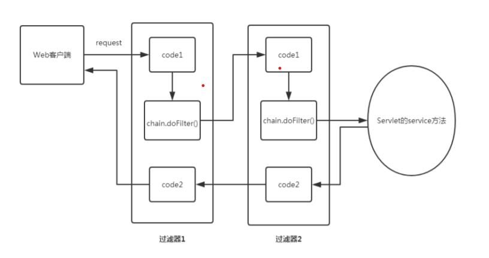

# java web篇二

<hr/>

## Cookie

> Cookie就是由**服务器发给客户端**的特殊信息，而这些信息以文本文件的方式**存放在客户端**，
> 然后客户端每次向服务器发送请求的时候都会带上这些特殊的信息。
>
> Web应用程序是使用HTTP协议传输数据的。HTTP协议是无状态的协议。
> 一旦数据交换完毕，客户端与服务器端的连接就会关闭，再次交换数据需要建立新的连接。
> 这就意味着服务器无法从连接上**跟踪会话**。在Session出现之前，基本上所有的网站都**采用Cookie来跟踪会话**。
>
> **会话cookie和持久cookie**：
>
> > 会话cookie：保存在内存，关闭浏览器就会消失，一般用来保存sessionID
> >
> > 持久cookie：持久化到内存，下一次开机还能访问
>
> **cookie特性：**
>
> 1. 不可跨域：cookie由浏览器管理，浏览器在请求时会发送对应的cookie，不会把淘宝的发给拼夕夕
> 2. 不安全：由浏览器保存，并且收发都放请求头和响应头，不安全
>
>  
>
> ```
> Cookie c = new Cookie("record",System.currentTimeMillis()+"");
>         //设置cookie的有效期是 1 小时
>         c.setMaxAge(60*60);
>         response.addCookie(c);
> ```
>
> MaxAge：
>
> -1：默认值，浏览器关闭销毁，不存储硬盘
>
> 正整数：存活秒，存硬盘，到期销毁
>
> 0：失效，应删除

key：不为中文，要转码URLDEcoder: encode decode

value：字符串可中文

## Session

> Session是一种记录客户状态的机制，不同于Cookie的是Cookie保存在客户端浏览器中，而Session保存在服务器上。
> 客户端浏览器访问服务器的时候，服务器把客户端信息以某种形式记录在服务器上。这就是Session。
>
> 生命周期：浏览器的一次访问(session生命周期内，默认3分钟)。
>
> **session简谈**
>
> 1. 用户访问servlet（jsp），后台通过request的getSession（）方法获得session，并将sessionid发送给浏览器（浏览器session保存，浏览器关闭销毁）
>
> 2. Session在服务器与浏览器断开并不会立马销毁，要显式调用HttpSession.invalidate() 
>
>    或者距离上一次收到客户端发送的session id时间间隔超过了session的最大有效时间
>
>    ，服务器进程被停止也会清除session
>
> 3. session存在于一个服务器：当遇到nginx负态均衡采用非ip取模等方式（同一ip始终访问一台服务器），之前的sessionID就无法取得session；（笔者学疏才浅，只想到以下解决：session持久化同一redis服务器；持久化数据库）
## 文件上传下载

### 上传

```
<%@ page contentType="text/html;charset=UTF-8" language="java" %>
<html>
<head>
    <title>上传</title>
</head>
<body>
<form enctype="multipart/form-data" method="post" action="/upload">
    <label for="file">上传文件</label><input type="file" id="file" name="file"><br>
    <input type="submit" value="提交">
</form>
</body>
</html>
```

> 1. 请求类型为post
> 2. enctype="multipart/form-data"
> 3. 表单类型为file（图片等等）

```
@WebServlet("/upload")
@MultipartConfig//必须加
public class FileUpload extends HttpServlet {
    @Override
    protected void service(HttpServletRequest req, HttpServletResponse resp) throws ServletException, IOException {
        req.setCharacterEncoding("utf-8");
        Part file = req.getPart("file");
        //路径可以为项目路径  getServletContext().getRealPath("/")+fileName
        file.write("C:\\Users\\lwf\\IdeaProjects\\11_17ServletFilter\\src\\main\\webapp\\"+file.getSubmittedFileName());
    }
}
```

> @MultipartConfig注解必须加
>
> 请求体设置编码

### 下载

#### a标签下载

>         当我们在 HTML 或 JSP ⻚⾯中使⽤a标签时，原意是希望能够进⾏跳转，但当超链接遇到浏览器不识 别的资源时会⾃动下载；当遇⻅浏览器能够直接显示的资源，浏览器就会默认显示出来，⽐如 txt、 png、jpg 等。当然我们也可以通过 download 属性规定浏览器进⾏下载。但有些浏览器并不⽀持。 默认下载 
>
>         ```
>         <!-- 当超链接遇到浏览器不识别的资源时，会⾃动下载 -->
>         <a href="test.zip">超链接下载</a>
>         ```
>
>         指定 download 属性下载
>
>         ```
>         <!-- 当超链接遇到浏览器识别的资源时，默认不会下载。通过download属性可进⾏下载 -->
>         <a href="test.txt" download>超链接下载</a>
>         ```
>
>         download 属性可以不写任何信息，会⾃动使⽤默认⽂件名。如果设置了download属性的值，则使 ⽤设置的值做为⽂件名。当⽤户打开浏览器点击链接的时候就会直接下载⽂件。

#### servlet发送文件

 

> 1. 需要通过 response.setContentType ⽅法设置 Content-type 头字段的值， 为浏览器⽆法使⽤某 种⽅式或激活某个程序来处理的 MIME 类型，例 如 "application/octet-stream"
> 或"application/x-msdownload" 等。
> 2. 需要通过 response.setHeader ⽅法设置 Content-Disposition 头的值 为 "attachment;filename= ⽂件名"
> 3. 读取下载⽂件，调⽤ response.getOutputStream ⽅法向客户端写⼊附件内容。

```
<%@ page contentType="text/html;charset=UTF-8" language="java" %>
<html>
<head>
    <title>后台下载</title>
</head>
<body>
<form action="/download" method="post">
   <label for="file">文件</label> <input id="file" name="fileName" type="text"><br>
    <input type="submit">
</form>
</body>
</html>
```


```
@WebServlet("/download")
public class FileDownLoad extends HttpServlet {
    @Override
    public void service(HttpServletRequest req, HttpServletResponse res) throws ServletException, IOException {
        req.setCharacterEncoding("utf-8");
        String path = getServletContext().getRealPath("/");
        String name=req.getParameter("fileName");
        File file=new File(path+name);
        System.out.println(file.getAbsolutePath());
        if(file.exists()&&file.isFile()){
            BufferedInputStream stream=new BufferedInputStream(new FileInputStream(file));
            res.setContentType("application/x-msdownload");
            res.setHeader("Content-Disposition", "attachment;filename=" +
                    name);
            ServletOutputStream outputStream = res.getOutputStream();
            byte[] buf=new byte[1024*5];
            int len=-1;
            while ((len=stream.read(buf))!=-1){
                outputStream.write(buf,0,len);
            }
            outputStream.close();
            stream.close();
        }else {
            res.setContentType("text/html;charset=utf-8");
            PrintWriter writer = res.getWriter();
            writer.write("失败");
            writer.close();
        }
    }
}
```


## 过滤器
### 作用
由于拦截器在servlet前执行，并且很多个servlet路径能被一个拦截器拦截，所以可以将以下操作给拦截器处理：
1. 重复的代码
2. 查看session，将没有登录的用户重定向到登录页面
3. 设置请求和响应编码集防止乱码
4. 过滤含有非法信息请求
### 注解

> ```@WebFilter("/*") ```一个参数表拦截此路径以下所有路径（/*)表拦截所有请求

### web.xml配置(推荐使用注解)

```
<filter>
    <filter-name>all</filter-name>
    <filter-class>com.lwf.filter.MyFilter</filter-class>
  </filter>
  <filter-mapping>
    <filter-name>all</filter-name>
    <url-pattern>/*</url-pattern>
  </filter-mapping>
```


### 规范
实现Filter接口，实现方法doFilter：

```
@WebFilter("/*")
public class MyFilter implements Filter {

    @Override
    public void doFilter(ServletRequest servletRequest, ServletResponse servletResponse, FilterChain filterChain) throws IOException, ServletException {
        servletRequest.setCharacterEncoding("utf-8");
        servletResponse.setCharacterEncoding("utf-8");
        System.out.println("拦截器设置");
        if(servletRequest.getRemoteHost().equals("0:0:0:0:0:0:0:1")){
             //放行
            filterChain.doFilter(servletRequest, servletResponse);
        }
        else {
            System.out.println("拦截访问ip"+servletRequest.getRemoteHost());
        }
    }
}
```

##  EL表达式

> EL 表达式的全称是：Expression Language。是表达式语言。
>
> EL 表达式的什么作用：EL 表达式主要是代替 jsp 页面中的表达式脚本在 jsp 页面中进行数据的输出。
>
> 因为 EL 表达式在输出数据的时候，要比 jsp 的表达式脚本要简洁很多。

<%这里面可以写java代码%>

${通过键获取出属性}

```jsp
<body> 
<% //往四个域中都保存了相同的 key 的数据。 
request.setAttribute("key", "request");
session.setAttribute("key", "session"); 
application.setAttribute("key", "application"); 
pageContext.setAttribute("key", "pageContext"); 
%>
${key}
12345678
```

request session application pageContext都是jsp的内置对象。

> 若出现键名一直，则选取作用范围最小的。
>
> 显示优先：pageContext>request>session>application
>
> pageContext，request，session，application是指变量（对象）的生命周期，它们都可以通过setAttribute()和getAttribute()来设定或读取属性。
>
> pageContext对象的范围只适用于当前页面范围，即超过这个页面就不能够使用了。所以使用pageContext对象向其它页面传递参数是不可能的。
>
> request对象的范围是指在一JSP网页发出请求到另一个JSP网页之间，随后这个属性就失效。
>
> session的作用范围为一段用户持续和服务器所连接的时间，但与服务器断线后，这个属性就无效。比如断网或者关闭浏览器。（可以设置超时）
>
> application的范围在服务器一开始执行服务，到服务器关闭为止。它的范围最大，生存周期最长。

### EL 表达式的 11 个隐含对象

| 变量             | 类型                 | 作用                                             |
| ---------------- | -------------------- | ------------------------------------------------ |
| pageContext      | PageContextImpl      | 它可以获取 jsp 中的九大内置对象                  |
| pageScope        | Map<String,Object>   | 它可以获取 pageContext 域中的数据                |
| requestScope     | Map<String,Object>   | 它可以获取 Request 域中的数据                    |
| sessionScope     | Map<String,Object>   | 它可以获取 Session 域中的数据                    |
| applicationScope | Map<String,Object>   | 它可以获取 ServletContext 域中的数据             |
| param            | Map<String,String>   | 它可以获取请求参数的值                           |
| paramValues      | Map<String,String[]> | 它也可以获取请求参数的值，获取多个值的时候使用。 |
| header           | Map<String,String>   | 它可以获取请求头的信息                           |
| headerValues     | Map<String,String[]> | 它可以获取请求头的信息，它可以获取多个值的情况   |
| cookie           | Map<String,Cookie>   | 它可以获取当前请求的 Cookie 信息                 |
| initParam        | Map<String,String>   | 它可以获取在 web.xml 中配置的上下文参数          |

### jsp获得请求信息

```jsp
<%-- 
	request.getScheme() 它可以获取请求的协议 
    request.getServerName() 获取请求的服务器 ip 或域名
    request.getServerPort() 获取请求的服务器端口号 
    getContextPath() 获取当前工程路径 
    request.getMethod() 获取请求的方式（GET 或 POST） 
    request.getRemoteHost() 获取客户端的 ip 地址 
    session.getId() 获取会话的唯一标识
--%>
```
## jstl

> Java Server Pages Standard Tag Libray(JSTL)：JSP
> 标准标签库，是⼀个定制标签类库的集合，⽤于解决⼀些常⻅的问题，例如迭代⼀个映射或者集合、条件测试、XML
> 处理，甚⾄数据库和访问数据库操作等。

### 导包

### 页面引入
为了在 JSP ⻚⾯使⽤ JSTL 类库，必须以下列格式使⽤ taglib 指令：
例如：

```
<%@taglib uri="" prefix="" %>
```

前缀可以是任意内容，遵循规范可以使团队中由不同⼈员编写的代码更加相似；所以，建议使⽤事先设计好的前缀。

```
<%@taglib uri="http://java.sun.com/jsp/jstl/core" prefix="c" %>
```
### if标签：与Mybatis动态sql相似度极高
if 标签先对某个条件进⾏测试，如果该条件运算结果为 true, 则处理它的主体内容，测试结果保存在⼀个 Boolean 对象中，并创建⼀个限域变量来引⽤ Boolean 对象。可以利⽤ var 属性设置限域变量名，利⽤ scope 属性来指定其作⽤范围。

```
<c:if test="<boolean>" var="<string>" scope="<string>">
 ...
</c:if>
```


```
<%
 request.setAttribute("flag",true);
 request.setAttribute("num",1);
%>
<c:if test="${flag}">
 <p>结果为true<p>
</c:if>
<c:if test="${num > 0}">
 <p>num的值⽐0⼤<p>
</c:if>
```
### choose、when 和 otherwise 标签

> choose 和 when 标签的作⽤与 Java 中的 switch 和 case 关键字相似，⽤于在众多选项中做出选择。
> 也就是说：他们为相互排斥的条件式执⾏提供相关内容。when和otherwise中只执行一个。**test**里放el表达式结果为**布尔值判断该流程是否执行**。
> switch语句中有case，⽽choose标签中对应有when，switch语句中有default，⽽choose标签中有otherwise。

```
<%
 request.setAttribute("score", 90);
%>
<c:choose>
 <c:when test="${score < 60 }">
 <h3>你个⼩渣渣！</h3>
 </c:when>
 <c:when test="${score >= 60 && score < 80 }">
 <h3>⾰命尚未成功，同志仍需努⼒！</h3>
 </c:when>
 <c:otherwise>
 <h3>你很棒棒哦！</h3>
 </c:otherwise>
</c:choose>
```

> choose标签和otherwise标签没有属性，⽽when标签必须设置test属性
> choose标签中必须有⾄少⼀个when标签，可以没有otherwise标签 otherwise标签必须放在最后⼀个when标签之后
> choose标签中只能有when标签和otherwise标签，when标签和otherwise标签可以嵌套其他标签
> otherwise标签在所有的when标签不执⾏的情况下才会执⾏

### foreach

> forEach 是将⼀个主体内容迭代多次，或者迭代⼀个对象集合。可以迭代的对象包括所有的java.util.Collection 和 java.util.Map 接⼝的实现，以及对象或者基本类型的数组。他还可 以迭代java.util.Iterator 和java.util.Enumeration,但不能在多个动作指令中使⽤ Iterator 或者 Enumeration,因为Iterator 或者 Enumeration 都不能重置（reset）。 各属性含义如下：


```
 <%
 List<String> list = new ArrayList<String>();
 for (int i = 1; i <= 10; i++) {
 list.add("A:" + i);
 }
 pageContext.setAttribute("li", list);
%>

<!-- 循环集合 -->
<c:forEach items="${li }" var="item">
 ${item }
</c:forEach>


<!-- 循环对象集合 -->
<%
 List<User> userList = new ArrayList<User>();
 User user = new User(1,"zhangsan","123456");
 User user2 = new User(2,"lisi","123321");
 User user3 = new User(3,"wangwu","654321");
 userList.add(user);
 userList.add(user2);
 userList.add(user3);
 // 将数据设置到作⽤域中
 request.setAttribute("userList", userList);
%>
<c:if test="${!empty userList }">
 <table align="center" width="800" border="1" style="border-collapse:
collapse;">
 <tr>
 <th>⽤户编号</th>
 <th>⽤户名称</th>
 <th>⽤户密码</th>
 <th>⽤户操作</th>
 </tr>
 <c:forEach items="${userList }" var="user">
 <tr align="center">
 <td>${user.userId }</td>
 <td>${user.uname }</td>
 <td>${user.upwd }</td>
 <td>
 <button>修改</button>
 <button>删除</button>
 </td>
 </tr>
 </c:forEach>
  </table>
</c:if>
```