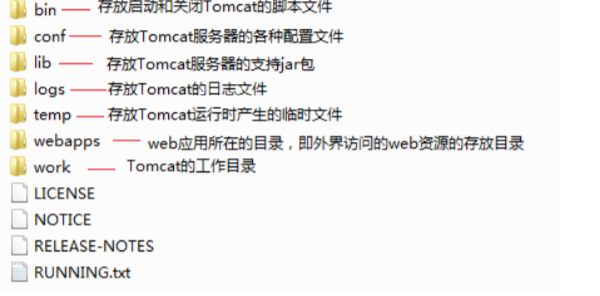
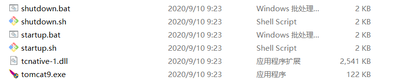
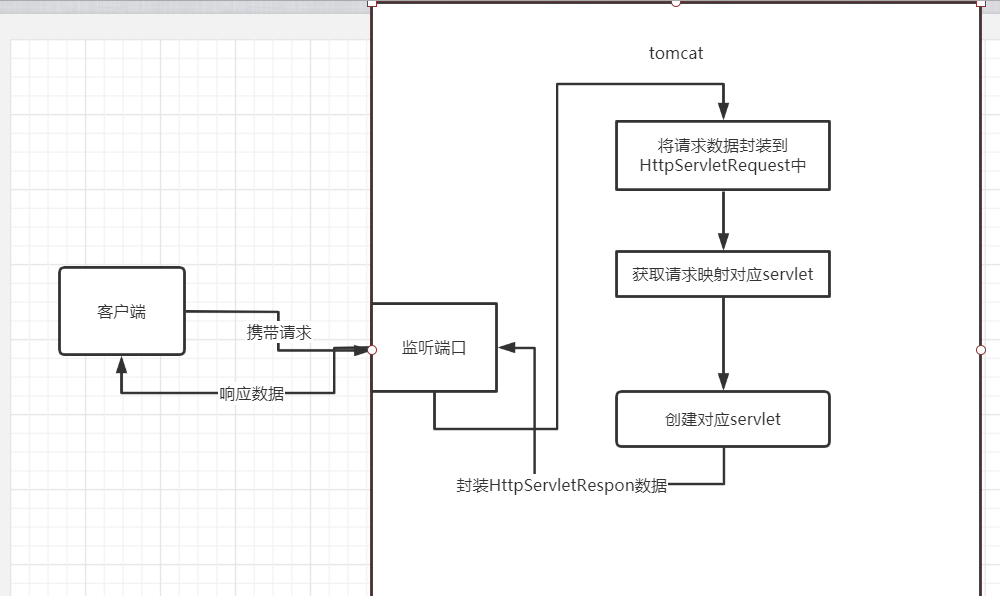
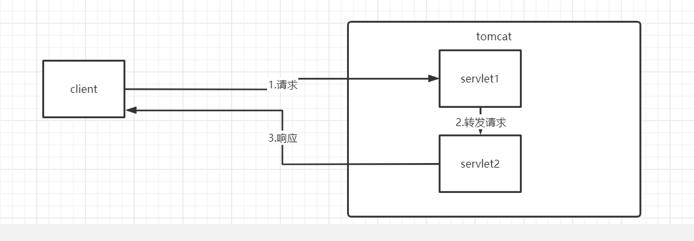
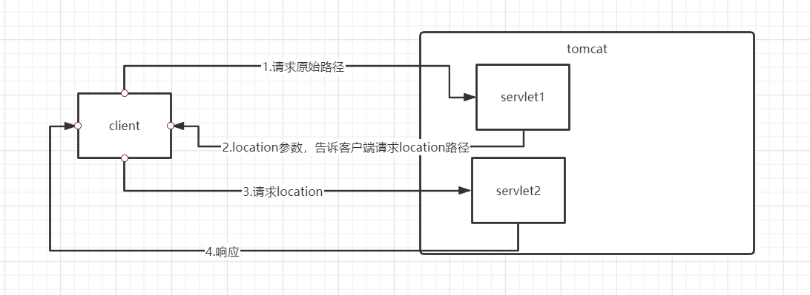

# javaWeb

## http

>  HTTP 协议（Hypertext Transfer Protocol，超文本传输协议），是一个客户端请求和回应的标准 协议，这个协议详细规定了浏览器和万维网服务器之间互相通信的规则。用户输入地址和端口号之后就 可以从服务器上取得所需要的网页信息。  
>
> ​     通信规则规定了客户端发送给服务器的内容格式，也规定了服务器发送给客户端的内容格式。客户 端发送给服务器的格式叫“请求协议”；服务器发送给客户端的格式叫“响应协议”。

### 特点

>   1.）支持 客户 / 服务器 模式。  
>
> ​       2.）简单快速：客户向服务器请求服务时，只需传送请求方法和路径。请求方法常用的有 GET、 POST。每种方法规定了客户与服务器联系的类型不同。由于 HTTP 协议简单，使得 HTTP 服务器的程 序规模小，因而通信速度很快。  
>
> ​       3.）灵活：HTTP 允许传输任意类型的数据对象。正在传输的类型由 Content-Type 加以标记。  
>
> ​       4.）HTTP1.1 支持持续连接。通过这种连接，就有可能在建立一个 TCP 连接后，发送请求并得到回 应，然后发送更多的请求并得到更多的回应。通过把建立和释放 TCP 连接的开销分摊到多个请求上，则 对于每个请求而言，由于 TCP 而造成的相对开销被大大地降低了。而且， 还可以发送流水线请求,也就 是说在发送请求 1 之后的回应到来之前就可以发送请求 2，也可以认为，一次连接发送多个请求，由客 户机确认是否关闭连接，而服务器会认为这些请求分别来自不同的客户端。  
>
> ​      5.）无状态：HTTP 协议是无状态协议。无状态是指协议对于事务处理没有记忆能力。缺少状态意 味着如果后续处理需要前面的信息，则它必须重传，这样可能导致每次连接传送的数据量增大。另一方 面，在服务器不需要先前信息时它的应答就较快。

### 请求结构

> HTTP 请求头信息由三部分组成，分别是：**请求行、请求头、请求正文**
>
> **1XX 信息**
>
> -  **100 Continue** ：表明到目前为止都很正常，客户端可以继续发送请求或者忽略这个响应。
>
> **2XX 成功**
>
> -  **200 OK** 
>
> -  **204 No Content** ：请求已经成功处理，但是返回的响应报文不包含实体的主体部分。一般在只需要从客户端往服务器发送信息，而不需要返回数据时使用。
>
> -  **206 Partial Content** ：表示客户端进行了范围请求，响应报文包含由 Content-Range 指定范围的实体内容。
>
> **3XX 重定向**
>
> -  **301 Moved Permanently** ：永久性重定向
>
> -  **302 Found** ：临时性重定向
>
> -  **303 See Other** ：和 302 有着相同的功能，但是 303 明确要求客户端应该采用 GET 方法获取资源。
>
> -  注：虽然 HTTP 协议规定 301、302 状态下重定向时不允许把 POST 方法改成 GET 方法，但是大多数浏览器都会在 301、302 和 303 状态下的重定向把 POST 方法改成 GET 方法。
>
> -  **304 Not Modified** ：如果请求报文首部包含一些条件，例如：If-Match，If-Modified-Since，If-None-Match，If-Range，If-Unmodified-Since，如果不满足条件，则服务器会返回 304 状态码。
>
> -  **307 Temporary Redirect** ：临时重定向，与 302 的含义类似，但是 307 要求浏览器不会把重定向请求的 POST 方法改成 GET 方法。
>
> **4XX 客户端错误**
>
> -  **400 Bad Request** ：客户端请求有语法错误，不能被服务器所理解
> -  **401 Unauthorized** ：请求未经授权，这个状态码必须和 *WWW-Authenticate* 一起使用
> -  **403 Forbidden** ：服务器收到请求，但是拒绝提供服务
> -  **404 Not Found** ：请求的资源不存在，比如输入错误的 URL
>
> **5XX 服务器错误**
>
> -  **500 Internal Server Error** ：服务器发生不可预期的错误。
> -  **503 Service Unavailable** ：服务器当前不能处理客户端的请求，一段时间后可能恢复正常
>
> **请求类型：**  
>
> | 序号 | 方法    | 描述                                                         |
> | :--- | :------ | :----------------------------------------------------------- |
> | 1    | GET     | 请求指定的页面信息，并返回实体主体。                         |
> | 2    | HEAD    | 类似于 GET 请求，只不过返回的响应中没有具体的内容，用于获取报头 |
> | 3    | POST    | 向指定资源提交数据进行处理请求（例如提交表单或者上传文件）。数据被包含在请求体中。POST 请求可能会导致新的资源的建立和/或已有资源的修改。 |
> | 4    | PUT     | 从客户端向服务器传送的数据取代指定的文档的内容。             |
> | 5    | DELETE  | 请求服务器删除指定的页面。                                   |
> | 6    | CONNECT | HTTP/1.1 协议中预留给能够将连接改为管道方式的代理服务器。    |
> | 7    | OPTIONS | 允许客户端查看服务器的性能。                                 |
> | 8    | TRACE   | 回显服务器收到的请求，主要用于测试或诊断。                   |
> | 9    | PATCH   | 是对 PUT 方法的补充，用来对已知资源进行局部更新 。           |
>
> # HTTP 响应头信息
>
> HTTP请求头提供了关于请求，响应或者其他的发送实体的信息。
>
> 在本章节中我们将具体来介绍HTTP响应头信息。
>
> | 应答头           | 说明                                                         |
> | :--------------- | :----------------------------------------------------------- |
> | Allow            | 服务器支持哪些请求方法（如GET、POST等）。                    |
> | Content-Encoding | 文档的编码（Encode）方法。只有在解码之后才可以得到Content-Type头指定的内容类型。利用gzip压缩文档能够显著地减少HTML文档的下载时间。Java的GZIPOutputStream可以很方便地进行gzip压缩，但只有Unix上的Netscape和Windows上的IE 4、IE 5才支持它。因此，Servlet应该通过查看Accept-Encoding头（即request.getHeader("Accept-Encoding")）检查浏览器是否支持gzip，为支持gzip的浏览器返回经gzip压缩的HTML页面，为其他浏览器返回普通页面。 |
> | Content-Length   | 表示内容长度。只有当浏览器使用持久HTTP连接时才需要这个数据。如果你想要利用持久连接的优势，可以把输出文档写入 ByteArrayOutputStream，完成后查看其大小，然后把该值放入Content-Length头，最后通过byteArrayStream.writeTo(response.getOutputStream()发送内容。 |
> | Content-Type     | 表示后面的文档属于什么MIME类型。Servlet默认为text/plain，但通常需要显式地指定为text/html。由于经常要设置Content-Type，因此HttpServletResponse提供了一个专用的方法setContentType。 |
> | Date             | 当前的GMT时间。你可以用setDateHeader来设置这个头以避免转换时间格式的麻烦。 |
> | Expires          | 应该在什么时候认为文档已经过期，从而不再缓存它？             |
> | Last-Modified    | 文档的最后改动时间。客户可以通过If-Modified-Since请求头提供一个日期，该请求将被视为一个条件GET，只有改动时间迟于指定时间的文档才会返回，否则返回一个304（Not Modified）状态。Last-Modified也可用setDateHeader方法来设置。 |
> | Location         | 表示客户应当到哪里去提取文档。Location通常不是直接设置的，而是通过HttpServletResponse的sendRedirect方法，该方法同时设置状态代码为302。 |
> | Refresh          | 表示浏览器应该在多少时间之后刷新文档，以秒计。除了刷新当前文档之外，你还可以通过setHeader("Refresh", "5; URL=http://host/path")让浏览器读取指定的页面。 注意这种功能通常是通过设置HTML页面HEAD区的＜META HTTP-EQUIV="Refresh" CONTENT="5;URL=http://host/path"＞实现，这是因为，自动刷新或重定向对于那些不能使用CGI或Servlet的HTML编写者十分重要。但是，对于Servlet来说，直接设置Refresh头更加方便。  注意Refresh的意义是"N秒之后刷新本页面或访问指定页面"，而不是"每隔N秒刷新本页面或访问指定页面"。因此，连续刷新要求每次都发送一个Refresh头，而发送204状态代码则可以阻止浏览器继续刷新，不管是使用Refresh头还是＜META HTTP-EQUIV="Refresh" ...＞。  注意Refresh头不属于HTTP 1.1正式规范的一部分，而是一个扩展，但Netscape和IE都支持它。 |
> | Server           | 服务器名字。Servlet一般不设置这个值，而是由Web服务器自己设置。 |
> | Set-Cookie       | 设置和页面关联的Cookie。Servlet不应使用response.setHeader("Set-Cookie", ...)，而是应使用HttpServletResponse提供的专用方法addCookie。参见下文有关Cookie设置的讨论。 |
> | WWW-Authenticate | 客户应该在Authorization头中提供什么类型的授权信息？在包含401（Unauthorized）状态行的应答中这个头是必需的。例如，response.setHeader("WWW-Authenticate", "BASIC realm=＼"executives＼"")。 注意Servlet一般不进行这方面的处理，而是让Web服务器的专门机制来控制受密码保护页面的访问（例如.htaccess）。 |

## tomcat

>  Tomcat 是一个符合 JavaEE WEB 标准的最小的 WEB 容器，所有的 JSP 程序一定要有 WEB 容器的 支持才能运行，而且在给定的 WEB 容器里面都会支持事务处理操作。  
>
> ​    Tomcat 是由 Apache 提供的（www.apache.org），可以用安装版和解压版，安装版可以在服务 中出现一 Tomcat 的服务，免安装没有，开发中使用免安装版。 Tomcat 简单的说就是一个**运行 Java 的 网络服务器**，底层是 Socket 的一个程序，它也是 JSP 和 Servlet 的一个容器。Tomcat 是 Apache 软件 基金会（Apache Software Foundation）的 Jakarta 项目中的一个核心项目，由 Apache、Sun和其他 一些公司及个人共同开发而成。  
>
> ​       由于有了 Sun 的参与和支持，最新的 Servlet 和 JSP 规范总是能在 Tomcat 中得到体现。因为 Tomcat 技术**先进、性能稳定，而且免费**（划重点），因而深受 Java 爱好者的喜爱并得到了部分软件开发商的认 可，成为目前比较流行的 Web 应用服务器。  
>
> ​         Tomcat 服务器是一个免费的开放源代码的 Web 应用服务器，属于轻量级应用服务器，在中小型系 统和并发访问用户不是很多的场合下被普遍使用，是开发和调试 JSP 程序的首选。 对于一个初学者来 说，可以这样认为，当在一台机器上配置好 Apache 服务器，可利用它响应 HTML（标准通用标记语言 下的一个应用）页面的访问请求。实际上 Tomcat 部分是 Apache 服务器的扩展，但它是独立运行的， 所以当你运行 tomcat 时，它实际上作为一个与 Apache 独立的进程单独运行的。  
>
> ​        当配置正确时，Apache 为 HTML 页面服务，而 Tomcat 实际上是在运行 JSP 页面和 Servlet。另 外，Tomcat 和 IIS 等 Web 服务器一样，具有处理 HTML 页面的功能，另外它还是一个 Servlet 和 JSP 容器，独立的 Servlet 容器是 Tomcat 的默认模式。不过，Tomcat 处理静态 HTML 的能力不如 Apache 服务器。目前 Tomcat 最新版本为 9.0。

### 解决控制台中文命令行乱码

修改logging.properties

```
handlers = 1catalina.org.apache.juli.AsyncFileHandler, 2localhost.org.apache.juli.AsyncFileHandler, 3manager.org.apache.juli.AsyncFileHandler, 4host-manager.org.apache.juli.AsyncFileHandler, java.util.logging.ConsoleHandler.handlers = 1catalina.org.apache.juli.AsyncFileHandler, java.util.logging.ConsoleHandler

1catalina.org.apache.juli.AsyncFileHandler.level = FINE
1catalina.org.apache.juli.AsyncFileHandler.directory = ${catalina.base}/logs
1catalina.org.apache.juli.AsyncFileHandler.prefix = catalina.
1catalina.org.apache.juli.AsyncFileHandler.maxDays = 90
1catalina.org.apache.juli.AsyncFileHandler.encoding = GBK

2localhost.org.apache.juli.AsyncFileHandler.level = FINE
2localhost.org.apache.juli.AsyncFileHandler.directory = ${catalina.base}/logs
2localhost.org.apache.juli.AsyncFileHandler.prefix = localhost.
2localhost.org.apache.juli.AsyncFileHandler.maxDays = 90
2localhost.org.apache.juli.AsyncFileHandler.encoding = GBK

3manager.org.apache.juli.AsyncFileHandler.level = FINE
3manager.org.apache.juli.AsyncFileHandler.directory = ${catalina.base}/logs
3manager.org.apache.juli.AsyncFileHandler.prefix = manager.
3manager.org.apache.juli.AsyncFileHandler.maxDays = 90
3manager.org.apache.juli.AsyncFileHandler.encoding = GBK

4host-manager.org.apache.juli.AsyncFileHandler.level = FINE
4host-manager.org.apache.juli.AsyncFileHandler.directory = ${catalina.base}/logs
4host-manager.org.apache.juli.AsyncFileHandler.prefix = host-manager.
4host-manager.org.apache.juli.AsyncFileHandler.maxDays = 90
4host-manager.org.apache.juli.AsyncFileHandler.encoding = GBK

java.util.logging.ConsoleHandler.level = FINE
java.util.logging.ConsoleHandler.formatter = org.apache.juli.OneLineFormatter
java.util.logging.ConsoleHandler.encoding = GBK


org.apache.catalina.core.ContainerBase.[Catalina].[localhost].level = INFO
org.apache.catalina.core.ContainerBase.[Catalina].[localhost].handlers = 2localhost.org.apache.juli.AsyncFileHandler

org.apache.catalina.core.ContainerBase.[Catalina].[localhost].[/manager].level = INFO
org.apache.catalina.core.ContainerBase.[Catalina].[localhost].[/manager].handlers = 3manager.org.apache.juli.AsyncFileHandler

org.apache.catalina.core.ContainerBase.[Catalina].[localhost].[/host-manager].level = INFO
org.apache.catalina.core.ContainerBase.[Catalina].[localhost].[/host-manager].handlers = 4host-manager.org.apache.juli.AsyncFileHandler
```

### 修改tomcat运行端口

conf/server.xml修改：

> ```
> <Connector port="9999" protocol="HTTP/1.1"
>                connectionTimeout="20000"
>                redirectPort="8443" />
> ```
>
> 修改第69行port属性为中意的端口（0-65535，0-1023 系统留用，选择大的端口最后8000以上）

### 部署项目设置路径映射

> <Context path="根路径" docBase="项目路径" reloadable="true">
>
> 访问项目首页：localhost:9999/根路径

### 目录

 

**bin下**



> //手动启动关闭·
>
> tomcat9.exe：双击运行tomcat
>
> //命令开启关闭
>
> startup：sh为linux系统tomcat启动文件，bat为windows系统tomcat启动文件
>
> shutdown：关闭tomcat脚本

### 运行大概流程



## servlet

>  Servlet 是 Server Applet 的缩写，是服务端小程序的意思。使用 Java 语言编写的服务器端程序， 主要功能在于交互式地浏览和生成数据，生成动态Web内容，Servlet 主要运行在服务器端，并由服务 器调用执行，是一种按照 Servlet 标准来开发的类。 是 SUN 公司提供的一门用于开发动态 Web 资源的 技术。（言外之意：要实现 web 开发，需要实现 Servlet 标准）
>
>   Servlet 本质上也是 Java 类，但要遵循 Servlet 规范进行编写，没有 main() 方法，它的创建、使 用、销毁都由 Servlet 容器进行管理(如 Tomcat)。（言外之意：写自己的类，不用写 main 方法，别人 自动调用）  Servlet 是和 HTTP 协议是紧密联系的，其可以处理 HTTP 协议相关的所有内容。这也是 Servlet 应 用广泛的原因之一。
>
>   提供了 Servlet 功能的服务器，叫做 Servlet 容器，其常见容器有很多，如 Tomcat, Jetty, WebLogic Server, WebSphere, JBoss 等等。

### 路径--!

#### 注解设置路径(推荐)---!

```
public @interface WebServlet {
    String name() default "";

    String[] value() default {};

    String[] urlPatterns() default {};

    int loadOnStartup() default -1;

    WebInitParam[] initParams() default {};

    boolean asyncSupported() default false;

    String smallIcon() default "";

    String largeIcon() default "";

    String description() default "";

    String displayName() default "";
}
```

> 默认为value，写一个参数时，默认value，为servlet的映射路径（以/加路径名）
>
> ```
> @WebServlet(PATH路径字符串) //例如 /s
> ```
>
> name:servlet名字，一般不写
>
> urlPatterns：写多个路径
>
> ```
> @WebServlet({"/json","/js"})
> //两种等价（urlPatterns可省略)
> @WebServlet(urlPatterns = {"/json","/js"})
> ```
>
> 


#### 配置文件设置路径

> https://www.baidu.com /s  ?ie=utf-8&f=8&rsv_bp=1&tn=baidu&wd=%E6%86%A8%E6%86%A
>
> https://www.baidu.com：协议：//ip（域名）：端口（默认80，tomcat默认8080）
>
> /s:PATH，服务器内servlet的PATH

> 该路径为**url中端口后字符串PATH**，**PATH**是tomcat**唯一识别Servlet**的标志：PATH与servlet的关系是多对一，即一个servlet能有很多个PATH，但一个PATH只能有一个servlet。

### 规范--!

>  **继承HttpServlet:**
>
> service方法体：
>
> ```
>  String method = req.getMethod();
>         long lastModified;
>         if (method.equals("GET")) {
>             lastModified = this.getLastModified(req);
>             if (lastModified == -1L) {
>                 this.doGet(req, resp);
>             } else {
>                 long ifModifiedSince;
>                 try {
>                     ifModifiedSince = req.getDateHeader("If-Modified-Since");
>                 } catch (IllegalArgumentException var9) {
>                     ifModifiedSince = -1L;
>                 }
> 
>                 if (ifModifiedSince < lastModified / 1000L * 1000L) {
>                     this.maybeSetLastModified(resp, lastModified);
>                     this.doGet(req, resp);
>                 } else {
>                     resp.setStatus(304);
>                 }
>             }
>         } else if (method.equals("HEAD")) {
>             lastModified = this.getLastModified(req);
>             this.maybeSetLastModified(resp, lastModified);
>             this.doHead(req, resp);
>         } else if (method.equals("POST")) {
>             this.doPost(req, resp);
>         } else if (method.equals("PUT")) {
>             this.doPut(req, resp);
>         } else if (method.equals("DELETE")) {
>             this.doDelete(req, resp);
>         } else if (method.equals("OPTIONS")) {
>             this.doOptions(req, resp);
>         } else if (method.equals("TRACE")) {
>             this.doTrace(req, resp);
>         } else {
>             String errMsg = lStrings.getString("http.method_not_implemented");
>             Object[] errArgs = new Object[]{method};
>             errMsg = MessageFormat.format(errMsg, errArgs);
>             resp.sendError(501, errMsg);
>         }
> ```
>
> **service**方法负责判断请求类型Type，并分派相应的doType（）方法执行。
>
> > 1.**service先于doPost，doGet....执行**，所有可只写service接收所有请求类型的请求，但是不推荐。
> >
> > 2.由于父类HttpServlet写了service方法，我们写的servlet可**只写单一的响应的请求处理方式**：如doGet，doPost

### HttpRequest

> tomcat 应用服务器监听配置文件设置的端口（或ide中配置的端口），将请求头和请求体封装到HttpRequest中
>
> 获取请求参数：
>
> 1. 文本框或密码框等非多选：req.getParameter(输入框name);
> 2. 多选：req.getParameterValues(输入框name);
>
> | 序号 | 方法 & 描述                                                  |
> | :--- | :----------------------------------------------------------- |
> | 1    | **Cookie[] getCookies()** 返回一个数组，包含客户端发送该请求的所有的 Cookie 对象。 |
> | 2    | **Enumeration getAttributeNames()** 返回一个枚举，包含提供给该请求可用的属性名称。 |
> | 3    | **Enumeration getHeaderNames()** 返回一个枚举，包含在该请求中包含的所有的头名。 |
> | 4    | **Enumeration getParameterNames()** 返回一个 String 对象的枚举，包含在该请求中包含的参数的名称。 |
> | 5    | **HttpSession getSession()** 返回与该请求关联的当前 session 会话，或者如果请求没有 session 会话，则创建一个。 |
> | 6    | **HttpSession getSession(boolean create)** 返回与该请求关联的当前 HttpSession，或者如果没有当前会话，且创建是真的，则返回一个新的 session 会话。 |
> | 7    | **Locale getLocale()** 基于 Accept-Language 头，返回客户端接受内容的首选的区域设置。 |
> | 8    | **Object getAttribute(String name)** 以对象形式返回已命名属性的值，如果没有给定名称的属性存在，则返回 null。 |
> | 9    | **ServletInputStream getInputStream()** 使用 ServletInputStream，以二进制数据形式检索请求的主体。 |
> | 10   | **String getAuthType()** 返回用于保护 Servlet 的身份验证方案的名称，例如，"BASIC" 或 "SSL"，如果JSP没有受到保护则返回 null。 |
> | 11   | **String getCharacterEncoding()** 返回请求主体中使用的字符编码的名称。 |
> |      | **void setCharacterEncoding()** 设置请求转发数据使用编码。   |
> | 12   | **String getContentType()** 返回请求主体的 MIME 类型，如果不知道类型则返回 null。 |
> | 13   | **String getContextPath()** 返回指示请求上下文的请求 URI 部分。 |
> | 14   | **String getHeader(String name)** 以字符串形式返回指定的请求头的值。 |
> | 15   | **String getMethod()** 返回请求的 HTTP 方法的名称，例如，GET、POST 或 PUT。 |
> | 16   | **String getParameter(String name)** 以字符串形式返回请求参数的值，或者如果参数不存在则返回 null。 |
> | 17   | **String getPathInfo()** 当请求发出时，返回与客户端发送的 URL 相关的任何额外的路径信息。 |
> | 18   | **String getProtocol()** 返回请求协议的名称和版本。          |
> | 19   | **String getQueryString()** 返回包含在路径后的请求 URL 中的查询字符串。 |
> | 20   | **String getRemoteAddr()** 返回发送请求的客户端的互联网协议（IP）地址。 |
> | 21   | **String getRemoteHost()** 返回发送请求的客户端的完全限定名称。 |
> | 22   | **String getRemoteUser()** 如果用户已通过身份验证，则返回发出请求的登录用户，或者如果用户未通过身份验证，则返回 null。 |
> | 23   | **String getRequestURI()** 从协议名称直到 HTTP 请求的第一行的查询字符串中，返回该请求的 URL 的一部分。 |
> | 24   | **String getRequestedSessionId()** 返回由客户端指定的 session 会话 ID。 |
> | 25   | **String getServletPath()** 返回调用 JSP 的请求的 URL 的一部分。 |
> | 26   | **String[] getParameterValues(String name)** 返回一个字符串对象的数组，包含所有给定的请求参数的值，如果参数不存在则返回 null。 |
> | 27   | **boolean isSecure()** 返回一个布尔值，指示请求是否使用安全通道，如 HTTPS。 |
> | 28   | **int getContentLength()** 以字节为单位返回请求主体的长度，并提供输入流，或者如果长度未知则返回 -1。 |
> | 29   | **int getIntHeader(String name)** 返回指定的请求头的值为一个 int 值。 |
> | 30   | **int getServerPort()** 返回接收到这个请求的端口号。         |
> | 31   | **int getParameterMap()** 将参数封装成 Map 类型。            |
> | 32   | void  getRequestDispatcher(url) 请求转发                     |

### HttpServletResponse

下面的方法可用于在 Servlet 程序中设置 HTTP 响应报头。这些方法通过 *HttpServletResponse* 对象可用。

| 序号 | 方法 & 描述                                                  |
| :--- | :----------------------------------------------------------- |
| 1    | **String encodeRedirectURL(String url)** 为 sendRedirect 方法中使用的指定的 URL 进行编码，或者如果编码不是必需的，则返回 URL 未改变。 |
| 2    | **String encodeURL(String url)** 对包含 session 会话 ID 的指定 URL 进行编码，或者如果编码不是必需的，则返回 URL 未改变。 |
| 3    | **boolean containsHeader(String name)** 返回一个布尔值，指示是否已经设置已命名的响应报头。 |
| 4    | **boolean isCommitted()** 返回一个布尔值，指示响应是否已经提交。 |
| 5    | **void addCookie(Cookie cookie)** 把指定的 cookie 添加到响应。 |
| 6    | **void addDateHeader(String name, long date)** 添加一个带有给定的名称和日期值的响应报头。 |
| 7    | **void addHeader(String name, String value)** 添加一个带有给定的名称和值的响应报头。 |
| 8    | **void addIntHeader(String name, int value)** 添加一个带有给定的名称和整数值的响应报头。 |
| 9    | **void flushBuffer()** 强制任何在缓冲区中的内容被写入到客户端。 |
| 10   | **void reset()** 清除缓冲区中存在的任何数据，包括状态码和头。 |
| 11   | **void resetBuffer()** 清除响应中基础缓冲区的内容，不清除状态码和头。 |
| 12   | **void sendError(int sc)** 使用指定的状态码发送错误响应到客户端，并清除缓冲区。 |
| 13   | **void sendError(int sc, String msg)** 使用指定的状态发送错误响应到客户端。 |
| 14   | **void sendRedirect(String location)** 使用指定的重定向位置 URL 发送临时重定向响应到客户端。 |
| 15   | **void setBufferSize(int size)** 为响应主体设置首选的缓冲区大小。 |
| 16   | **void setCharacterEncoding(String charset)** 设置被发送到客户端的响应的字符编码（MIME 字符集）例如，UTF-8。 |
| 17   | **void setContentLength(int len)** 设置在 HTTP Servlet 响应中的内容主体的长度，该方法设置 HTTP Content-Length 头。 |
| 18   | **void setContentType(String type)** 如果响应还未被提交，设置被发送到客户端的响应的内容类型。 |
| 19   | **void setDateHeader(String name, long date)** 设置一个带有给定的名称和日期值的响应报头。 |
| 20   | **void setHeader(String name, String value)** 设置一个带有给定的名称和值的响应报头。 |
| 21   | **void setIntHeader(String name, int value)** 设置一个带有给定的名称和整数值的响应报头。 |
| 22   | **void setLocale(Locale loc)** 如果响应还未被提交，设置响应的区域。 |
| 23   | **void setStatus(int sc)** 为该响应设置状态码。              |

### 请求转发

> 浏览器地址栏不变
>
> 同一个服务器
>
> 运行携带数据
>
> 
>
> ```
> req.getRequestDispatcher(url).forward(req,resp);
> ```
>
> 使用setAttribute( name，value)封装数据
>
> 使用 getAttribute(String name)取出数据
>
> 

### 重定向

> 浏览器地址栏改变
>
> 允许跨域请求
>
> 不能携带数据
>
> ```
> resp.sendRedirect(重定向路径);
> ```
>
> 

### 解决服务器数据到客户端乱码

#### 1

```
//返回网页
resp.setCharacterEncoding("utf-8");
resp.setHeader("content-Type","text/html;charset=utf-8");
//json数据
resp.setCharacterEncoding("utf-8");
resp.setContentType("application/json;charset=utf-8");
```

#### 2

```
//网页
resp.setContentType("text/html;charset=utf-8");
//json数据
resp.setContentType("application/json;charset=utf-8");
```

#### 解决客户端到服务器编码

这种我没有试过，浏览器一般编码utf-8，没转过。

```
req.setCharacterEncoding(编码);
```

稳妥

```
String charSet=req.getCharacterEncoding();
String data=new String(请求数据.getByte(charSet),"utf-8");
```

