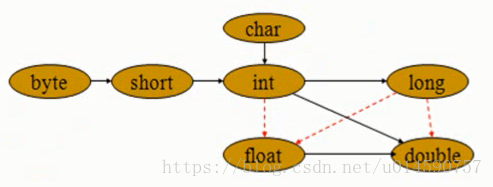
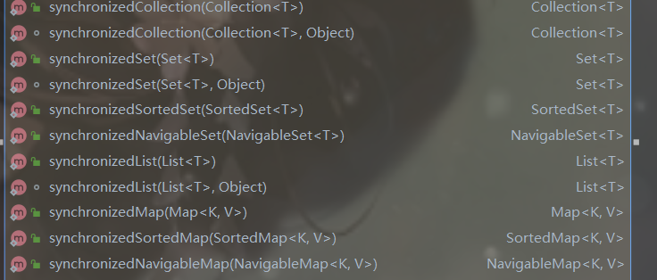

# java基础随笔

## 八大基本类型

| **数据类型** | 长度  | 包装类    | **默认值** |
| ------------ | ----- | --------- | ---------- |
| byte         | 1字节 | Byte      | 0          |
| short        | 2字节 | Short     | 0          |
| int          | 4字节 | Integer   | 0          |
| long         | 8字节 | Long      | 0L         |
| float        | 4字节 | Float     | 0.0f       |
| double       | 8字节 | Double    | 0.0d       |
| char         | 2字节 | Character | 'u0000'    |
| boolean      | 1字节 | Boolean   | false      |

### 自动转型

**byte->short->char->int->long->float->double**



> **一般来说小地址的能转大地址的。反过来就要强转，但是可能会出现内存溢出。**

## Integer缓冲池

**jvm会创建－128到127的整数，new Integer对象时如果使用：**

```
// 12在 -128到127 从缓冲池取值 a指向常量池
Integer a=12;
//创建对象，b对象里的值指向常量池
Integer b=new Integer(12);
//在堆里开辟空间，129放堆里
Integer c=129；
```


## String类

**String内部存储字符串使用的是一个final 修饰的char 数组，这就表示String值不可变；**

``` java
//String对象指向常量池“qwe”
String a="qwe";
//由于值不可变，这里将a指向"asd";"qwe"就变成了没有对象引用的值
a="asd;"
```

**StringBuilder和StringBuffer**

> StringBuilder是线程不安全的，并且它是可变长，它的值是用char数组保存，容量不够new一个数组然后拷贝值，将扩容数组引用给原来的数组引用。
>
> StringBuffer是线程安全的，它也是可变长的，和StringBuilder相同，但是它使用了同步块保证自身安全，所以它的效率比StringBuilde低。在单线程首选StringBuilder，多线程用StringBuffer；

## equals()

> Object类的方法，每个类都有。如果不重写该方法就会使用Object的equals()方法，该方法与“==”运算符等价，会比较两个对象的引用地址转化的字符串。八大基本类型包装类，String类重写了该方法。
>
> **所以自定义javabean要比较对象需要重写该方法。**

**为什么重写equals()要重写hashCode（）方法**

> hashCode() 返回散列值，而 equals() 是用来判断两个对象是否等价。
> **等价的两个对象散列值一定相同，但是散列值相同的两个对象不一定等价**。
>
> **在覆盖 equals() 方法时应当总是覆盖 hashCode() 方法，保证等价的两个对象散列值也相等**。

**hashCode（）介绍**

hashCode()  的作用是获取哈希码，也称为散列码；它实际上是返回一个int整数。这个哈希码的作用是确定该对象在哈希表中的索引位置。hashCode()  定义在JDK的Object.java中，这就意味着Java中的任何类都包含有hashCode() 函数。

散列表存储的是键值对(key-value)，它的特点是：能根据“键”快速的检索出对应的“值”。这其中就利用到了散列码！（可以快速找到所需要的对象）

**为什么要有 hashCode**

**我们先以“HashSet 如何检查重复”为例子来说明为什么要有 hashCode：** 当你把对象加入  HashSet 时，HashSet 会先计算对象的 hashcode 值来判断对象加入的位置，同时也会与其他已经加入的对象的 hashcode  值作比较，如果没有相符的hashcode，HashSet会假设对象没有重复出现。但是如果发现有相同 hashcode 值的对象，这时会调用 `equals（）`方法来检查 hashcode 相等的对象是否真的相同。如果两者相同，HashSet  就不会让其加入操作成功。如果不同的话，就会重新散列到其他位置。（摘自我的Java启蒙书《Head first  java》第二版）。这样我们就大大减少了 equals 的次数，相应就大大提高了执行速度。

通过我们可以看出：`hashCode()` 的作用就是**获取哈希码**，也称为散列码；它实际上是返回一个int整数。这个**哈希码的作用**是确定该对象在哈希表中的索引位置。**`hashCode() `在散列表中才有用，在其它情况下没用。**在散列表中hashCode() 的作用是获取对象的散列码，进而确定该对象在散列表中的位置。

### hashCode（）与equals（）的相关规定

1. 如果两个对象相等，则hashcode一定也是相同的
2. 两个对象相等,对两个对象分别调用equals方法都返回true
3. 两个对象有相同的hashcode值，它们也不一定是相等的
4. **因此，equals 方法被覆盖过，则 hashCode 方法也必须被覆盖**
5. hashCode() 的默认行为是对堆上的对象产生独特值。如果没有重写 hashCode()，则该 class 的两个对象无论如何都不会相等（即使这两个对象指向相同的数据）

## 多态

> 父类引用指向子类对象，并重写了父类方法，这样父类引用对象调用同一方法就有不同的效果

## 对象的创建

1. new 关键字调用构造方法
2. 类实现Cloneable接口 调用clone（）方法
3. 反射
4. 序列化实现Serializable接口

## 静态块，普通块

创建对象：

> 1. 静态变量 
> 2. 静态块  static{}
> 3. 属性
> 4. 构造块
> 5. 构造方法

普通块：方法内{}

## Collections

容器工具类：

* sort（）：对传入Collection实现类实例进行排序，前提是容器存放对象实现了Comparator的compare方法。或者传入一个实现Comparable 方法并实现了comparaTo方法     
* 将不安全容器转化线程安全                

 

## lambda

```
@FunctionalInterface或自定义只有一个方法接口表示的接口可以直接用lambda：（形参名）->{语句}
```

## 容器

**Collection**：

> List:
>
>           1. **ArrayList**:内部使用数组存储值，快速查找，不适合频繁插入删除
>              2. **LinkedList**：使用双向链表存储，查询效率低，利于频繁插入删除
>              3. Queue：队列，是一个接口LinkedList实现了它
>              4. Vector：线程安全链表
>              5. **HashSet**：使用HashMap的key存储值；
>
> 

**Map:**

内部包含了一个 Entry 类型的数组 table。

```java
transient Entry[] table;
```

Entry 存储着键值对。它包含了四个字段，从 next 字段我们可以看出 Entry 是一个链表。
即数组中的每个位置被当成一个桶，一个桶存放一个链表。HashMap 使用**拉链法**来解决冲突，
同一个链表中存放哈希值相同的 Entry。

**hashMap：内部重写hashCode方法**

 内部使用**Entry节点**存储**<hash,key，value，下一节点引用>**；采用数组加链表形式;初始容量16，负载因子0.75

如果元素个数大于16*0.75，数组长度扩大为原来2倍，重新hash。单条链表大于8就会转化为红黑树。

1.为什么默认初始容量为16(1<<4)

> **因为位运算直接对内存数据进行操作，不需要转成十进制，所以位运算要比取模运算的效率更高，所以HashMap在计算元素要存放在数组中的index的时候，使用位运算代替了取模运算。之所以可以做等价代替，前提是要求HashMap的容量一定要是2^n** 。
>
> **太小了就有可能频繁发生扩容，影响效率。太大了又浪费空间，不划算。**
>
> **所以，16就作为一个经验值被采用了。**

2.java1.8之前采用头插，之后为什么尾插（明明知道HashMap是线程不安全的，为啥还要考虑这个）

> 头插时，多线程操作时，当HashMap到达扩容长度时，两个线程同时扩容，如果相邻两个Entry：（A，B）再hash的值相同，头插时，第一个线程，将两个Entry（B，A）插好后短时间，第二个又进行扩容，两个Entry顺序又变了（A，B），而线程1将B下一个指向A，这时就形成了一个环，导致get（）取值死循环。
>
> 而尾插扩容顺序不会变，不会形成死链。

**hashTable**：线程安全的Map