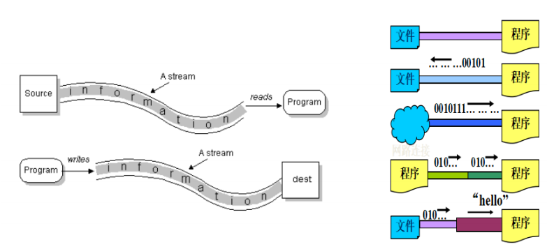
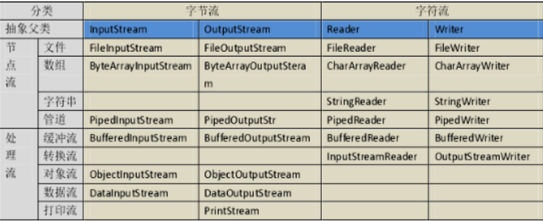
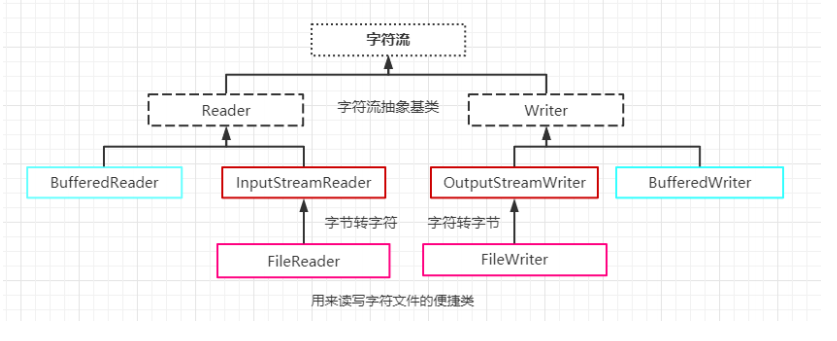
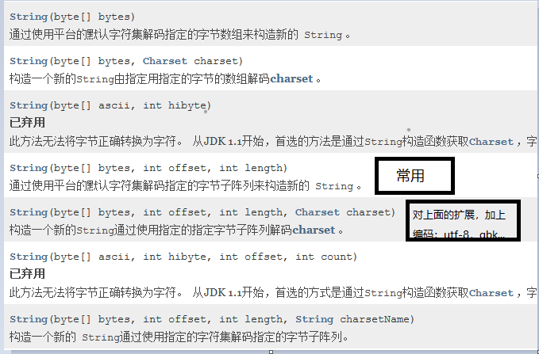
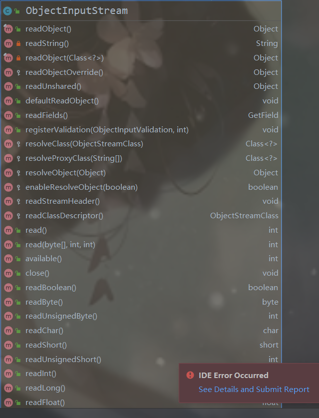
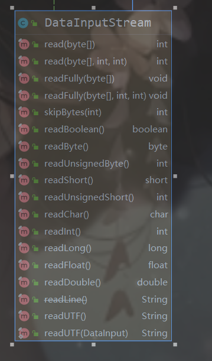
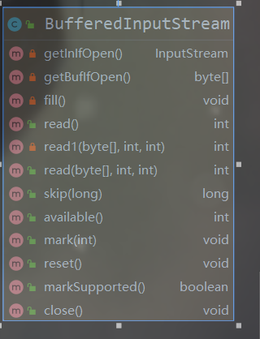
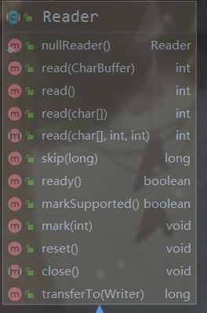

# javaIO

## File 

> 在Java中，Everything is Object！所以在文件中，也不例外！在Java中，可以用 File
>
> 类来表示一个与硬盘上文件联系！！！注意: 
>
> 1、File仅代表一个联系，可能文件存在，也可能不存在；
>
> 2、这里的文件可以是文件，也可以是文件夹；

## IO流介绍

> 对于任何程序设计语言而言，输入输出( I/O )系统都是比较复杂的而且是比较核心
>
> 的。程序运行需要数据，数据的获取往往需要跟外部系统进行通信，外部系统可能
>
> 是 文件、数据库、其他程序、网络、IO设备等等 。我们可以发现，外部系统比较
>
> 复杂多变，那么我们有必要通过某种手段进行抽象、屏蔽外部的差异。我们希望通
>
> 过某种技术实现对所有外部系统的输入输出操作， java.io 包为我们提供了相关
>
> 的API，这就是我们这章所要学习的技术。

### 数据源 

> data source , 提供原始数据 的原始媒介。常见的： 数据库、文件、其他程
>
> 序、内存、网络连接、IO设备 。
>
> 数据源就像水箱，流就像水管中流着的水流，程序就是我们最终的用户。 流是一个
>
> 抽象、动态的概念，是一连串连续动态的数据集合。

###  流的概念 

> Stream：名词，水流，趋势。动词：流出，流动
>
> **数据源就像水箱，流就像水管中流着的水流，程序就是我们最终的用户。** 流是一个抽象、动态的概念，是一连串连续动态的数据集合。
>
>  

### io流分类

 

#### 处理单元

 

> **处理数据**是**音频、视频、doc、文本等一切为 字节流** ， **仅能处理文本**的为**字符流** 。 字节流和字符流的用法几乎完全一致，区别在于它们所操作的数据单元不同，**字节流（8 位）、字符流（16 位）**，字节流主要由 InputStream 和 OutputStream 作为基类，字符流主要由 Reader 和 Writer作为基类。
>
> **字节流：**按照字节读取数据(InputStream、OutputStream)
>
> **字符流**：按照字符读取数据(Reader、Writer) 

#### 流向

> **输入流**和**输出流**。 从节点到 java 内存 叫输入流， 从 java 内存到节点 叫输出流。Java 的输入流主要由 InputStream 和 Reader 作为基类，输出流主要由OutputStream 和 Writer 作为基类。 （一切以程序为中心）
>
> 输入流：数据源到程序(InputStream、Reader读进来)
>
> 输出流：程序到目的地(OutPutStream、Writer写出去)

#### 功能

> **节点流**和**处理流**。 直接从/向一个特定的I/0设备（磁盘、网络等）读写数据 的流称为节点流，也常被称为低级流。 处理流则 对于一个已存在的节点流进行连接或封装 ，常被称为高级流（装饰器设计模式）。处理流为增强、提升性能的，本身不具备直接操作节点的能力。如扩音器，就是放大声音的。 节点流处于io操作的第一线，所
>
> 有操作必须通过他们进行；处理流可以对其他流 进行处理(提高效率或操作灵活性)。
>
> **节点流**：可以直接从数据源或目的地读写数据。
>
> **处理流**：不直接连接到数据源或目的地，是**处理流的流**。通过对其他流的处理提高
>
> 程序的性能。

### 架构图

 

### 字节流

#### 输入字节流：InputStream（接口）

> 在**InputStream**种常用如下几个方法：
>
> > * **read（）**：返回读取到当前字节，并将指针后移一位
> >
> > * **read(char[] buf)**:返回读取到的字符数组长度，buf填上读取的数据，读到最后一次时，可能会存在前面是取得的数据后面是上一次读取的数据，此时它的返回值就派上用场。
> >
> >   ```java
> >   InputStream in=new FileINputStream(new File(path));
> >   //读完返回-1
> >   int len=-1;
> >   byte [] buf=bew byte[1024];
> >   while((len=in.read(buf)!=-1){
> >       //读取到的字符串
> >       
> >       String read=new String(buf,0,len);
> >   }
> >   ```
> >
> >   
> >
> > * **read(char[] cbuf, int off, int len)** 将字符读入数组的一部分。
> >
> > * **close（）**：关闭流

**实现类**：

已知直接子类： 

[AudioInputStream](../../javax/sound/sampled/AudioInputStream.html) ， [ByteArrayInputStream](../../java/io/ByteArrayInputStream.html) ， [FileInputStream](../../java/io/FileInputStream.html) ，  [FilterInputStream](../../java/io/FilterInputStream.html) ， [InputStream](../../org/omg/CORBA/portable/InputStream.html) ， [ObjectInputStream](../../java/io/ObjectInputStream.html) ， [PipedInputStream](../../java/io/PipedInputStream.html)  ， [SequenceInputStream](../../java/io/SequenceInputStream.html) ， [StringBufferInputStream](../../java/io/StringBufferInputStream.html) 

**常用子类：**

* **FileInputStream**：文件读取流，传入File对象或文件路径构建输入流，最常用的类。

*  **ObjectInputStream**：对象输入流，用于对象反序列化，从磁盘读取对象：可以读取对象，八大基本类型，UTF字符串...

   

* **DataInputStream:**  专门读取数据的流能读取  各种常用类型，可以看到它的功能和对象输出流差不多（对象流还能读对象），它的特点是它是包装流，可以包装其他InputStream的实现类，使之具有 DataInputStream功能。 

   

*    **BufferedInputStream**     :     处理流，对节点流提供一个缓存通道，实现多次读取一次打印。速度比节点流快。传入**节点字节流**构建对象

   

  

  

#### 字节输出流:OutputStream(接口)

常用抽象方法

> **close()** ：关闭流，先刷新。
>
> **flush()**： 刷新流。
>
> **write(char[] cbuf)** 写入一个字符数组。
>
> **write(char[] cbuf, int off, int len)** 写入字符数组的一部分。
>
> **write(int c)** 写一个字符
>
> **write(String str)** 写一个字符串
>
> **write(String str, int off, int len)** 写一个字符串的一部分。

* **FileOutputStream**：文件读取流，传入File对象或文件路径构建输出流，最常用的类。

*  **ObjectOutputStream**：对象输出流，用于对象序列化，写入对象到磁盘：可以持久化对象，八大基本类型，UTF字符串...和对象输入流的每一个方法对应。writeInt，writeLong,,,,,使用对象输入流对应的readInt，readLong读出。

* **DataOutputStream:**  数据输入流的反过程。 

*    **BufferedOutputStream**     :     处理流，对节点流提供一个缓存通道，实现多次输入一次写入文件。速度比节点流快。传入**节点字节流**构建对象

  

### 字符流

#### 字符输入：Reader（抽象类）

 

（抽象类）：

已知直接子类： 

[BufferedReader](../../java/io/BufferedReader.html) ， [CharArrayReader](../../java/io/CharArrayReader.html) ，  [FilterReader](../../java/io/FilterReader.html) ， [InputStreamReader](../../java/io/InputStreamReader.html) ， [PipedReader](../../java/io/PipedReader.html) ， [StringReader](../../java/io/StringReader.html) 

常用

* **FileRead：**字符读取流， [InputStreamReader](../../java/io/InputStreamReader.html) 的子类常用文件字符输入流
* **BufferedReader**：缓存流快速读取
* **InputStreamReader**：转换流，把字节流包装成字符流。可对流进行设置编码

#### 字符输出writer

已知直接子类： 

[BufferedWriter](../../java/io/BufferedWriter.html) ， [CharArrayWriter](../../java/io/CharArrayWriter.html) ，  [FilterWriter](../../java/io/FilterWriter.html) ， [OutputStreamWriter](../../java/io/OutputStreamWriter.html) ， [PipedWriter](../../java/io/PipedWriter.html) ， [PrintWriter](../../java/io/PrintWriter.html) ， [StringWriter](../../java/io/StringWriter.html) 

常用

* **FileWriter：**字符写入流，OutputStreamReader的子类常用文件字符输出流
* **BufferedWriter**：缓存流快速写入
* **OutputStreamReader**：转换流，把字节流包装成字符流。可对流进行设置编码

## commons-io工具包使用

###  **获取**jar**包**

从某个地方以合法合理的方式获取都行。

commons-io-2.4.jar 就是需要导入到项目中的 jar 包，里面存放的是class文件

commons-io-2.4-sources.jar 工具类中原代码

docs 是帮助文档

###  **导入** commons-io 

Eclipse的方式：build path->add to build path 

IDEA的方式：拷贝 ->add as library 

### commons-io **的使用**

#### IO**工具类**IOUtils 

```
IOUtils.copy(InputStream input, OutputStream output) 

// 这个方法适合拷贝较大的数据流，比如2G以上

IOUtils.copyLarge(Reader input, Writer output)

// 默认会用1024*4的 buwer来读取

IOUtils.toInputStream(String input, String encoding) 

// 通过文本获取输入流 ， 可以指定编码格式

IOUtils.toBufferedInputStream(InputStream input)

 // 获取一个缓冲输入流，默认缓冲大小 1KB，也可以指定缓冲大小

IOUtils.toBufferedReader(Reader reader) 

// 获取一个字符缓冲流，可指定缓冲大小
```


#### IO **工具类** FilenameUtils

> 这个工具类是用来处理文件名（文件路径）的，可以轻松解决不同操作系统文件名称规范不同的问题，里面的方法都是静态的，直接用类进行调用
>
> FilenameUtils.getBaseName(String filename) // 去除目录和后缀后的文件名
>
> FilenameUtils.getExtension(String filename) // 获取文件的后缀 
>
> FilenameUtils.getName(String filename) // 获取文件名
>
> FilenameUtils.getPath(String filename) // 去除盘符后的路径 
>
> FilenameUtils.getPrefix(String filename) // 盘符 
>
> isExtension(String fileName, String text) // 判断fileName是否是text后缀名

#### IO **工具类** FileUtils

> 提供文件操作，如移动文件、读取文件、检查文件是否存在等的方法
>
> **复制文件夹**FileUtils.copyDirectory(File srcDir, File destDir) // 复制文件夹
>
> （文件夹里面的文件内容也会复制）
>
> FileUtils.copyDirectory(File srcDir, File destDir, FileFilter 
>
> filter) // 复制文件夹，带有文件过滤功能
>
> FileUtils.copyDirectoryToDirectory(File srcDir, File destDir) //
>
> 以子目录的形式将文件夹复制到到另一个文件夹下
>
> **复制文件**
>
> FileUtils.copyFile(File srcFile, File destFile) // 复制文件
>
> FileUtils.copyFileToDirectory(File srcFile, File destDir) // 复制文件到一个指定的目录
>
> **把字符串写入文件**
>
> FileUtils.writeStringToFile(File file, String data, String 
>
> encoding) // 字符串以指定的编码写到文件
>
> FileUtils.writeStringToFile(File file, String data, String encoding, boolean append) // 指定知否追加
>
> **字节数组写入文件**
>
> FileUtils.writeByteArrayToFile(File file, byte[] data) // 系列方法，可以指定追加，偏移量等
>
> **文件移动**
>
> FileUtils.moveFile(File srcFile, File destFile) // 移动文件
>
> **删除文件夹**
>
> FileUtils.deleteDirectory(File directory) // 删除文件夹，包括文件夹和文件夹里面所有的文件

