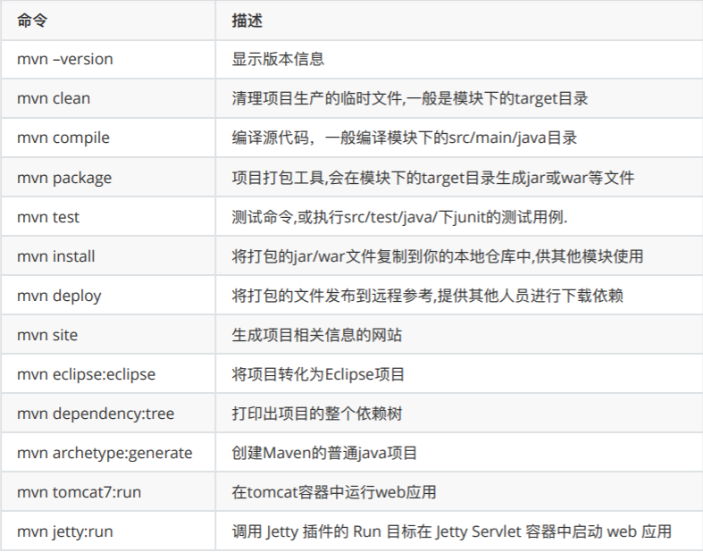
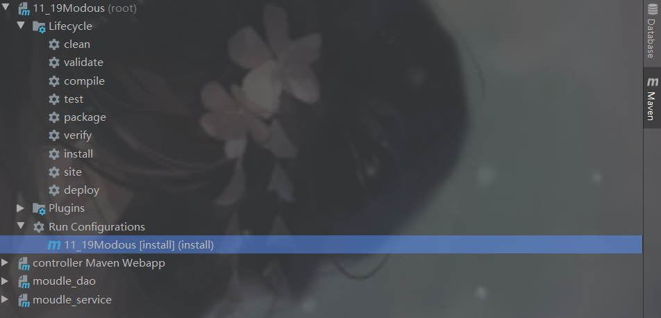
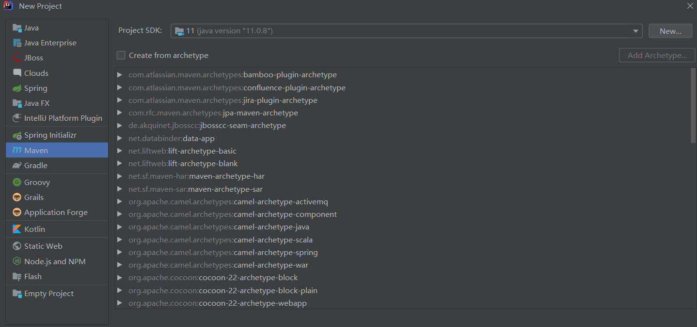
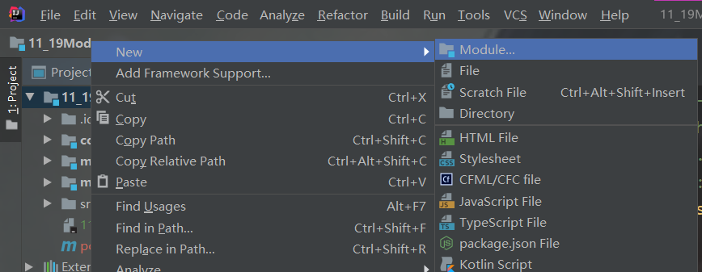
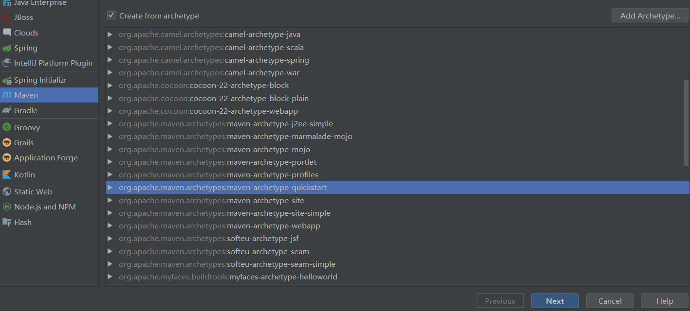
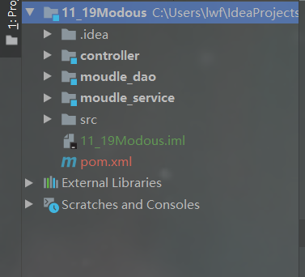

# maven

## 简介

> ​     Maven【[ˈmevən]】这个词可以翻译为"专家","内⾏"。 作为Apache组织中的⼀个颇为成功的开源项 ⽬，Maven主要服务于基于java平台的项⽬构建，依赖管理和项⽬信息管理。 ⽆论是⼩型的开源类库项⽬，还是⼤型的企业级应⽤； ⽆论是传统的瀑布式开发，还是流⾏的敏捷开 发，Maven都能⼤显身⼿。

## 项目构建

> ​        不管你是否意识到，构建（build）是每⼀位程序员每天都在做的⼯作。早上来到公司，我们做的第⼀ 件事就是从源码库签出最新的代码，然后进⾏单元测试，如果测试失败，会找相关的同事⼀起调试，修 复错误代码。 接着回到⾃⼰的⼯作上来，编写⾃⼰的单元测试及产品代码。 
>
> ​        仔细总结⼀下，我们会发现，除了编写源代码，我们每天有相当⼀部分时间花在了编译，运⾏单元测 试，⽣成⽂档，打包和部署等繁琐且不起眼的⼯作上，这就是构建。 如果我们现在还⼿⼯这样做，那成 本也太⾼了，于是有⼈⽤软件的⽅法让这⼀系列⼯作完全⾃动化，使得软件的构建可以像全⾃动流⽔线 ⼀样，只需要⼀条简单的命令，所有繁琐的步骤都能够⾃动完成，很快就能得到最终结果。

## 项目构建工具

**Ant构建** 

> 最早的构建⼯具，基于IDE, ⼤概是2000年有的，当时是最流⾏java构建⼯具，不过它的XML脚本编写 格式让XML⽂件特别⼤。对⼯程构建过程中的过程控制特别好 

**Maven【JAVA】**

>  项⽬对象模型，通过其描述信息来管理项⽬的构建，报告和⽂档的软件项⽬管理⼯具。它填补了Ant 缺点，Maven第⼀次⽀持了从⽹络上下载的功能，仍然采⽤xml作为配置⽂件格式。Maven专注的是依 赖管理，使⽤Java编写。 

 **Gradle**

> 属于结合以上两个的优点，它继承了Ant的灵活和Maven的⽣命周期管理，它最后被google作为了 Android御⽤管理⼯具。它最⼤的区别是不⽤XML作为配置⽂件格式，采⽤了DSL格式，使得脚本更加 简洁。 ⽬前市⾯上Ant⽐较⽼, 所以⼀般是⼀些⽐较传统的软件企业公司使⽤, Maven使⽤Java编写, 是当下⼤ 多数互联⽹公司会使⽤的⼀个构建⼯具, 中⽂⽂档也⽐较⻬全, gradle是⽤groovy编写, ⽬前⽐较新型的 构建⼯具⼀些初创互联⽹公司会使⽤, 以后会有很⼤的使⽤空间.

## maven四大特性

***1.依赖管理系统***

> 将每一个jar包以<组织名，项目名，版本号>区分开，任何基于Maven构建的项⽬⾃身也必须定义这三项属性，⽣成的包可以是Jar包，也可以是war包或者 jar包。

***2.多模块构建***

> 项⽬复查时 dao service controller 层分离将⼀个项⽬分解为多个模块已经是很通⽤的⼀种⽅式。 在Maven中需要定义⼀个parent POM作为⼀组module的聚合POM。在该POM中可以使⽤ 标签来 定义⼀组⼦模块。parent POM不会有什么实际构建产出。⽽parent POM中的build配置以及依赖配置 都会⾃动继承给⼦module。

***3.项目结构一致***

> Ant时代⼤家创建Java项⽬⽬录时⽐较随意，然后通过Ant配置指定哪些属于source，那些属于 testSource等。⽽Maven在设计之初的理念就是Conversion over configuration（约定⼤于配置）。其 制定了⼀套项⽬⽬录结构作为标准的Java项⽬结构,解决不同ide 带来的⽂件⽬录不⼀致问题。

***4.⼀致的构建模型和插件机制***

```
<plugin>
 <groupId>org.mortbay.jetty</groupId>
 <artifactId>maven-jetty-plugin</artifactId>
 <version>6.1.25</version>
 <configuration>
 <scanIntervalSeconds>10</scanIntervalSeconds>
 <contextPath>/test</contextPath>
 </configuration>
</plugin>
```

## 环境变量（基本不用做，在ide中配置就好）

> 1.右键此电脑，属性
>
> 2.点击高级系统设置，选择环境变量
>
> 3.在当前用户（或系统用户）下新建      MAVEN_HOME    D:\Maven\apache-maven-3.6.0（maven根目录）；在path中添加%MAVEN_HOME%\bin
>
> 4.验证：mvn -v        

## 修改配置文件

1.更改镜像：maven默认下载中央仓库（在外国）速度非常慢，修改maven/conf/setting.xml,将mirrors改成如下：

```
  <mirrors>
  <mirror> 
    <id>alimaven</id>  
    <name>aliyun maven</name>  
    <url>http://maven.aliyun.com/nexus/content/groups/public/</url>  
    <mirrorOf>central</mirrorOf> 
  </mirror>
  <mirror>
    <id>uk</id>  
    <mirrorOf>central</mirrorOf>  
    <name>Human Readable Name for this Mirror.</name>  
    <url>http://uk.maven.org/maven2/</url>
  </mirror>
  <mirror>
    <id>CN</id>
    <name>OSChina Central</name>
    <url>http://maven.oschina.net/content/groups/public/</url>
    <mirrorOf>central</mirrorOf>
  </mirror>

  <mirror>
    <id>nexus</id>
    <name>internal nexus repository</name>
    <!-- <url>http://192.168.1.100:8081/nexus/content/groups/public/</url>-->
    <url>http://repo.maven.apache.org/maven2</url>
    <mirrorOf>central</mirrorOf>
  </mirror>
</mirrors>
```

2.设置本地仓库：maven下载的jar包存放根路径；jar存放在该路径下：groupId/artifactId/version/jar包

```
  #setting标签下，路径为自己想放的地方
  <localRepository>D:\Maven\LocalWarehouse</localRepository>
```

## 命令



 ***-D 传⼊属性参数***

> 例如： mvn package -Dmaven.test.skip=true  
>
> 以 -D 开头，将 maven.test.skip 的值设为 true ,就是告诉maven打包的时候跳过单元测试。同 理， mvn deploy-Dmaven.test.skip=true 代表部署项⽬并跳过单元测试。

***-P 使⽤指定的Profile配置***

```
 <profiles>
        <profile>
            <id>dev</id>
            <properties>
                <env>dev</env>
            </properties>
            <activation>
                <activeByDefault>true</activeByDefault>
            </activation>
        </profile>
        <profile>
            <id>qa</id>
            <properties>
                <env>qa</env>
            </properties>
        </profile>
        <profile>
            <id>pre</id>
            <properties>
                <env>pre</env>
            </properties>
        </profile>
        <profile>
            <id>prod</id>
            <properties>
                <env>prod</env>
            </properties>
        </profile>
    </profiles>
    <build>
        <filters>
            <filter>config/${env}.properties</filter>
        </filters>
        <resources>
            <resource>
                <directory>src/main/resources</directory>
                <filtering>true</filtering>
            </resource>
        </resources>
    </build>
```

> profiles 定义了各个环境的变量 id ， filters 中定义了变量配置⽂件的地址，其中地址中的环境 变量就是上⾯ profile 中定义的值， resources 中是定义哪些⽬录下的⽂件会被配置⽂件中定义的变 量替换。
>
> 通过maven可以实现按不同环境进⾏打包部署，例如： mvn package -Pdev -Dmaven.test.skip=true 表示打包本地环境，并跳过单元测试

## 添加tomcat插件

```
<!-- 设置在plugins标签中 -->
<plugin>
 <groupId>org.apache.tomcat.maven</groupId>
 <artifactId>tomcat7-maven-plugin</artifactId>
 <version>2.1</version>
 <configuration>
 <port>8081</port> <!-- 启动端⼝ 默认:8080 -->
 <path>/test</path> <!-- 项⽬的站点名，即对外访问路径 -->
 <uriEncoding>UTF-8</uriEncoding> <!-- 字符集编码 默认：ISO-8859-1 -->
 <server>tomcat7</server> <!-- 服务器名称 -->
 </configuration>
</plugin>
```

## Scope

Scope： 依赖范围（compile,test,provided,runtime,system） 

> compile: 编译依赖范围。 如果没有指定，就会默认使⽤该依赖范围。使⽤此依赖范围的Maven依赖，对于编译、测 试、运⾏三种classpath都有效。
>
>  test: 测试依赖范围。 使⽤此依赖范围的Maven依赖，只对于测试classpath有效，在编译主代码或者运⾏项⽬的使 ⽤时将⽆法使⽤此类依赖。典型的例⼦就是JUnit，它只有在编译测试代码及运⾏测试的时候 才需要。 
>
> provided: 已提供依赖范围。 使⽤此依赖范围的Maven依赖，对于编译和测试classpath有效，但在运⾏时⽆效。典型的例 ⼦是servlet-api，编译和测试项⽬的时候需要该依赖，但在运⾏项⽬的时候，由于容器已经 提供，就不需要Maven重复地引⼊⼀遍(如：servlet-api)。 
>
> runtime: 运⾏时依赖范围。 使⽤此依赖范围的Maven依赖，对于测试和运⾏classpath有效，但在编译主代码时⽆效。典 型的例⼦是JDBC驱动实现，项⽬主代码的编译只需要JDK提供的JDBC接⼝，只有在执⾏测试 或者运⾏项⽬的时候才需要实现上述接⼝的具体JDBC驱动。
>
>  system: 系统依赖范围。 该依赖与三种classpath的关系，和provided依赖范围完全⼀致。但是，使⽤system范围依 赖时必须通过systemPath元素显式地指定依赖⽂件的路径。由于此类依赖不是通过Maven仓 库解析的，⽽且往往与本机系统绑定，可能造成构建的不可移植，因此应该谨慎使⽤。

## dea使用maven



依次点击clean，compile，package，install（多模块是点击）；只点击compile就可以运行

## 构建多模块项目

父模块打包pom，子模块除了controller（控制器）模块war其他采用jar

1.构建父路径：该页面直接next，什么都不勾



2.子模块：父项目文件右键new->Module



3.maven勾选（controller控制器模块选择下方第3行的webapp）：



4.最终结构：controller依赖moudle_service,moudle_service依赖moudle_dao，模块间调用使用dependency坐标为<父模块groupid，子模块名，子模块版本>



调用模块pom.xml

```
<?xml version="1.0" encoding="UTF-8"?>

<project xmlns="http://maven.apache.org/POM/4.0.0" xmlns:xsi="http://www.w3.org/2001/XMLSchema-instance"
  xsi:schemaLocation="http://maven.apache.org/POM/4.0.0 http://maven.apache.org/xsd/maven-4.0.0.xsd">
  <modelVersion>4.0.0</modelVersion>

  <groupId>com.lwf</groupId>
  <artifactId>controller</artifactId>
  <version>1.0-SNAPSHOT</version>
  <packaging>war</packaging>

  <name>controller Maven Webapp</name>
  <!-- FIXME change it to the project's website -->
  <url>http://www.example.com</url>

  <properties>
    <project.build.sourceEncoding>UTF-8</project.build.sourceEncoding>
    <maven.compiler.source>1.8</maven.compiler.source>
    <maven.compiler.target>1.8</maven.compiler.target>
  </properties>

  <dependencies>
    <dependency>
      <groupId>junit</groupId>
      <artifactId>junit</artifactId>
      <version>4.12</version>
      <scope>test</scope>
    </dependency>
    <!-- https://mvnrepository.com/artifact/javax.servlet/javax.servlet-api -->
    <dependency>
      <groupId>javax.servlet</groupId>
      <artifactId>javax.servlet-api</artifactId>
      <version>4.0.1</version>
      <scope>provided</scope>
    </dependency>
     <!-- 引入依赖模块，父groupid，子模块名，版本，依赖范围 -->
    <dependency>
      <groupId>com.lwf</groupId>
      <artifactId>moudle_service</artifactId>
      <version>1.0-SNAPSHOT</version>
      <scope>compile</scope>
    </dependency>
    
    <!-- https://mvnrepository.com/artifact/com.google.code.gson/gson -->
    <dependency>
      <groupId>com.google.code.gson</groupId>
      <artifactId>gson</artifactId>
      <version>2.8.6</version>
    </dependency>

  </dependencies>

  <build>
    <plugins>
      <plugin>
        <groupId>org.apache.tomcat.maven</groupId>
        <artifactId>tomcat7-maven-plugin</artifactId>
        <configuration>
          <port>8088</port>
          <!-- 表示在根目录运行，不用加工程名 -->
          <path>/</path>
        </configuration>
      </plugin>
    </plugins>
  </build>
</project>

```

被调用模块

```
<?xml version="1.0" encoding="UTF-8"?>

<project xmlns="http://maven.apache.org/POM/4.0.0" xmlns:xsi="http://www.w3.org/2001/XMLSchema-instance"
  xsi:schemaLocation="http://maven.apache.org/POM/4.0.0 http://maven.apache.org/xsd/maven-4.0.0.xsd">
  <modelVersion>4.0.0</modelVersion>

  <groupId>com.lwf</groupId>
  <artifactId>moudle_service</artifactId>
  <version>1.0-SNAPSHOT</version>

  <name>moudle_service</name>
  <!-- FIXME change it to the project's website -->
  <url>http://www.example.com</url>

  <properties>
    <project.build.sourceEncoding>UTF-8</project.build.sourceEncoding>
    <maven.compiler.source>1.8</maven.compiler.source>
    <maven.compiler.target>1.8</maven.compiler.target>
  </properties>

  <dependencies>
    <dependency>
      <groupId>junit</groupId>
      <artifactId>junit</artifactId>
      <version>4.12</version>
      <scope>test</scope>
    </dependency>
    <dependency>
      <groupId>com.lwf</groupId>
      <artifactId>moudle_dao</artifactId>
      <version>1.0-SNAPSHOT</version>
      <scope>compile</scope>
    </dependency>
  </dependencies>

  <build>
    <pluginManagement><!-- lock down plugins versions to avoid using Maven defaults (may be moved to parent pom) -->
      <plugins>
        <!-- clean lifecycle, see https://maven.apache.org/ref/current/maven-core/lifecycles.html#clean_Lifecycle -->
        <plugin>
          <artifactId>maven-clean-plugin</artifactId>
          <version>3.1.0</version>
        </plugin>
        <!-- default lifecycle, jar packaging: see https://maven.apache.org/ref/current/maven-core/default-bindings.html#Plugin_bindings_for_jar_packaging -->
        <plugin>
          <artifactId>maven-resources-plugin</artifactId>
          <version>3.0.2</version>
        </plugin>
        <plugin>
          <artifactId>maven-compiler-plugin</artifactId>
          <version>3.8.0</version>
        </plugin>
        <plugin>
          <artifactId>maven-surefire-plugin</artifactId>
          <version>2.22.1</version>
        </plugin>
        <plugin>
          <artifactId>maven-jar-plugin</artifactId>
          <version>3.0.2</version>
        </plugin>
        <plugin>
          <artifactId>maven-install-plugin</artifactId>
          <version>2.5.2</version>
        </plugin>
        <plugin>
          <artifactId>maven-deploy-plugin</artifactId>
          <version>2.8.2</version>
        </plugin>
        <!-- site lifecycle, see https://maven.apache.org/ref/current/maven-core/lifecycles.html#site_Lifecycle -->
        <plugin>
          <artifactId>maven-site-plugin</artifactId>
          <version>3.7.1</version>
        </plugin>
        <plugin>
          <artifactId>maven-project-info-reports-plugin</artifactId>
          <version>3.0.0</version>
        </plugin>
      </plugins>
    </pluginManagement>
  </build>
</project>

```

5.打包，父路径maven中双击package，install：controller中的war包就是该项目结果，包中WEB-INF下的lib中含有其所有依赖的模块jar包（直接依赖和传递依赖）