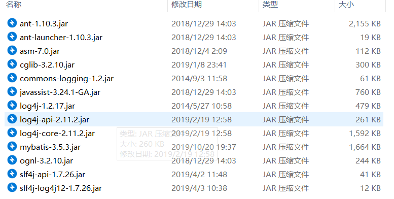
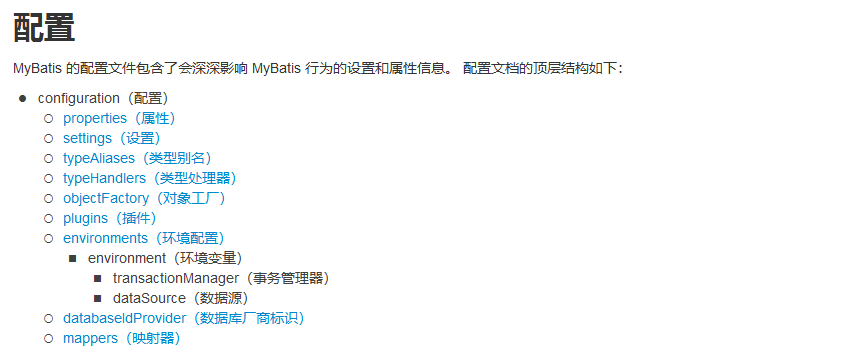

# mybatis复习

## 介绍

> ​        **MyBatis** 本是**apache**的一个开源项目iBatis, 2010年这个项目由apache soxware foundation 迁移到了google code，并且改名为MyBatis 。2013 年11月迁移到**Github**。 
>
> ​      **iBATIS**一词来源于“internet”和“abatis”的组合，是一个基于Java的**持久层框架**。iBATIS提供的持久层框架包括SQL Maps和Data Access  Objects（DAO） 
>
>   **MyBatis是一个支持普通SQL查询，存储过程和高级映射的优秀持久层框架**。MyBatis消除了几乎所有的JDBC代码和参数的手工设置以及对结果集的检索封装。MyBatis可以使用简单的XML或注解用于配置和原始映射，将接口和Java的POJO（Plain Old Java Objects，普通的Java对象）映射成数据库中的记录。
>
>    Mybatis不是一个完全的orm框架，Mybatis需要程序员自己写sql，但是也存在映射（输入参数映射，输出结果映射），学习门槛mybatis比hibernate低；同时灵活性高，特别适用于业务模型易变的项目，使用范围广。

## 特点

> 属于持久层ORM框架
>
> 1. 持久层: 讲内存中对象数据,转移到数据库中的过程持久层
>
> Mybatis Hibernate Spring-jpa 
>
> 2. ORM Object Relational Mapping 对象关系映射框架
>
> ​       类 表
>
> ​      属性 字段
>
> ​      对象 记录
>
> 3. 半自化 自动化
>
> ​             **Mybatis 半自动化**
>
> ​             表需要手动进行设计
>
> ​             提供sql
>
> ​             依赖与数据库平台
>
> ​            优点:学习使用简单(基与原声jdbc封装),优化灵活,适合做互联网项目
>
> ​            **Hibernate 自动化ORM框架**
>
> ​             表可以通过框架自动创建
>
> ​            省略一些基本的sql
>
> ​             不依赖与数据库平台
>
> ​            缺点: 学生成本高,优化难度大,适合与传统框(OA|图书管理系统...),不适合做大型互联网项目

## 环境搭建(配置文件)

 ### 导包

> 

> ​    mybatis 开源github上下载mybatis文件：
>
> > 包含核心jar包mybatis.jar
> >
> > lib下mybatis依赖的jar包
> >
> > 
> >
> > 总的来说，需要导入lib加mybatis.jar
> >
> > 

### 日志文件（非必须，不加会有警告)

#### log4j.properties

```
# Global logging configuration
log4j.rootLogger=ERROR, stdout
# MyBatis logging configuration...
log4j.logger.org.mybatis.example.BlogMapper=DEBUG
# Console output...
log4j.appender.stdout=org.apache.log4j.ConsoleAppender
log4j.appender.stdout.layout=org.apache.log4j.PatternLayout
log4j.appender.stdout.layout.ConversionPattern=%5p [%t] - %m%n
```

### javaBean

```
@Data
@AllArgsConstructor
@NoArgsConstructor
public class Student implements Serializable {
    private String sno;
    private String sname;
    private Integer sage;
    private Character ssex;
    private String sdept;
}
```

### 数据库oracle.properties文件

```
url=jdbc:oracle:thin:@localhost:1521:XE
user=SCOTT
password=TIGER
driver=oracle.jdbc.OracleDriver
```


### mybatis核心配置文件

#### mybatis.properties(名字随便取)

```
<?xml version="1.0" encoding="UTF-8" ?>
<!DOCTYPE configuration
        PUBLIC "-//mybatis.org//DTD Config 3.0//EN"
        "http://mybatis.org/dtd/mybatis-3-config.dtd">
<configuration>
    <!--数据库配置文件位置，采用classPath：这里放到资源文件中-->
    <properties resource="oracle.properties" />
    <!--包别名，在此包下可省略全包路径-->
    <typeAliases>
        <package name="classTest.Mybatis.Emtity"/>
    </typeAliases>
    <!--数据库环境，default填要使用的数据库环境id-->
    <environments default="development">
        <!--数据库环境，由id唯一确定，可写多个-->
        <environment id="development">
            <!--采用JDBC事务-->
            <transactionManager type="JDBC"/>
            <!--使用jdbc自带连接池-->
            <dataSource type="POOLED">
                <property name="driver" value="${driver}"/>
                <property name="url" value="${url}"/>
                <property name="username" value="${user}"/>
                <property name="password" value="${password}"/>
            </dataSource>
        </environment>
    </environments>
    <!--mapper位置，存放sql-->
<!-- 指明SQL映射文件路径 resource : 包路径 com/shsxt.../xxxMapper.xml-->
    <mappers>
<!--        多个mapper写不同mapper的路径-->
<!--        <mapper resource="classTest/Mybatis/Mapper/StudentMapper.xml"/>-->
<!--        自动扫描包下的mapper-->
        <package name="classTest.Mybatis.Mapper"/>
    </mappers>
</configuration>
```

#### POJONameMapper.xml文件

```
<!DOCTYPE mapper
        PUBLIC "-//mybatis.org//DTD Mapper 3.0//EN"
        "http://mybatis.org/dtd/mybatis-3-mapper.dtd">
<!--namespace表示对应接口类路径-->
<mapper namespace="classTest.Mybatis.Mapper.StudentMapper">
<!--    id表示接口对应方法，parameterType为传入参数类型，
        resultType为结果类型
        resultMap定义需要的结果集
        sql语句后不能加';'
-->
    <select id="queryAll" parameterType="classTest.Mybatis.Emtity.Student" resultType="classTest.Mybatis.Emtity.Student">
        select * from student
    </select>
    <select id="queryBySno" parameterType="String" resultType="Student">
        select * from student where sno=#{sno}
    </select>
    <update id="update" parameterType="Student">
        update student
        <set>
            <if test="#{sname}!= null">sname=#{sname},</if>
            <if test="#{sage}!= null">sage=#{sage},</if>
            <if test="#{sdept} != null">sdept=#{sdept},</if>
        </set>
        where sno=#{sno}
    </update>
    <insert id="insert" parameterType="Student">
        insert into student values (#{sno},#{sname},#{ssex},#{sage},#{sdept})
    </insert>
    <delete id="delete" parameterType="Student" >
        delete  from student where 1=1
        <if test="#{sno}!=null">and sno=#{sno}</if>
        <if test="#{sname}!=null">and sname=#{sname}</if>
        <if test="#{sage}!=null">and sage=#{sage}</if>
        <if test="#{sdept}!=null">and sdept=#{sdept}</if>
    </delete>
</mapper>
```

#### 测试

**项目结构:**


```
package classTest.Mybatis;

import classTest.Mybatis.Emtity.Student;
import classTest.Mybatis.Mapper.StudentMapper;
import org.apache.ibatis.io.Resources;
import org.apache.ibatis.session.SqlSession;
import org.apache.ibatis.session.SqlSessionFactory;
import org.apache.ibatis.session.SqlSessionFactoryBuilder;
import java.io.IOException;

/**
 * @author lwf
 * @title: MyBatisTest1
 * @projectName 11_3OracleJavaDay2Code
 * @description: TODO
 * @date 2020/11/315:03
 */
public class MyBatisTest1 {
    public static void main(String[] args) throws IOException {
        SqlSessionFactory sqlSessionFactory= new  SqlSessionFactoryBuilder().build(Resources.getResourceAsStream("mybatis.xml" ));
        SqlSession sqlSession = sqlSessionFactory.openSession();
        StudentMapper mapper = (StudentMapper) sqlSession.getMapper(StudentMapper.class);
        mapper.queryAll().forEach(System.out::println);
        System.out.println("---------------------查一个");
        System.out.println(mapper.queryBySno("9521105"));
        System.out.println("---------------------- 更新");
        mapper.update(new Student("9521105", "罗日天", 20,'男', "信息学院"));
        System.out.println(mapper.queryBySno("9521105"));
        System.out.println("-----------------------插入");
        mapper.insert(new Student("9521106", "日天",21,'男', "信息学院"));
        System.out.println(mapper.queryBySno("9521106"));
        mapper.delete(new Student("9521106", "日天", 21,'男', "信息学院"));
        sqlSession.close();
    }
}

```

## 核心配置文件结构



###  properties(数据库连接信息)

> ```
> <!--数据库配置文件位置，采用classPath：这里放到资源文件中-->
>     <properties resource="oracle.properties" />
> ```
>
> 获取properties文件中数据时候,要通过${}的方式获取，例如：
>
> ```
> <!--数据库环境，default填要使用的数据库环境id-->
>     <environments default="development">
>         <!--数据库环境，由id唯一确定，可写多个-->
>         <environment id="development">
>             <!--采用JDBC事务-->
>             <transactionManager type="JDBC"/>
>             <!--使用jdbc自带连接池-->
>             <dataSource type="POOLED">
>                 <property name="driver" value="${driver}"/>
>                 <property name="url" value="${url}"/>
>                 <property name="username" value="${user}"/>
>                 <property name="password" value="${password}"/>
>             </dataSource>
>         </environment>
>     </environments>
> ```

### settings

> 这是 MyBatis 中极为重要的调整设置，它们会改变 MyBatis 的运行时行为。 下表描述了设置中各项设置的含义、默认值等。
>
> | 设置名                           | 描述                                                         | 有效值                                                       | 默认值                                                |
> | -------------------------------- | ------------------------------------------------------------ | ------------------------------------------------------------ | ----------------------------------------------------- |
> | cacheEnabled                     | 全局性地开启或关闭所有映射器配置文件中已配置的任何缓存。     | true \| false                                                | true                                                  |
> | lazyLoadingEnabled               | 延迟加载的全局开关。当开启时，所有关联对象都会延迟加载。 特定关联关系中可通过设置 `fetchType`  属性来覆盖该项的开关状态。 | true \| false                                                | false                                                 |
> | aggressiveLazyLoading            | 开启时，任一方法的调用都会加载该对象的所有延迟加载属性。 否则，每个延迟加载属性会按需加载（参考  `lazyLoadTriggerMethods`)。 | true \| false                                                | false （在 3.4.1 及之前的版本中默认为 true）          |
> | multipleResultSetsEnabled        | 是否允许单个语句返回多结果集（需要数据库驱动支持）。         | true \| false                                                | true                                                  |
> | useColumnLabel                   | 使用列标签代替列名。实际表现依赖于数据库驱动，具体可参考数据库驱动的相关文档，或通过对比测试来观察。 | true \| false                                                | true                                                  |
> | useGeneratedKeys                 | 允许 JDBC 支持自动生成主键，需要数据库驱动支持。如果设置为 true，将强制使用自动生成主键。尽管一些数据库驱动不支持此特性，但仍可正常工作（如  Derby）。 | true \| false                                                | False                                                 |
> | autoMappingBehavior              | 指定 MyBatis 应如何自动映射列到字段或属性。 NONE 表示关闭自动映射；PARTIAL 只会自动映射没有定义嵌套结果映射的字段。 FULL  会自动映射任何复杂的结果集（无论是否嵌套）。 | NONE, PARTIAL, FULL                                          | PARTIAL                                               |
> | autoMappingUnknownColumnBehavior | 指定发现自动映射目标未知列（或未知属性类型）的行为。  `NONE`: 不做任何反应  `WARNING`:  输出警告日志（`'org.apache.ibatis.session.AutoMappingUnknownColumnBehavior'`  的日志等级必须设置为 `WARN`）  `FAILING`: 映射失败 (抛出 `SqlSessionException`) | NONE, WARNING, FAILING                                       | NONE                                                  |
> | defaultExecutorType              | 配置默认的执行器。SIMPLE 就是普通的执行器；REUSE 执行器会重用预处理语句（PreparedStatement）； BATCH  执行器不仅重用语句还会执行批量更新。 | SIMPLE REUSE BATCH                                           | SIMPLE                                                |
> | defaultStatementTimeout          | 设置超时时间，它决定数据库驱动等待数据库响应的秒数。         | 任意正整数                                                   | 未设置 (null)                                         |
> | defaultFetchSize                 | 为驱动的结果集获取数量（fetchSize）设置一个建议值。此参数只可以在查询设置中被覆盖。 | 任意正整数                                                   | 未设置 (null)                                         |
> | defaultResultSetType             | 指定语句默认的滚动策略。（新增于 3.5.2）                     | FORWARD_ONLY \| SCROLL_SENSITIVE \| SCROLL_INSENSITIVE \| DEFAULT（等同于未设置） | 未设置 (null)                                         |
> | safeRowBoundsEnabled             | 是否允许在嵌套语句中使用分页（RowBounds）。如果允许使用则设置为 false。 | true \| false                                                | False                                                 |
> | safeResultHandlerEnabled         | 是否允许在嵌套语句中使用结果处理器（ResultHandler）。如果允许使用则设置为 false。 | true \| false                                                | True                                                  |
> | mapUnderscoreToCamelCase         | 是否开启驼峰命名自动映射，即从经典数据库列名 A_COLUMN 映射到经典 Java 属性名 aColumn。 | true \| false                                                | False                                                 |
> | localCacheScope                  | MyBatis 利用本地缓存机制（Local Cache）防止循环引用和加速重复的嵌套查询。 默认值为 SESSION，会缓存一个会话中执行的所有查询。  若设置值为 STATEMENT，本地缓存将仅用于执行语句，对相同 SqlSession 的不同查询将不会进行缓存。 | SESSION \| STATEMENT                                         | SESSION                                               |
> | jdbcTypeForNull                  | 当没有为参数指定特定的 JDBC 类型时，空值的默认 JDBC 类型。 某些数据库驱动需要指定列的 JDBC 类型，多数情况直接用一般类型即可，比如  NULL、VARCHAR 或 OTHER。 | JdbcType 常量，常用值：NULL、VARCHAR 或 OTHER。              | OTHER                                                 |
> | lazyLoadTriggerMethods           | 指定对象的哪些方法触发一次延迟加载。                         | 用逗号分隔的方法列表。                                       | equals,clone,hashCode,toString                        |
> | defaultScriptingLanguage         | 指定动态 SQL 生成使用的默认脚本语言。                        | 一个类型别名或全限定类名。                                   | org.apache.ibatis.scripting.xmltags.XMLLanguageDriver |
> | defaultEnumTypeHandler           | 指定 Enum 使用的默认 `TypeHandler` 。（新增于 3.4.5）        | 一个类型别名或全限定类名。                                   | org.apache.ibatis.type.EnumTypeHandler                |
> | callSettersOnNulls               | 指定当结果集中值为 null 的时候是否调用映射对象的 setter（map 对象时为 put）方法，这在依赖于 Map.keySet() 或 null  值进行初始化时比较有用。注意基本类型（int、boolean 等）是不能设置成 null 的。 | true \| false                                                | false                                                 |
> | returnInstanceForEmptyRow        | 当返回行的所有列都是空时，MyBatis默认返回 `null`。 当开启这个设置时，MyBatis会返回一个空实例。  请注意，它也适用于嵌套的结果集（如集合或关联）。（新增于 3.4.2） | true \| false                                                | false                                                 |
> | logPrefix                        | 指定 MyBatis 增加到日志名称的前缀。                          | 任何字符串                                                   | 未设置                                                |
> | logImpl                          | 指定 MyBatis 所用日志的具体实现，未指定时将自动查找。        | SLF4J \| LOG4J \| LOG4J2 \| JDK_LOGGING \| COMMONS_LOGGING \| STDOUT_LOGGING \|  NO_LOGGING | 未设置                                                |
> | proxyFactory                     | 指定 Mybatis 创建可延迟加载对象所用到的代理工具。            | CGLIB \| JAVASSIST                                           | JAVASSIST （MyBatis 3.3 以上）                        |
> | vfsImpl                          | 指定 VFS 的实现                                              | 自定义 VFS 的实现的类全限定名，以逗号分隔。                  | 未设置                                                |
> | useActualParamName               | 允许使用方法签名中的名称作为语句参数名称。 为了使用该特性，你的项目必须采用 Java 8 编译，并且加上  `-parameters` 选项。（新增于 3.4.1） | true \| false                                                | true                                                  |
> | configurationFactory             | 指定一个提供 `Configuration` 实例的类。 这个被返回的 Configuration  实例用来加载被反序列化对象的延迟加载属性值。 这个类必须包含一个签名为`static Configuration  getConfiguration()` 的方法。（新增于 3.2.3） | 一个类型别名或完全限定类名。                                 | 未设置                                                |
> | shrinkWhitespacesInSql           | 从SQL中删除多余的空格字符。请注意，这也会影响SQL中的文字字符串。 (新增于 3.5.5) | true \| false                                                | false                                                 |
> | defaultSqlProviderType           | Specifies an sql provider class that holds provider method (Since 3.5.6).  This class apply to the `type`(or `value`) attribute on  sql provider annotation(e.g. `@SelectProvider`), when these attribute  was omitted. | A type alias or fully qualified class name                   | Not set                                               |
>
> 一个配置完整的 settings 元素的示例如下： 
>
> ```
> <settings>
>   <setting name="cacheEnabled" value="true"/>
>   <setting name="lazyLoadingEnabled" value="true"/>
>   <setting name="multipleResultSetsEnabled" value="true"/>
>   <setting name="useColumnLabel" value="true"/>
>   <setting name="useGeneratedKeys" value="false"/>
>   <setting name="autoMappingBehavior" value="PARTIAL"/>
>   <setting name="autoMappingUnknownColumnBehavior" value="WARNING"/>
>   <setting name="defaultExecutorType" value="SIMPLE"/>
>   <setting name="defaultStatementTimeout" value="25"/>
>   <setting name="defaultFetchSize" value="100"/>
>   <setting name="safeRowBoundsEnabled" value="false"/>
>   <setting name="mapUnderscoreToCamelCase" value="false"/>
>   <setting name="localCacheScope" value="SESSION"/>
>   <setting name="jdbcTypeForNull" value="OTHER"/>
>   <setting name="lazyLoadTriggerMethods" value="equals,clone,hashCode,toString"/>
> </settings>
> ```

### typeAliases**别名**

> 类型别名可为 Java 类型设置一个缩写名字。 它仅用于 XML 配置，意在降低冗余的全限定类名书写。例如：
>
> ```
> <typeAliases>
>   <typeAlias alias="Author" type="classTest.Mybatis.EmtityAuthor
>   <typeAlias alias="Blog" type="classTest.Mybatis.Emtity.Blog"/>
>   <typeAlias alias="Comment" type="classTest.Mybatis.Emtity.Comment"/>
> </typeAliases>
> 
> ```

或者：这样等于classTest.Mybatis.Emtity包下所有javaBean在Mapper.xml中全限定类名可以不用写，只写类名

```
<!--包别名，在此包下可省略全包路径-->
    <typeAliases>
        <package name="classTest.Mybatis.Emtity"/>
    </typeAliases>
```

下面是一些为常见的 Java 类型内建的类型别名。它们都是不区分大小写的，注意，为了应对原始类型的命名重复，采取了特殊的命名风格。

| 别名       | 映射的类型 |
| ---------- | ---------- |
| _byte      | byte       |
| _long      | long       |
| _short     | short      |
| _int       | int        |
| _integer   | int        |
| _double    | double     |
| _float     | float      |
| _boolean   | boolean    |
| string     | String     |
| byte       | Byte       |
| long       | Long       |
| short      | Short      |
| int        | Integer    |
| integer    | Integer    |
| double     | Double     |
| float      | Float      |
| boolean    | Boolean    |
| date       | Date       |
| decimal    | BigDecimal |
| bigdecimal | BigDecimal |
| object     | Object     |
| map        | Map        |
| hashmap    | HashMap    |
| list       | List       |
| arraylist  | ArrayList  |
| collection | Collection |
| iterator   | Iterator   |

### 类型处理器（typeHandlers）

MyBatis 在设置预处理语句（PreparedStatement）中的参数或从结果集中取出一个值时， 都会用类型处理器将获取到的值以合适的方式转换成  Java 类型。

> ```
> <!-- mybatis-config.xml -->
> <typeHandlers>
>   <typeHandler handler="org.mybatis.example.ExampleTypeHandler"/>
> </typeHandlers>
> ```

### 对象工厂（objectFactory）

每次 MyBatis 创建结果对象的新实例时，它都会使用一个对象工厂（ObjectFactory）实例来完成实例化工作。  默认的对象工厂需要做的仅仅是实例化目标类，要么通过默认无参构造方法，要么通过存在的参数映射来调用带有参数的构造方法。  如果想覆盖对象工厂的默认行为，可以通过创建自己的对象工厂来实现。比如：

```
// ExampleObjectFactory.java
public class ExampleObjectFactory extends DefaultObjectFactory {
  public Object create(Class type) {
    return super.create(type);
  }
  public Object create(Class type, List<Class> constructorArgTypes, List<Object> constructorArgs) {
    return super.create(type, constructorArgTypes, constructorArgs);
  }
  public void setProperties(Properties properties) {
    super.setProperties(properties);
  }
  public <T> boolean isCollection(Class<T> type) {
    return Collection.class.isAssignableFrom(type);
  }}
<!-- mybatis-config.xml -->
<objectFactory type="org.mybatis.example.ExampleObjectFactory">
  <property name="someProperty" value="100"/>
</objectFactory>
```

ObjectFactory 接口很简单，它包含两个创建实例用的方法，一个是处理默认无参构造方法的，另外一个是处理带参数的构造方法的。  另外，setProperties 方法可以被用来配置 ObjectFactory，在初始化你的 ObjectFactory 实例后， objectFactory  元素体中定义的属性会被传递给 setProperties 方法。

### 环境配置（environments）

> MyBatis 可以配置成适应多种环境，这种机制有助于将 SQL 映射应用于多种数据库之中， 现实情况下有多种理由需要这么做。
>
> **default属性填写使用的environment（数据源）id值**

#### 单个数据源（environment）

> 定义oracle或mysql数据源信息：事务，

##### transactionManager（事务管理器) 

在 MyBatis 中有两种类型的事务管理器（也就是 type="[JDBC|MANAGED]"）：

- JDBC – 这个配置直接使用了 JDBC 的提交和回滚设施，它依赖从数据源获得的连接来管理事务作用域。 

- MANAGED – 这个配置几乎没做什么。它从不提交或回滚一个连接，而是让容器来管理事务的整个生命周期（比如 JEE 应用服务器的上下文）。  默认情况下它会关闭连接。然而一些容器并不希望连接被关闭，因此需要将 closeConnection 属性设置为 false 来阻止默认的关闭行为。例如: 

  ```
  <transactionManager type="MANAGED">
    <property name="closeConnection" value="false"/>
  </transactionManager>
  ```

提示 如果你正在使用 Spring +  MyBatis，则没有必要配置事务管理器，因为 Spring 模块会使用自带的管理器来覆盖前面的配置。 

这两种事务管理器类型都不需要设置任何属性。它们其实是类型别名，换句话说，你可以用 TransactionFactory  接口实现类的全限定名或类型别名代替它们。 

```
public interface TransactionFactory {
  default void setProperties(Properties props) { // 从 3.5.2 开始，该方法为默认方法
    // 空实现
  }
  Transaction newTransaction(Connection conn);
  Transaction newTransaction(DataSource dataSource, TransactionIsolationLevel level, boolean autoCommit);
}
```

在事务管理器实例化后，所有在 XML 中配置的属性将会被传递给 setProperties() 方法。你的实现还需要创建一个 Transaction  接口的实现类，这个接口也很简单：

```
public interface Transaction {
  Connection getConnection() throws SQLException;
  void commit() throws SQLException;
  void rollback() throws SQLException;
  void close() throws SQLException;
  Integer getTimeout() throws SQLException;
}
```

使用这两个接口，你可以完全自定义 MyBatis 对事务的处理。

##### 数据源（dataSource）

dataSource 元素使用标准的 JDBC 数据源接口来配置 JDBC 连接对象的资源。

- 大多数 MyBatis 应用程序会按示例中的例子来配置数据源。虽然数据源配置是可选的，但如果要启用延迟加载特性，就必须配置数据源。 

有三种内建的数据源类型（也就是 type="[UNPOOLED|POOLED|JNDI]"）：

**UNPOOLED**–  这个数据源的实现会每次请求时打开和关闭连接。虽然有点慢，但对那些数据库连接可用性要求不高的简单应用程序来说，是一个很好的选择。  性能表现则依赖于使用的数据库，对某些数据库来说，使用连接池并不重要，这个配置就很适合这种情形。UNPOOLED 类型的数据源仅仅需要配置以下 5  种属性：

- `driver` – 这是 JDBC 驱动的 Java 类全限定名（并不是 JDBC 驱动中可能包含的数据源类）。 
- `url` – 这是数据库的 JDBC URL 地址。 
- `username` – 登录数据库的用户名。 
- `password` – 登录数据库的密码。 
- `defaultTransactionIsolationLevel` – 默认的连接事务隔离级别。 
- `defaultNetworkTimeout` – 等待数据库操作完成的默认网络超时时间（单位：毫秒）。查看  `java.sql.Connection#setNetworkTimeout()` 的 API 文档以获取更多信息。 

作为可选项，你也可以传递属性给数据库驱动。只需在属性名加上“driver.”前缀即可，例如： 

- `driver.encoding=UTF8` 

这将通过 DriverManager.getConnection(url, driverProperties) 方法传递值为  `UTF8` 的 `encoding` 属性给数据库驱动。 

**POOLED**– 这种数据源的实现利用“池”的概念将 JDBC 连接对象组织起来，避免了创建新的连接实例时所必需的初始化和认证时间。  这种处理方式很流行，能使并发 Web 应用快速响应请求。 

除了上述提到 UNPOOLED 下的属性外，还有更多属性用来配置 POOLED 的数据源：

- `poolMaximumActiveConnections` – 在任意时间可存在的活动（正在使用）连接数量，默认值：10 
- `poolMaximumIdleConnections` – 任意时间可能存在的空闲连接数。 
- `poolMaximumCheckoutTime` – 在被强制返回之前，池中连接被检出（checked  out）时间，默认值：20000 毫秒（即 20 秒） 
- `poolTimeToWait` –  这是一个底层设置，如果获取连接花费了相当长的时间，连接池会打印状态日志并重新尝试获取一个连接（避免在误配置的情况下一直失败且不打印日志），默认值：20000  毫秒（即 20 秒）。 
- `poolMaximumLocalBadConnectionTolerance` – 这是一个关于坏连接容忍度的底层设置，  作用于每一个尝试从缓存池获取连接的线程。  如果这个线程获取到的是一个坏的连接，那么这个数据源允许这个线程尝试重新获取一个新的连接，但是这个重新尝试的次数不应该超过  `poolMaximumIdleConnections` 与  `poolMaximumLocalBadConnectionTolerance` 之和。 默认值：3（新增于 3.4.5） 
- `poolPingQuery` – 发送到数据库的侦测查询，用来检验连接是否正常工作并准备接受请求。默认是“NO PING  QUERY SET”，这会导致多数数据库驱动出错时返回恰当的错误消息。 
- `poolPingEnabled` – 是否启用侦测查询。若开启，需要设置 `poolPingQuery`  属性为一个可执行的 SQL 语句（最好是一个速度非常快的 SQL 语句），默认值：false。 
- `poolPingConnectionsNotUsedFor` – 配置 poolPingQuery  的频率。可以被设置为和数据库连接超时时间一样，来避免不必要的侦测，默认值：0（即所有连接每一时刻都被侦测 — 当然仅当 poolPingEnabled 为  true 时适用）。 

**JNDI** – 这个数据源实现是为了能在如 EJB 或应用服务器这类容器中使用，容器可以集中或在外部配置数据源，然后放置一个 JNDI  上下文的数据源引用。这种数据源配置只需要两个属性： 

- `initial_context` – 这个属性用来在 InitialContext  中寻找上下文（即，initialContext.lookup(initial_context)）。这是个可选属性，如果忽略，那么将会直接从  InitialContext 中寻找 data_source 属性。 
- `data_source` – 这是引用数据源实例位置的上下文路径。提供了 initial_context  配置时会在其返回的上下文中进行查找，没有提供时则直接在 InitialContext 中查找。 

和其他数据源配置类似，可以通过添加前缀“env.”直接把属性传递给 InitialContext。比如： 

- `env.encoding=UTF8` 

这就会在 InitialContext 实例化时往它的构造方法传递值为 `UTF8` 的 `encoding`  属性。 

你可以通过实现接口 `org.apache.ibatis.datasource.DataSourceFactory`  来使用第三方数据源实现： 

```
public interface DataSourceFactory {
  void setProperties(Properties props);
  DataSource getDataSource();
}
```

`org.apache.ibatis.datasource.unpooled.UnpooledDataSourceFactory`  可被用作父类来构建新的数据源适配器，比如下面这段插入 C3P0 数据源所必需的代码： 

```
import org.apache.ibatis.datasource.unpooled.UnpooledDataSourceFactory;
import com.mchange.v2.c3p0.ComboPooledDataSource;

public class C3P0DataSourceFactory extends UnpooledDataSourceFactory {

  public C3P0DataSourceFactory() {
    this.dataSource = new ComboPooledDataSource();
  }
}
```

为了令其工作，记得在配置文件中为每个希望 MyBatis 调用的 setter 方法增加对应的属性。 下面是一个可以连接至 PostgreSQL  数据库的例子：

```
<dataSource type="POOLED">
                <property name="driver" value="${driver}"/>
                <property name="url" value="${url}"/>
                <property name="username" value="${user}"/>
                <property name="password" value="${password}"/>
            </dataSource>
```

### 映射文件路径(mappers)

> ```
> <!-- mapper 配置扫描接口 -->
> <mappers> 
> <mapper resource="classTest/Mybatis/Mapper/StudentMapper.xml"/>
> </mappers>
> ```
>
> ```
> <!-- mapper 配置扫描接口 -->
> <mappers> 
> <package name="classTest.Mybatis.Mapper"/>
> </mappers>
> ```
>
> 1. xml文件名要与接口名保持一致
>
> 2. namespace属性值 必须与接口的权限定名
>
> 3. id属性必须与抽象方法名保持一致
>
> 4. 返回值类型和参数类型与方法的返回值和参数保持一致
>
>    ```
>    <!DOCTYPE mapper
>            PUBLIC "-//mybatis.org//DTD Mapper 3.0//EN"
>            "http://mybatis.org/dtd/mybatis-3-mapper.dtd">
>    <!--namespace表示对应接口类路径-->
>    <mapper namespace="classTest.Mybatis.Mapper.StudentMapper">
>    <!--    id表示接口对应方法，parameterType为传入参数类型，
>            resultType为结果类型
>            resultMap定义需要的结果集
>            sql语句后不能加';'
>    -->
>        <select id="queryAll" parameterType="classTest.Mybatis.Emtity.Student" resultType="classTest.Mybatis.Emtity.Student">
>            select * from student
>        </select>
>        <select id="queryBySno" parameterType="String" resultType="Student">
>            select * from student where sno=#{sno}
>        </select>
>        <update id="update" parameterType="Student">
>            update student
>            <set>
>                <if test="#{sname}!= null">sname=#{sname},</if>
>                <if test="#{sage}!= null">sage=#{sage},</if>
>                <if test="#{sdept} != null">sdept=#{sdept},</if>
>            </set>
>            where sno=#{sno}
>        </update>
>        <insert id="insert" parameterType="Student">
>            insert into student values (#{sno},#{sname},#{ssex},#{sage},#{sdept})
>        </insert>
>        <delete id="delete" parameterType="Student" >
>            delete  from student where 1=1
>            <if test="#{sno}!=null">and sno=#{sno}</if>
>            <if test="#{sname}!=null">and sname=#{sname}</if>
>            <if test="#{sage}!=null">and sage=#{sage}</if>
>            <if test="#{sdept}!=null">and sdept=#{sdept}</if>
>        </delete>
>    </mapper>
>    ```
>
>    

## 接口（与映射文件同名，并且类全限定名为映射文件namespace值）

* 方法返回值与对应xml下对应id的返回类型相同（容器则存放类型相同）

* 参数：

  **方式一** 

  a)接口中定义方法

  b) 映射文件中提供对应的标签. 此时, SQL 语句中获取方式有两种, 通过

  \#{arg+数字}或#{param+数字}的方式. 

  ```
  User selByUP(String username, String password);
  
  
  <select id="selByUP" resultType="user"> 
  
  select * from t_user where username=#{param1} and 
  
  password=#{param2} 
  
  </select> 
  ```

   **方式二** 

  a) 接口中定义方法, 参数中使用@Param 注解设定参数名用于在 SQL 语

  句中使用. 

  ```
  User selByUP(@Param("username") String username, @Param("password") String password); 
  ```

  b) 映射文件中提供对应的标签. 此时, SQL 语句中获取方式有两种, 通过

  ```
  <select id="selByUP" resultType="user"> select * from t_user where username=#{username} and password=#{password} </select>
  ```

  

## 动态 SQL

MyBatis 的一个强大的特性之一通常是它的动态 SQL 能力。 如果你有使用 JDBC 或其他 相似框架的经验,你就明白条件地串联 SQL  字符串在一起是多么的痛苦,确保不能忘了空 格或在列表的最后省略逗号。动态 SQL 可以彻底处理这种痛苦。   

通常使用动态 SQL 不可能是独立的一部分,MyBatis 当然使用一种强大的动态 SQL 语 言来改进这种情形,这种语言可以被用在任意映射的 SQL  语句中。   

动态 SQL 元素和使用 JSTL 或其他相似的基于 XML 的文本处理器相似。在 MyBatis 之 前的版本中,有很多的元素需要来了解。MyBatis  3 大大提升了它们,现在用不到原先一半 的元素就能工作了。MyBatis 采用功能强大的基于 OGNL 的表达式来消除其他元素。   

- if
- choose (when, otherwise)
- trim (where, set)
- foreach

### if

在动态 SQL 中所做的最通用的事情是包含部分 where 字句的条件。比如:   

```
<delete id="delete" parameterType="Student" >
        delete  from student where 1=1
        <if test="#{sno}!=null">and sno=#{sno}</if>
        <if test="#{sname}!=null">and sname=#{sname}</if>
        <if test="#{sage}!=null">and sage=#{sage}</if>
        <if test="#{sdept}!=null">and sdept=#{sdept}</if>
    </delete>
```

### choose, when, otherwise

有时我们不想应用所有的条件, 相反我们想选择很多情况下的一种。 Java 中的 switch 和 语句相似,MyBatis 提供 choose 元素。    

我们使用上面的示例,但是现在我们来搜索当 title 提供时仅有 title 条件,当 author 提 供时仅有 author  条件。如果二者都没提供,只返回 featured blogs(也许是由管理员策略地选 择的结果列表,而不是返回大量没有意义的随机博客结果列表)。   

```
<select id="findActiveBlogLike" 
     parameterType="Blog" resultType="Blog">
  SELECT * FROM BLOG WHERE state = ‘ACTIVE’
  <choose>
    <when test="title != null">
      AND title like #{title}
    </when>
    <when test="author != null and author.name != null">
      AND author_name like #{author.name}
    </when>
    <otherwise>
      AND featured = 1
    </otherwise>
  </choose>
</select>
```


### trim, where, set

前面的例子已经方便地处理了一个臭名昭著的动态 SQL 问题。要考虑我们回到“if”示 例后会发生什么,但是这次我们将“ACTIVE =  1”也设置成动态的条件。   

```
<select id="findActiveBlogLike" 
     parameterType="Blog" resultType="Blog">
  SELECT * FROM BLOG 
  WHERE 
  <if test="state != null">
    state = #{state}
  </if> 
  <if test="title != null">
    AND title like #{title}
  </if>
  <if test="author != null and author.name != null">
    AND author_name like #{author.name}
  </if>
</select>
```

如果这些条件都没有匹配上将会发生什么?这条 SQL 结束时就会成这样:   

```
SELECT * FROM BLOG 
WHERE
```

这会导致查询失败。如果仅仅第二个条件匹配是什么样的?这条 SQL 结束时就会是这 样:   

```
SELECT * FROM BLOG 
WHERE 
AND title like ‘someTitle’
```

这个查询也会失败。这个问题不能简单的用条件来解决,如果你从来没有这样写过,那 么你以后也不会这样来写。   

MyBatis 有一个简单的处理,这在 90%的情况下都会有用。而在不能使用的地方,你可 以自定义处理方式。加上一个简单的改变,所有事情都会顺利进行:    

```
<select id="findActiveBlogLike" 
     parameterType="Blog" resultType="Blog">
  SELECT * FROM BLOG 
  <where> 
    <if test="state != null">
         state = #{state}
    </if> 
    <if test="title != null">
        AND title like #{title}
    </if>
    <if test="author != null and author.name != null">
        AND author_name like #{author.name}
    </if>
  </where>
</select>
```

where 元素知道如果由被包含的标记返回任意内容,就仅仅插入“WHERE” 。而且,如 果以“AND”或“OR”开头的内容,那么就会跳过 WHERE  不插入。   

如果 where 元素没有做出你想要的,你可以使用 trim 元素来自定义。比如,和 where 元素相等的 trim 元素是:   

```
<trim prefix="WHERE" prefixOverrides="AND |OR ">
  ... 
</trim>
```

prefixOverrides 属性采用管道文本分隔符来覆盖, 这里的空白也是重要的。 它的结果就是移除 在 prefixOverrides  属性中指定的内容,插入在 with 属性中的内容。   

和动态更新语句相似的解决方案是 set。set 元素可以被用于动态包含更新的列,而不包 含不需更新的。比如: 

```
<update id="updateAuthorIfNecessary"
       parameterType="domain.blog.Author">
  update Author
    <set>
      <if test="username != null">username=#{username},</if>
      <if test="password != null">password=#{password},</if>
      <if test="email != null">email=#{email},</if>
      <if test="bio != null">bio=#{bio}</if>
    </set>
  where id=#{id}
</update>
```

这里,set 元素会动态前置 SET 关键字,而且也会消除任意无关的逗号,那也许在应用 条件之后来跟踪定义的值。   

如果你对和这相等的 trim 元素好奇,它看起来就是这样的:   

```
<trim prefix="SET" suffixOverrides=",">
  ...
</trim>
```

注意这种情况下我们覆盖一个后缀,而同时也附加前缀。   

### foreach

另外一个动态 SQL 通用的必要操作是迭代一个集合, 通常是构建在 IN 条件中的。 比如:   

```
<select id="selectPostIn" resultType="domain.blog.Post">
  SELECT *
  FROM POST P
  WHERE ID in
  <foreach item="item" index="index" collection="list"
      open="(" separator="," close=")">
        #{item}
  </foreach>
</select>
```

foreach 元素是非常强大的,它允许你指定一个集合,声明集合项和索引变量,它们可 以用在元素体内。它也允许你指定开放和关闭的字符串,在迭代之间放置分隔符。这个元素 是很智能的,它不会偶然地附加多余的分隔符。   

注意 你可以传递一个 List 实例或者数组作为参数对象传给  MyBatis。当你这么做的时 候,MyBatis 会自动将它包装在一个 Map 中,用名称在作为键。List 实例将会以“list”  作为键,而数组实例将会以“array”作为键。   

这个部分是对关于 XML 配置文件和 XML 映射文件的而讨论的。下一部分将详细讨论 Java API,所以你可以得到你已经创建的最有效的映射。