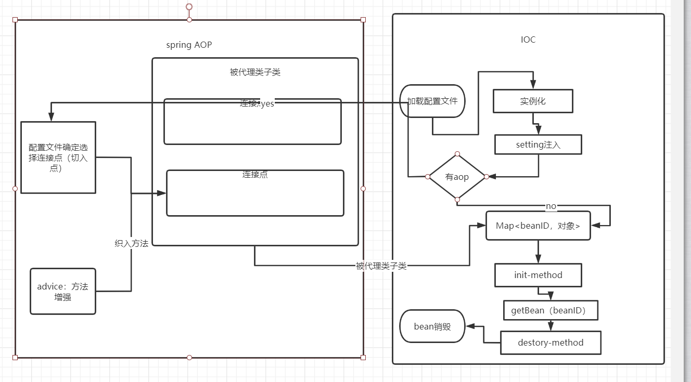
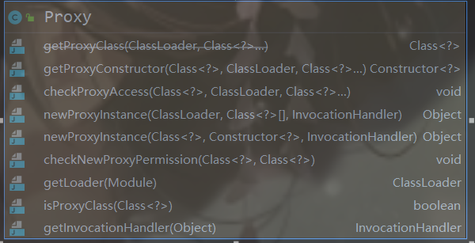
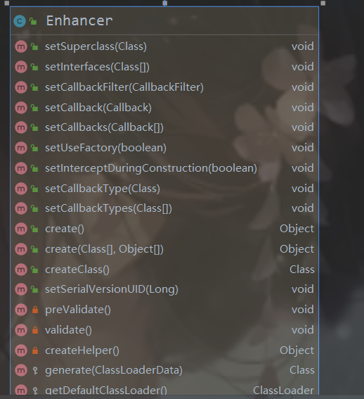

# spring AOP

> Aspect Oriented Programing ⾯向切⾯编程，相⽐较 oop ⾯向对象编程来说，Aop关注的不再是程 序代码中某个类，某些⽅法，⽽aop考虑的更多的是⼀种⾯到⾯的切⼊，即层与层之间的⼀种切⼊，所 以称之为切⾯。联想⼤家吃的汉堡（中间夹⾁）。那么aop是怎么做到拦截整个⾯的功能呢？考虑前⾯ 学到的servlet filter /* 的配置 ，实际上也是aop 的实现。



## 作用

> ​       AOP主要应⽤于⽇志记录，性能统计，安全控制,事务处理等⽅⾯，实现公共功能性的重复使⽤。

## 特点

> 1. 降低模块与模块之间的耦合度，提⾼业务代码的聚合度。（⾼内聚低耦合） 
> 2.  提⾼了代码的复⽤性。 
> 3. 提⾼系统的扩展性。（⾼版本兼容低版本） 
> 4.  可以在不影响原有的功能基础上添加新的功能

## 底层实现

**动态代理（JDK + CGLIB）**：

1. ⽬标对象不固定 
2.  在应⽤程序执⾏时动态创建⽬标对象 
3.  代理对象会增强⽬标对象的⾏为

### JDK实现动态代理

**注：JDK动态代理的⽬标对象必须有接⼝实现**



1. **newProxyInstance**

   ```
   /*
    返回⼀个指定接⼝的代理类的实例⽅法调⽤分派到指定的调⽤处理程序。 (返回代理对象)
    loader：⼀个ClassLoader对象，定义了由哪个ClassLoader对象来对⽣成的代理对象进⾏加载
    interfaces：⼀个Interface对象的数组，表示的是我将要给我需要代理的对象提供⼀组什么接
   ⼝，如果 我提供了⼀组接⼝给它，那么这个代理对象就宣称实现了该接⼝(多态)，这样我
   就能调⽤这 组接⼝中的⽅法了
    h：⼀个InvocationHandler接⼝，表示代理实例的调⽤处理程序实现的接⼝。每个代理实例都具有
   ⼀个 关联的调⽤处理程序。对代理实例调⽤⽅法时，将对⽅法调⽤进⾏编码并将其指派到它的调⽤
   处理程序 的 invoke ⽅法（传⼊InvocationHandler接⼝的⼦类）
   */
   public static Object newProxyInstance(ClassLoader loader,
    Class<?>[] interfaces,
    InvocationHandler h)
   
   ```

   

2. **代码**

   ```
   //接口一
   public interface LaoWang{
        void done();
   }
   //接口二
   public interface SellCar{
       void sell();
   }
   //被代理类
   public class Psl implements LaoWang,SellCar{
       @Override
       public void done() {
           System.out.println("老王(皮思亮)事发,被打了");
       }
   
       @Override
       public void sell() {
           System.out.println("买车给同桌，不给钱");
       }
   }
   //代理
   public class JDKProxy{
       public static void main(String[] args) {
           LaoWang psl=new Psl();
           //获得代理
           Object poxy=poxy(psl);
           LaoWang laoWang=(LaoWang)poxy;
           laoWang.done();
           SellCar sellCar=(SellCar)poxy;
           sellCar.sell();
       }
       //jdk动态代理:基于实现接口
       public static Object poxy(Object obj){
           Object poxy= Proxy.newProxyInstance(JDKProxy.class.getClassLoader(), obj.getClass().getInterfaces(), new InvocationHandler() {
               @Override
               public Object invoke(Object proxy, Method method, Object[] args) throws Throwable {
                   if(method.getName().equals("done")){
                       method.invoke(obj,args);
                       System.out.println("其实他同桌干的");
                   }else if(method.getName().equals("sell")){
                       method.invoke(obj, args);
                       System.out.println("他同桌笑了");
                   }else {
                       System.out.println("null");
                   }
                   return null;
               }
           });
           return poxy;
       }
   
   }
   
   ```

### cglib动态代理

**可以不实现接口**

> ​      JDK的动态代理机制只能代理实现了接⼝的类，⽽不能实现接⼝的类就不能使⽤JDK的动态代理， cglib是针对类来实现代理的，它的原理是对指定的⽬标类⽣成⼀个⼦类，并覆盖其中⽅法实现增强，但 因为采⽤的是继承，所以不能对final修饰的类进⾏代理。

   

   **导包**

   ```
       <!-- https://mvnrepository.com/artifact/cglib/cglib -->
       <dependency>
         <groupId>cglib</groupId>
         <artifactId>cglib</artifactId>
         <version>3.3.0</version>
       </dependency>
   ```

   **使用**

   继承被代理类，再传入一个方法增强类（实现MethodInterceptor），对被代理类进行方法增强

   1. 获取Enhancer对象
   2. 调用setSuperclass，传入被代理class对象，让代理类继承被代理对象
      3. 调用setCallback，传入方法增强类
      4. 调用create（），返回代理对象

   **代码**

   ```
   public class CglibPoxy implements MethodInterceptor {
       public static void main(String[] args) {
           CglibPoxy cglibPoxy = new CglibPoxy(new Psl());
           Psl poxy = (Psl) cglibPoxy.poxy();
           poxy.done();
           poxy.sell();
       }
       private Object bePoxy;
       public CglibPoxy(Object bePoxy){
           this.bePoxy=bePoxy;
       }
       public  Object poxy(){
           Enhancer enhancer=new Enhancer();
           enhancer.setSuperclass(bePoxy.getClass());
           enhancer.setCallback(this);
           return enhancer.create();
       }
   
       @Override
       public Object intercept(Object o, Method method, Object[] objects, MethodProxy methodProxy) throws Throwable {
           System.out.println("cglib代理");
           //代理对象方法
           methodProxy.invoke(bePoxy,objects);
           //执行后
           System.out.println("方法执行完");
           return null;
       }
   }
   ```

 

### 区别

> * JDK动态代理实现接⼝，Cglib动态代理继承思想 
>
> * JDK动态代理（⽬标对象存在接⼝时）执⾏效率⾼于Ciglib 
>
> * 如果⽬标对象有接⼝实现，选择JDK代理，如果没有接⼝实现选择Cglib代理

## 概念

**Joinpoint（连接点）** 

> 被拦截到的每个点，spring中指被拦截到的每⼀个⽅法，spring aop⼀个连接点即代表⼀个⽅法的执 ⾏。 

 **Pointcut（切⼊点）** 

> 对连接点进⾏拦截的定义（匹配规则定义 规定拦截哪些⽅法，对哪些⽅法进⾏处理），spring 有专 ⻔的表达式语⾔定义。

 **Advice（通知）** 

> 拦截到每⼀个连接点即（每⼀个⽅法）后所要做的操作 
>
> 1. 前置通知 （前置增强）— before() 执⾏⽅法前通知 
> 2.  返回通知（返回增强）— afterReturn（pointcut，returning） ⽅法正常结束返回后的通知 ，returning为返回对象。
> 3.  异常抛出通知（异常抛出增强）— afetrThrow(pointcut，throwing)，throwing值为抛出异常对象。
> 4.  最终通知 — after ⽆论⽅法是否发⽣异常，均会执⾏该通知。
> 5. 环绕通知 — around 包围⼀个连接点（join point）的通知，如⽅法调⽤。这是最强⼤的⼀种通知 类型。 环绕通知可以在⽅法调⽤前后完成⾃定义的⾏为。它也会选择是否继续执⾏连接点或直接 返回它们⾃⼰的返回值或抛出异常来结束执⾏。

 **Aspect（切⾯）** 

> 切⼊点与通知的结合，决定了切⾯的定义，切⼊点定义了要拦截哪些类的哪些⽅法，通知则定义了拦 截过⽅法后要做什么，切⾯则是横切关注点的抽象，与类相似，类是对物体特征的抽象，切⾯则是横切 关注点抽象。 

**Target（⽬标对象）** 

> 被代理的⽬标对象 

 **Weave（织⼊）** 

> 将切⾯应⽤到⽬标对象并⽣成代理对象的这个过程即为织⼊ 

**Introduction（引⼊）** 

> 在不修改原有应⽤程序代码的情况下，在程序运⾏期为类动态添加⽅法或者字段的过程称为引⼊

## 实现

### 环境搭建

**maven依赖**

```
<!-- 添加Spring框架的核⼼依赖 -->
    <dependency>
      <groupId>org.springframework</groupId>
      <artifactId>spring-context</artifactId>
      <version>5.2.4.RELEASE</version>
    </dependency>
    <!--Spring AOP-->
    <dependency>
      <groupId>org.aspectj</groupId>
      <artifactId>aspectjweaver</artifactId>
      <version>1.8.9</version>
    </dependency>
```

**xml约束，启用aop注解**

```
<?xml version="1.0" encoding="UTF-8"?>
<beans xmlns="http://www.springframework.org/schema/beans"
       xmlns:xsi="http://www.w3.org/2001/XMLSchema-instance"
       xmlns:context="http://www.springframework.org/schema/context"
       xmlns:aop="http://www.springframework.org/schema/aop"
       xsi:schemaLocation="http://www.springframework.org/schema/beans
 https://www.springframework.org/schema/beans/spring-beans.xsd http://www.springframework.org/schema/context https://www.springframework.org/schema/context/spring-context.xsd
 http://www.springframework.org/schema/aop
 http://www.springframework.org/schema/aop/spring-aop.xsd">
    <context:component-scan base-package="com.lwf"></context:component-scan>
    <context:annotation-config></context:annotation-config>
    <aop:aspectj-autoproxy/>
</beans>
```

### 代码

```
/**
* 切⾯
* 切⼊点和通知的抽象 （与⾯向对象中的 类 相似）
* 定义 切⼊点和通知 （切⼊点定义了要拦截哪些类的哪些⽅法，通知则定义了拦截过⽅法后要做什
么）
*/
@Aspect// 声明当前类是⼀个切⾯
@Component
public class MapperAsp {
 /**
 * 声明前置通知 并将通知应⽤到定义的切⼊点上
 * ⽬标类⽅法执⾏前 执⾏该通知
 *
 */
    @Before("select()")
    public void before(){
        System.out.println("执行 dao前");
    }
/**
 * 切⼊点：
 * 匹配规则。规定什么⽅法被拦截、需要处理什么⽅法
 * 定义切⼊点
 * @Pointcut("匹配规则")
 *
 * Aop 切⼊点表达式简介
 * 1. 执⾏任意公共⽅法：
 * execution(public *(..))
 * 2. 执⾏任意的set⽅法
 * execution(* set*(..))
 * 3. 执⾏com.xxxx.service包下任意类的任意⽅法
 * execution(* com.xxxx.service.*.*(..))
 * 4. 执⾏com.xxxx.service 包 以及⼦包下任意类的任意⽅法
 * execution(* com.xxxx.service..*.*(..))
 *
 * 注：表达式中的第⼀个* 代表的是⽅法的修饰范围
 * 可选值：private、protected、public （* 表示所有范围）
 */
    @Pointcut("execution (* com.lwf.mapper..*.*(..) )")
    public void select(){ }
 /**
 * 声明最终通知 并将通知应⽤到定义的切⼊点上
 * ⽬标类⽅法（⽆异常或有异常）执⾏后 执⾏该通知
 *
 */
    @After("select()")
    public void after(){
        System.out.println("after  dao");
    }
/**
 * 声明返回通知 并将通知应⽤到定义的切⼊点上
 * ⽬标类⽅法（⽆异常）执⾏后 执⾏该通知
 *
 */
    @AfterReturning("select()")
    public void finish(){
        System.out.println("finish");
    }
 /**
 * 声明异常通知 并将通知应⽤到定义的切⼊点上
 * ⽬标类⽅法出现异常时 执⾏该通知
 */
    @AfterThrowing("select()")
    public void err(){
        System.out.println("error");
    }
    
/**
 * 声明环绕通知 并将通知应⽤到切⼊点上
 * ⽅法执⾏前后 通过环绕通知定义相应处理
 * 需要通过显式调⽤对应的⽅法，否则⽆法访问指定⽅法 (pjp.proceed();)
 * @param pjp
 * @return
 */
 @Around(value = "select()")
 public Object around(ProceedingJoinPoint pjp) {
      System.out.println("前置通知...");
      Object object = null;
      try {
       object = pjp.proceed();
       System.out.println(pjp.getTarget() + "======" +pjp.getSignature());
      // System.out.println("返回通知...");
      } catch (Throwable throwable) {
       throwable.printStackTrace();
       System.out.println("异常通知...");
        System.out.println("最终通知...");
        return object;
 }
}
```

## Spring AOP总结 

 **代理模式实现三要素** 

> 1. 接⼝定义 
> 2.  ⽬标对象与代理对象必须实现统⼀接⼝ 
> 3.  代理对象持有⽬标对象的引⽤ 增强⽬标对象⾏为 

**代理模式实现分类以及对应区别** 

> 1. 静态代理：⼿动为⽬标对象制作代理对象，即在程序编译阶段完成代理对象的创建 
> 2. 动态代理：在程序运⾏期动态创建⽬标对象对应代理对象。 
> 3.  jdk动态代理：被代理⽬标对象必须实现某⼀或某⼀组接⼝ 实现⽅式 通过回调创建代理对象。 
> 4.  cglib 动态代理：被代理⽬标对象可以不必实现接⼝，继承的⽅式实现。 动态代理相⽐较静态代理，提⾼开发效率，可以批量化创建代理，提⾼代码复⽤率。 

 **Aop 理解** 

> 1. ⾯向切⾯，相⽐oop 关注的是代码中的层 或⾯
> 2.  解耦，提⾼系统扩展性 
> 3. 提⾼代码复⽤ 

 ***Aop 关键词***

> 1. 连接点:每⼀个⽅法 
> 2.  切⼊点:匹配的⽅法集合
> 3.  切⾯：连接点与切⼊点的集合决定了切⾯，横切关注点的抽象
> 4. 通知:⼏种通知 
> 5. ⽬标对象:被代理对象 
> 6. 织⼊：程序运⾏期将切⾯应⽤到⽬标对象 并⽣成代理对象的过程 
> 7. 引⼊:在不修改原始代码情况下，在程序运⾏期为程序动态引⼊⽅法或字段的过程