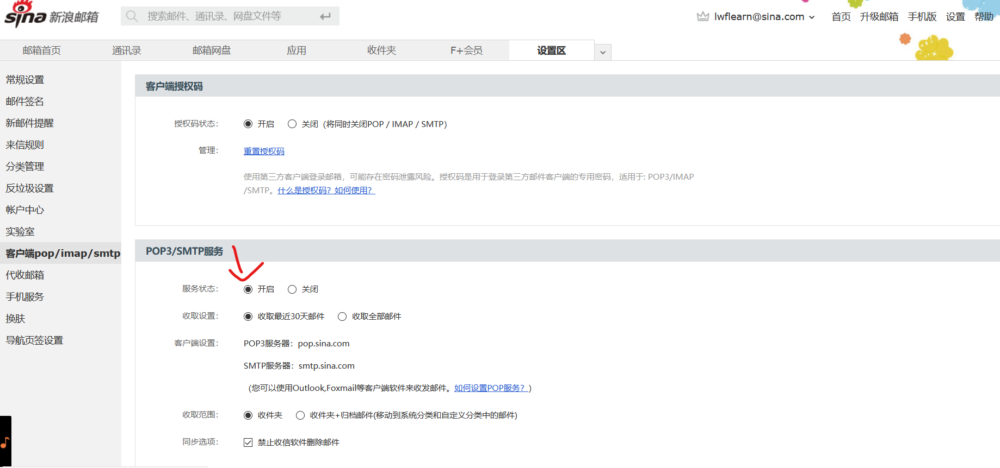
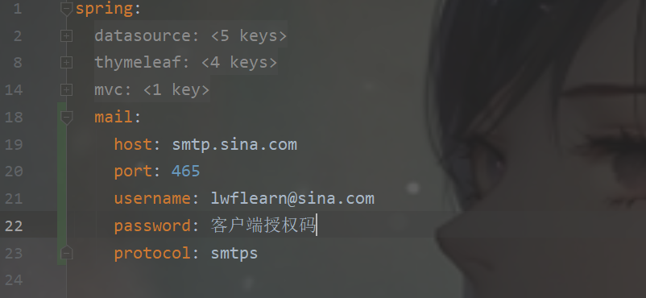
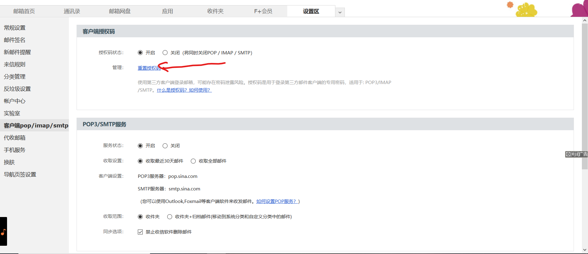

# spring boot发邮件

<hr />

## 注册一个邮箱,开启POP3/SMTP




## jar包

<a href="https://mvnrepository.com/search">maven仓库</a>搜索：[Spring Boot Starter Mail](https://mvnrepository.com/artifact/org.springframework.boot/spring-boot-starter-mail)

maven

```xml
<!-- https://mvnrepository.com/artifact/org.springframework.boot/spring-boot-starter-mail -->
<dependency>
    <groupId>org.springframework.boot</groupId>
    <artifactId>spring-boot-starter-mail</artifactId>
    <version>2.3.5.RELEASE</version>
</dependency>

```

## 配置springmail连接信息



```
host：smtp服务器地址
```

> qq，163，新浪的都可以
>
> 新浪SMTP服务器：smtp.sina.com
>
> qqSMTP服务器：smtp.qq.com
>
> 163：smtp.163.com

```
port：端口
```

> qq:  465 或587
>
> 新浪：465
>
> 163：我猜也是465

```
username : 邮箱地址
```

> 你的邮箱地址

```
password ： 客户端授权码
```

> 客户端授权码适用于任何通过IMAP/POP3/SMTP协议登录邮箱的客户端。用于替换在客户端设置中的“登录密码”。新浪邮箱官方手机客户端app，仍然使用邮箱登录密码登录。
>
> **所以spring boot配置文件属性：*spring.mail.password*  值要为客户端授权码，使用密码会报错：**
>
> <font color="red">org.springframework.mail.MailAuthenticationException: Authentication failed</font>
>
> 
>
> 

## 步骤

1. **获取JavaMailSender:**

   ```
   @Autowired
   private JavaMailSender sender;
   ```

   >  
   >
   > ```
   > //获取空白的邮件体
   > MimeMessage createMimeMessage();
   > //信件内容输入流构成邮件体
   > MimeMessage createMimeMessage(InputStream var1) throws MailException;
   > //发送单个邮件
   > void send(MimeMessage var1) throws MailException;
   > //多个
   > void send(MimeMessage... var1) throws MailException;
   > //下面两个没用过
   > void send(MimeMessagePreparator var1) throws MailException;
   > void send(MimeMessagePreparator... var1) throws MailException;
   > 
   > ```
   >
   > 

    

2. **获取MimeMessage**

   ```
    MimeMessage mimeMessage =sender.createMimeMessage();
   ```

   > MimeMessage:邮件消息体

3. **获取MimeMessageHelper**

   ```
   //封装消息体
   MimeMessageHelper helper=new MimeMessageHelper(mimeMessage);
   ```

   ```
   //取出消息体
   helper.getMimeMessage();
   ```

   设置消息体

   > ```
   >  //你的邮件地址
   >  helper.setFrom(from);
   >  //目标邮件地址
   >  helper.setTo(to);
   >  //邮件主题
   >  helper.setSubject(submit);
   >  //邮件内容 重载方法，后面参数为是否支持html 
   >  helper.setText(compnent,true);
   > ```
   >
   > 

4. **发送**(参数类型为MimeMessage)

   > ```
   > sender.send(helper.getMimeMessage());
   > ```

      ## 代码及测试

```
@Component
public class SpringMail {
    @Autowired
    private JavaMailSender sender;
    private static final Logger loger= LoggerFactory.getLogger(SpringMail.class);
    @Value("${spring.mail.username}")
    private String from;
    public void setSender(String to,String submit,String compnent) {
        MimeMessage mimeMessage =sender.createMimeMessage();
        MimeMessageHelper helper=new MimeMessageHelper(mimeMessage);
        try {
            helper.setFrom(from);
            helper.setTo(to);
            helper.setSubject(submit);
            //支持html
            helper.setText(compnent,true);
            sender.send(helper.getMimeMessage());
        } catch (MessagingException e) {
            loger.error("发送失败"+e.getMessage());
        }
    }
}
```

**测试部分：**

```
@Autowired
 private SpringMail mail;
 @Test
  public void send(){
  mail.setSender("519155720@qq.com","helloWorld","hello my first mail!");
}
```

使用thymeleaf引擎发送含有特定值的页面

```
@Autowired
        private SpringMail mail;
        @Autowired
        TemplateEngine templateEngine;
        @Test
        public void send() throws MalformedURLException {
            Context context=new Context();
            context.setVariable("name", "憨批");
            String process = templateEngine.process("/mail/mail.html", context);
            mail.setSender("632593482@qq.com","helloWorld",process);

        }
```

