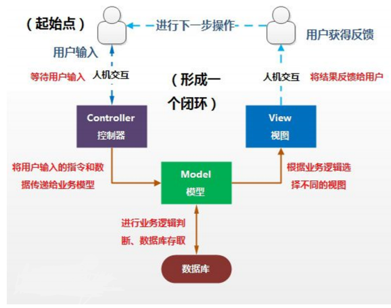
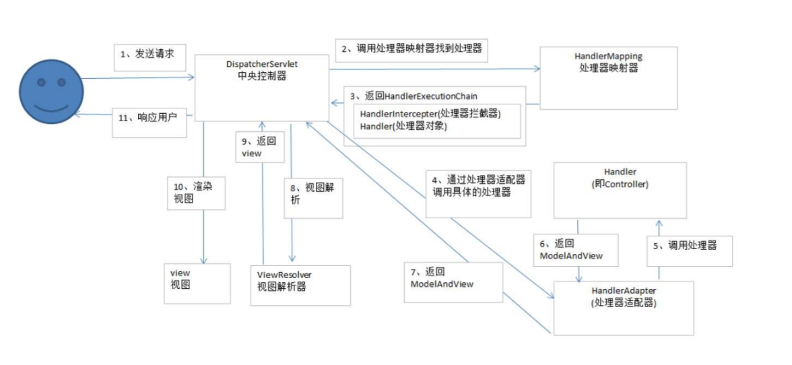
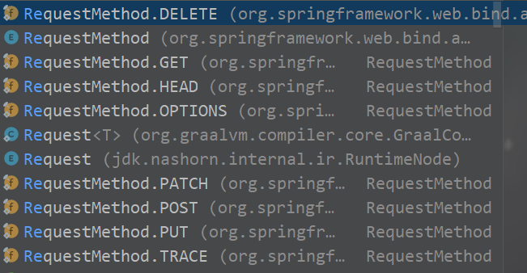
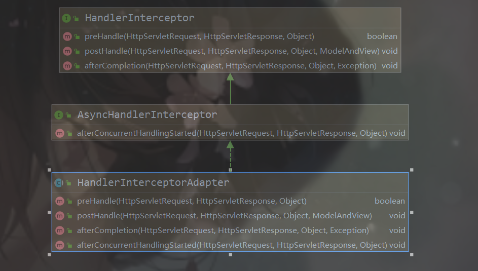
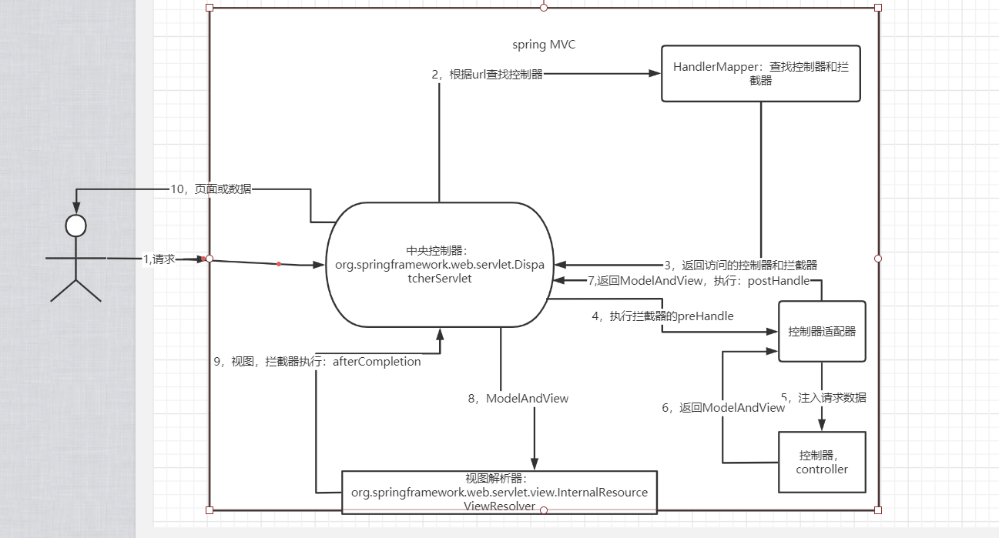

# spring mvc

[TOC]


## 什么是mvc

> ​       模型-视图-控制器（MVC）是⼀个众所周知的以设计界⾯应⽤程序为基础的设计思想。它主要通过分 离模型、视图及控制器在应⽤程序中的⻆⾊将业务逻辑从界⾯中解耦。通常，模型负责封装应⽤程序数 据在视图层展示。视图仅仅只是展示这些数据，不包含任何业务逻辑。控制器负责接收来⾃⽤户的请 求，并调⽤后台服务（service或者dao）来处理业务逻辑。处理后，后台业务层可能会返回了⼀些数据 在视图层展示。控制器收集这些数据及准备模型在视图层展示。MVC模式的核⼼思想是将业务逻辑从界 ⾯中分离出来，允许它们单独改变⽽不会相互影响。



## 3问

**什么是spring mvc**

> ​      Spring MVC是Spring家族中的⼀个web成员，它是⼀种基于Java的实现了Web MVC设计思想的请求 驱动类型的轻量级Web框架，即使⽤了MVC架构模式的思想，将web层进⾏职责解耦，基于请求驱动指 的就是使⽤请求-响应模型，框架的⽬的就是帮助我们简化开发，Spring MVC也是要简化我们⽇常Web 开发的。
>
> ​     Spring MVC是服务到⼯作者思想的实现。前端控制器是DispatcherServlet；应⽤控制器拆为处理器 映射器(Handler Mapping)进⾏处理器管理和视图解析器(View Resolver)进⾏视图管理；⽀持本地化/国 际化（Locale）解析及⽂件上传等；提供了⾮常灵活的数据验证、格式化和数据绑定机制；提供了强⼤ 的约定⼤于配置（惯例优先原则）的契约式编程⽀持。

**spring mvc能做什么**

> 1. 让我们能⾮常简单的设计出⼲净的Web层； 
> 2.  进⾏更简洁的Web层的开发； 
> 3.  天⽣与Spring框架集成（如IOC容器、AOP等）； 
> 4.  提供强⼤的约定⼤于配置的契约式编程⽀持； 
> 5.  能简单的进⾏Web层的单元测试； 
> 6. ⽀持灵活的URL到⻚⾯控制器的映射； 
> 7.  ⾮常容易与其他视图技术集成，如jsp、Velocity、FreeMarker等等，因为模型数据不放在特定的 API⾥，⽽是放在⼀个Model⾥（Map数据结构实现，因此很容易被其他框架使⽤）；
> 8.  ⾮常灵活的数据验证、格式化和数据绑定机制，能使⽤任何对象进⾏数据绑定，不必实现特定框架 的API； 
> 9.  ⽀持灵活的本地化等解析； 
> 10.  更加简单的异常处理； 
> 11. 对静态资源的⽀持；
> 12. ⽀持Restful⻛格。

**spring mvc怎么运行的**

**spring mvc返回视图的过程相当于请求转发**



> ​        Spring MVC框架也是⼀个基于请求驱动的Web框架，并且使⽤了前端控制器模式（是⽤来提供⼀个 集中的请求处理机制，所有的请求都将由⼀个单⼀的处理程序处理来进⾏设计，再根据请求映射规则分 发给相应的⻚⾯控制器（动作/处理器）进⾏处理。⾸先让我们整体看⼀下Spring MVC处理请求的流 程： 
>
> 1. ⾸先⽤户发送请求,请求被SpringMvc前端控制器（DispatherServlet）捕获；
> 2. . 前端控制器(DispatherServlet)对请求URL解析获取请求URI,根据URI, 调⽤HandlerMapping；
> 3.  前端控制器(DispatherServlet)获得返回的HandlerExecutionChain（包括Handler对象以及 Handler对象对应的拦截器）；
> 4. DispatcherServlet 根据获得的HandlerExecutionChain，选择⼀个合适的HandlerAdapter。（附 注：如果成功获得HandlerAdapter后，此时将开始执⾏拦截器的preHandler(...)⽅法）； 
> 5.  HandlerAdapter根据请求的Handler适配并执⾏对应的Handler；HandlerAdapter(提取Request 中的模型数据，填充Handler⼊参，开始执⾏Handler（Controller)。 在填充Handler的⼊参过程 中，根据配置，Spring将做⼀些额外的⼯作： HttpMessageConveter： 将请求消息（如Json、xml等数据）转换成⼀个对象，将对象转换为指 定的响应信息。 数据转换：对请求消息进⾏数据转换。如String转换成Integer、Double等数据格式化： 数据格式化。 如将字符串转换成格式化数字或格式化⽇期等 数据验证： 验证数据的有效性（⻓度、格式等），验证结果存储到BindingResult或Error中）
> 6.  Handler执⾏完毕，返回⼀个ModelAndView(即模型和视图)给HandlerAdaptor
> 7. HandlerAdaptor适配器将执⾏结果ModelAndView返回给前端控制器。
> 8.  前端控制器接收到ModelAndView后，请求对应的视图解析器。 
> 9.  视图解析器解析ModelAndView后返回对应View; 
> 10. 渲染视图并返回渲染后的视图给前端控制器。 
> 11. 最终前端控制器将渲染后的⻚⾯响应给⽤户或客户端

## 依赖

**pom.xml**

```
<?xml version="1.0" encoding="UTF-8"?>

<project xmlns="http://maven.apache.org/POM/4.0.0" xmlns:xsi="http://www.w3.org/2001/XMLSchema-instance"
  xsi:schemaLocation="http://maven.apache.org/POM/4.0.0 http://maven.apache.org/xsd/maven-4.0.0.xsd">
  <modelVersion>4.0.0</modelVersion>

  <groupId>com.lwf</groupId>
  <artifactId>11_24springMVC</artifactId>
  <version>1.0-SNAPSHOT</version>
  <packaging>war</packaging>

  <name>11_24springMVC Maven Webapp</name>
  <!-- FIXME change it to the project's website -->
  <url>http://www.example.com</url>

  <properties>
    <project.build.sourceEncoding>UTF-8</project.build.sourceEncoding>
    <maven.compiler.source>1.8</maven.compiler.source>
    <maven.compiler.target>1.8</maven.compiler.target>
  </properties>

  <dependencies>
    <dependency>
      <groupId>junit</groupId>
      <artifactId>junit</artifactId>
      <version>4.12</version>
      <scope>test</scope>
    </dependency>
    <dependency>
      <groupId>com.alibaba</groupId>
      <artifactId>fastjson</artifactId>
      <version>1.2.75</version>
    </dependency>
      <dependency>
          <groupId>org.projectlombok</groupId>
          <artifactId>lombok</artifactId>
          <version>1.18.16</version>
      </dependency>
    <!-- spring web -->
    <dependency>
      <groupId>org.springframework</groupId>
      <artifactId>spring-web</artifactId>
      <version>5.2.4.RELEASE</version>
    </dependency>
    <!-- spring mvc -->
    <dependency>
      <groupId>org.springframework</groupId>
      <artifactId>spring-webmvc</artifactId>
      <version>5.2.4.RELEASE</version>
    </dependency>
    <!-- web servlet -->
    <dependency>
      <groupId>javax.servlet</groupId>
      <artifactId>javax.servlet-api</artifactId>
      <version>3.0.1</version>
    </dependency>

  </dependencies>
  <build>
  <plugins>
  <!-- 编译环境插件 -->
  <plugin>
    <groupId>org.apache.maven.plugins</groupId>
    <artifactId>maven-compiler-plugin</artifactId>
    <version>2.3.2</version>
    <configuration>
      <source>1.8</source>
      <target>1.8</target>
      <encoding>UTF-8</encoding>
    </configuration>
  </plugin>
  <!-- jetty插件 -->
  <plugin>
  <groupId>org.eclipse.jetty</groupId>
  <artifactId>jetty-maven-plugin</artifactId>
  <version>9.4.27.v20200227</version>
  <configuration>
    <scanIntervalSeconds>10</scanIntervalSeconds>
    <!-- 设置端⼝ -->
    <httpConnector>
      <port>8085</port>
    </httpConnector>
    <!-- 设置项⽬路径 -->
    <webAppConfig>
      <contextPath>/springmvc01</contextPath>
    </webAppConfig>
  </configuration>
  </plugin>
  </plugins>
  </build>
</project>

```

## 启动配置（由web容器加载spring配置文件）

**web.xml**

```
<?xml version="1.0" encoding="UTF-8"?>
<web-app id="WebApp_ID" version="3.0"
         xmlns="http://java.sun.com/xml/ns/javaee"
         xmlns:xsi="http://www.w3.org/2001/XMLSchema-instance"
         xsi:schemaLocation="http://java.sun.com/xml/ns/javaee
 http://java.sun.com/xml/ns/javaee/web-app_3_0.xsd">
  <!-- 编码过滤 utf-8 -->
  <filter>
    <description>char encoding filter</description>
    <filter-name>encodingFilter</filter-name>
    <filter-class>org.springframework.web.filter.CharacterEncodingFilter</filter-class>
    <init-param>
      <param-name>encoding</param-name>
      <param-value>UTF-8</param-value>
    </init-param>
  </filter>
  <filter-mapping>
    <filter-name>encodingFilter</filter-name>
    <url-pattern>/*</url-pattern>
  </filter-mapping>
  <!-- servlet请求分发器 -->
  <servlet>
    <servlet-name>springMvc</servlet-name>
    <servlet-class>org.springframework.web.servlet.DispatcherServlet</servlet-class>
    <init-param>
      <param-name>contextConfigLocation</param-name>
      <param-value>classpath:spring.xml</param-value>
    </init-param>
    <!-- 表示启动容器时初始化该Servlet -->
    <load-on-startup>1</load-on-startup>
  </servlet>
  <servlet-mapping>
  <servlet-name>springMvc</servlet-name>
  <!-- 这是拦截请求， "/"代表拦截所有请求，"*.do"拦截所有.do请求 -->
   <url-pattern>/</url-pattern>
<!--    <url-pattern>*.do</url-pattern>-->
  </servlet-mapping>
  <display-name>Archetype Created Web Application</display-name>
</web-app>
```

## 简单展现

```
@Data
@NoArgsConstructor
@AllArgsConstructor
public class Test {
    private String name;
    private String city;
}

@Service
public class TestService {
    private List<Test> user=new ArrayList<>();
    {
        Test test=new Test("lwf","jx");
        Test test1=new Test("lwf1","jx");
        user.add(test);
        user.add(test1);
    }
    public List<Test> tests(){return user;}
}

@RestController
public class TestController {
    @Autowired
    private TestService testService;
    /*
    返回视图加数据
    */
    @RequestMapping("/test")
    public ModelAndView test(){
        ModelAndView modelAndView=new ModelAndView();
        modelAndView.addObject("one", testService.tests().get(0));
        modelAndView.setViewName("Test");
        return modelAndView;
    }
}
```

## @RequestMapper

**参数：**

**value：该处理器映射的路径可以单个url，也可以多个参数**

```
//返回对象以json方式
@RestController
//返回视图名
//@Controller
public class TestController {
    @Autowired
    private TestService testService;
    //value属性可以一个或多个url。value属性默认，所以“value=”可不写；类似与servlet的url，都是1对多的关系
    @RequestMapping({"/test","tes"})
   // @RequestMapping(value = {"/test","tes"})
    //@RequestMapping("/test")
    public ModelAndView test(){
        ModelAndView modelAndView=new ModelAndView();
        modelAndView.addObject("one", testService.tests().get(0));
        modelAndView.setViewName("Test");
        return modelAndView;
    }
}
```

**params：**根据请求url确定访问哪个控制器

```
/**
 * 通过参数名称访问
 * 通过参数的形式访问
 * 访问地址：
 * http://ip:port/springmvc/url?test06
 * @return
 */
@RequestMapping(params = "test06")
public ModelAndView test06(){
 ModelAndView modelAndView = new ModelAndView();
 modelAndView.addObject("hello","test06");
 modelAndView.setViewName("hello");
 return modelAndView;
}
```

**method：对应的请求方式（get，post，put.......），参数为RequestMethod枚举对象（delete,get,head,options,patch,post,put,trace**）

有多个参数，前缀（value，method）必须加（其实是idea帮我加的）。

```
@RequestMapping(value = {"/test","tes"},method = RequestMethod.POST)
```



***RequestMapper是全能注解，下面有针对各种请求的注解***

```
//delete请求，两种注解方式效果相同
@RequestMapping(value = "/test",method = RequestMethod.DELETE)
@DeleteMapping(value = "/test")

//同理
 @GetMapping("/test")
 @RequestMapping(value = "/test",method = RequestMethod.GET)
 
// post
@PostMapping("/test")
 @RequestMapping(value = "/test",method = RequestMethod.POST)
 
 //put
@RequestMapping(value = "/test",method = RequestMethod.PUT)
@PutMapping("/test")
```

8中请求方式，其它几种类似上面的，这里我们只列举这上面几种，上述4种请求方式对应了对持久层的curd（增删改查操作），合理使用这4种请求也是**RestFul**风格编码方式的基石；

***RestFul（spring mvc扩展）***

> RESTful架构应该遵循统一接口原则，统一接口包含了一组受限的预定义的操作，不论什么样的资源，都是通过使用相同的接口进行资源的访问。接口应该使用标准的HTTP方法如GET，PUT和POST，并遵循这些方法的语义。
>
> 如果按照HTTP方法的语义来暴露资源，那么接口将会拥有安全性和幂等性的特性，例如GET和HEAD请求都是安全的， 无论请求多少次，都不会改变服务器状态。而GET、HEAD、PUT和DELETE请求都是幂等的，无论对资源操作多少次， 结果总是一样的，后面的请求并不会产生比第一次更多的影响。
>
> 下面列出了GET，DELETE，PUT和POST的典型用法:
>
> ## GET
>
> - 安全且幂等
> - 获取表示
> - 变更时获取表示（缓存）
>
> - 200（OK） - 表示已在响应中发出
>
> - 204（无内容） - 资源有空表示
> - 301（Moved Permanently） - 资源的URI已被更新
> - 303（See Other） - 其他（如，负载均衡）
> - 304（not modified）- 资源未更改（缓存）
> - 400 （bad request）- 指代坏请求（如，参数错误）
> - 404 （not found）- 资源不存在
> - 406 （not acceptable）- 服务端不支持所需表示
> - 500 （internal server error）- 通用错误响应
> - 503 （Service Unavailable）- 服务端当前无法处理请求
>
> ## POST
>
> - 不安全且不幂等
> - 使用服务端管理的（自动产生）的实例号创建资源
> - 创建子资源
> - 部分更新资源
> - 如果没有被修改，则不过更新资源（乐观锁）
>
> - 200（OK）- 如果现有资源已被更改
>
> - 201（created）- 如果新资源被创建
> - 202（accepted）- 已接受处理请求但尚未完成（异步处理）
> - 301（Moved Permanently）- 资源的URI被更新
> - 303（See Other）- 其他（如，负载均衡）
> - 400（bad request）- 指代坏请求
> - 404 （not found）- 资源不存在
> - 406 （not acceptable）- 服务端不支持所需表示
> - 409 （conflict）- 通用冲突
> - 412 （Precondition Failed）- 前置条件失败（如执行条件更新时的冲突）
> - 415 （unsupported media type）- 接受到的表示不受支持
> - 500 （internal server error）- 通用错误响应
> - 503 （Service Unavailable）- 服务当前无法处理请求
>
> ## PUT
>
> - 不安全但幂等
> - 用客户端管理的实例号创建一个资源
> - 通过替换的方式更新资源
> - 如果未被修改，则更新资源（乐观锁）
>
> - 200 （OK）- 如果已存在资源被更改
>
> - 201 （created）- 如果新资源被创建
> - 301（Moved Permanently）- 资源的URI已更改
> - 303 （See Other）- 其他（如，负载均衡）
> - 400 （bad request）- 指代坏请求
> - 404 （not found）- 资源不存在
> - 406 （not acceptable）- 服务端不支持所需表示
> - 409 （conflict）- 通用冲突
> - 412 （Precondition Failed）- 前置条件失败（如执行条件更新时的冲突）
> - 415 （unsupported media type）- 接受到的表示不受支持
> - 500 （internal server error）- 通用错误响应
> - 503 （Service Unavailable）- 服务当前无法处理请求
>
> ## DELETE
>
> - 不安全但幂等
> - 删除资源
>
> - 200 （OK）- 资源已被删除
>
> - 301 （Moved Permanently）- 资源的URI已更改
> - 303 （See Other）- 其他，如负载均衡
> - 400 （bad request）- 指代坏请求
> - 404 （not found）- 资源不存在
> - 409 （conflict）- 通用冲突
> - 500 （internal server error）- 通用错误响应
> - 503 （Service Unavailable）- 服务端当前无法处理请求

**简单地总结，RestFul就是，同一个请求url地址，使用请求方式区分要进行增删改查的哪种操作，在巨大的项目中，这样避免了api接口爆炸。**

> ***举个栗子***
>
> **url**:   http://localhost:8080/springMVC/user
>
> **添加**: url: http://localhost:8080/springMVC/user    method:post    User{name:"lwf",age:18,desc:"帅到太阳都躲起来"}
>
> **删除**: url: http://localhost:8080/springMVC/user    method:delete    User{name:"lwf",age:18,desc:"帅到太阳都躲起来"}
>
>  **改**：url: http://localhost:8080/springMVC/user    method:put    User{name:"lwf",age:18,desc:"帅到太阳都躲起来"}
>
> **查**    ：url: http://localhost:8080/springMVC/user/{name}    method:get   

**位置**

1，方法上（应用RestFul风格）

2，控制器上，设置访问方法上的Maping映射的根路径

## 参数绑定

1. ### 参数名与前端传的数据name属性值相等

   > ***基本类型加字符串***
   >
   > 请求: http://localhost:8080/springmvc/test?name=lwf&age=18&desc='帅'
   >
   > ```
   > @RequestMapping("/test")
   >  public ModelAndView test(String name,Integer age,String desc){
   >      ModelAndView modelAndView=new ModelAndView();
   >      System.out.println("welcome:"+name+desc);
   >      modelAndView.addObject("one", testService.tests().get(0));
   >      modelAndView.setViewName("Test");
   >      return modelAndView;
   >  }
   > ```
   >
   > **复杂类型**
   >
   > **单个对象**，传的键值对key与java类属性名相同，自动绑定：
   >
   > 请求: http://localhost:8080/springmvc/test?name=lwf&age=18&desc='帅'
   >
   > ```
   > @RequestMapping("/test")
   >  public ModelAndView test(User user){
   >      ModelAndView modelAndView=new ModelAndView();
   >      System.out.println("welcome:"+user.toString());
   >      modelAndView.addObject("one", testService.tests().get(0));
   >      modelAndView.setViewName("Test");
   >      return modelAndView;
   >  }
   > ```
   >
   > **数组：**
   >
   > ```
   > /**
   >  * 数组类型数据绑定
   >  * 客户端传参形式：ids=1&ids=2&ids=3
   >  * @param ids
   >  */
   > @RequestMapping("/data06")
   > public void data06(String[] ids){
   >  for(String id : ids){
   >  System.out.println(id + "---");
   >  }
   > }
   > ```
   >
   > **list：**此时 User 实体需要定义对应 list 属性。（对于集合的参数绑定，⼀般需要使⽤ JavaBean 对象进⾏包 装）
   >
   > ```
   > //pojo类
   > @lombok.Data
   > public class User {
   > 
   >  private int id;
   >  private String userName;
   >  private String userPwd;
   > 
   >  private List<Phone> phones = new ArrayList<Phone>();
   >  }
   >  
   >  @lombok
   >  public class Phone {
   > 
   >  private String num;
   >  }
   >  
   >  //前端
   > <form action="data08" method="post">
   >  <input name="phones[0].num" value="123456" />
   >  <input name="phones[1].num" value="4576" />
   >  <button type="submit"> 提交</button>
   > </form>
   > 
   > //控制器
   > @RequestMapping("/data08")
   > public void data08(User user){
   >  System.out.println(user);
   > }
   > ```
   >
   > **set类型：与list类似**
   >
   > ```
   > //pojo类
   > @lombok.Data
   > public class User {
   > 
   >  private int id;
   >  private String userName;
   >  private String userPwd;
   > 
   >  private Set<Phone> phones = new HahSet<Phone>();
   >  }
   >  
   >  @lombok
   >  public class Phone {
   > 
   >  private String num;
   >  }
   >  
   >  //前端
   > <form action="data08" method="post">
   >  <input name="phones[0].num" value="123456" />
   >  <input name="phones[1].num" value="4576" />
   >  <button type="submit"> 提交</button>
   > </form>
   > 
   > //控制器
   > @RequestMapping("/data08")
   > public void data08(User user){
   >  System.out.println(user);
   > }
   > ```
   >
   > **Map**
   >
   > ```
   > //pojo类
   > @lombok.Data
   > public class User {
   > 
   >  private int id;
   >  private String userName;
   >  private String userPwd;
   > 
   >  private Map<String,Phone> map = new HahMap<>();
   >  }
   > <form action="data10" method="post">
   >  <input name="map['1'].num" value="123456" />
   >  <input name="map['2'].num" value="4576" />
   >  <input name="map['3'].num" value="4576" />
   >  <button type="submit"> 提交</button>
   > </form>
   >  
   > //控制器
   > @RequestMapping("/data08")
   > public void data08(User user){
   >  System.out.println(user);
   > }
   > ```
   >
   > 

2. ### 不相同，使用注解绑定

   > ***基本类型加字符串***
   >
   > 请求: http://localhost:8080/springmvc/test?name=lwf&age=18&desc='帅'
   >
   > ```
   > @RequestMapping("/test")
   >     public ModelAndView test(@RequestParam(name="name") String name1,@RequestParam(name="age") Integer age1,@RequestParam(name="desc") String desc1){
   >         ModelAndView modelAndView=new ModelAndView();
   >         System.out.println("welcome:"+name1+desc1);
   >         modelAndView.addObject("one", testService.tests().get(0));
   >         modelAndView.setViewName("Test");
   >         return modelAndView;
   >     }
   > ```
   >
   > **复杂类型**（闲的无聊弄成不一样）

3. 使用HttpServletRequest接收

   > 类似servlet的用法
   >
   > ```
   > //请求: http://localhost:8080/springmvc/test?name=lwf&age=18&desc='帅'
   > @RequestMapping("/test")
   >  public ModelAndView test(HttpServletRequest req){
   >      ModelAndView modelAndView=new ModelAndView();
   >      System.out.println("welcome:"+req.getParemitet("name"));
   >      modelAndView.addObject("one", testService.tests().get(0));
   >      modelAndView.setViewName("Test");
   >      return modelAndView;
   >  }
   > ```
   >
   > 

## 请求转发，重定向

SpringMVC 默认采⽤服务器内部转发的形式展示⻚⾯信息。同样也⽀持重定向⻚⾯。

***重定向***

重定向是发⼀个302的状态码给浏览器，浏览器⾃⼰去请求跳转的⽹⻚。地址栏会发⽣改变。 

**重定向以 redirect: 开头**

```
/**
 * 重定向到JSP⻚⾯
 * @return
 */
@RequestMapping(value="/view01")
public String view01(){
 return "redirect:view.jsp";
}
/**
 * 重定向到JSP⻚⾯
 * 传递参数
 * @return
 */
@RequestMapping(value="/view02")
public String view02(){
 return "redirect:view.jsp?uname=zhangsan&upwd=123456";
}
/**
 * 重定向到JSP⻚⾯
 * 传递参数 （传递中⽂参数会出现乱码）
 * @return
 */
@RequestMapping(value="/view03")
public String view03(){
 return "redirect:view.jsp?uname=张三&upwd=123456";
}
/**
 * 重定向到JSP⻚⾯
 * 传递参数 （通过 RedirectAttributes 对象设置重定向参数，避免中⽂乱码问题）
 * @param redirectAttributes
 * @return
 */
@RequestMapping(value="/view04")
public String view04(RedirectAttributes redirectAttributes){
 redirectAttributes.addAttribute("uname","张三");
 redirectAttributes.addAttribute("upwd","123456");
 return "redirect:view.jsp";
}
/**
 * 重定向到JSP⻚⾯
 * 返回 ModelAndView 对象
 * @param modelAndView
 * @return
 */
@RequestMapping(value="/view06")
public ModelAndView view06(ModelAndView modelAndView){
 modelAndView.addObject("uname","李四");
 modelAndView.addObject("upwd","123321");
 modelAndView.setViewName("redirect:view.jsp");
 return modelAndView;
}
/**
 * 重定向到Controller
 * 返回 ModelAndView 对象
 * @param modelAndView
 * @return
 */
@RequestMapping(value="/view07")
public ModelAndView view07(ModelAndView modelAndView){
 modelAndView.addObject("uname","admin");
 modelAndView.setViewName("redirect:test01");
 return modelAndView;
}
```

**⻚⾯中获取参数值**

```
普通数据：${参数名}
复杂数据：${参数名.属性}
```

***请求转发***

请求转发，直接调⽤跳转的⻚⾯，让它返回。对于浏览器来说，它⽆法感觉服务器有没有forward。 地址栏不发⽣改变。可以获取请求域中的数据。

**请求转发以 forward: 开头**

```
/**
 * 请求转发到JSP⻚⾯
 */
@RequestMapping("/view08")
public String view08(){
 return "forward:view.jsp";
}
/**
 * 请求转发到JSP⻚⾯
 * 设置参数
 */
@RequestMapping("/view09")
public String view09(){
 return "forward:view.jsp?uname=张三&upwd=123456";
}
/**
 * 请求转发到JSP⻚⾯
 * 设置请求域
 */
@RequestMapping("/view10")
public String view10(Model model){
 model.addAttribute("uname","张三");
 return "forward:view.jsp";
}
/**
 * 请求转发到JSP⻚⾯ （默认）
 * 默认会去指定⽬录下找JSP⻚⾯ （配置⽂件中设置的）
 */
@RequestMapping("/view11")
public String view11(){
 return "/../../view";
}
/**
 * 请求转发到 Controller
 * @return
 */
@RequestMapping("/view12")
public ModelAndView view12(ModelAndView modelAndView){
 modelAndView.setViewName("forward:test01");
 return modelAndView;
}
/**
 * 请求转发到 Controller
 * 传递参数
 * @return
 */
@RequestMapping("/view13")
public ModelAndView view13(ModelAndView modelAndView){
 modelAndView.setViewName("forward:test01?uname=admin");
 return modelAndView;
}
```

取值

```
普通数据：${参数名}
复杂数据：${参数名.属性}
```

## 以json数据交互

Json 在企业开发中已经作为通⽤的接⼝参数类型，在⻚⾯（客户端）解析很⽅便。SpringMVC 对于 json 提供了良好的⽀持，这⾥需要修改相关配置，添加 json 数据⽀持功能

**@ResponseBody** 

该注解⽤于将 Controller 的⽅法返回的对象，通过适当的 HttpMessageConverter 转换为指定格式 后，写⼊到 Response 对象的 body 数据区。 返回的数据不是 html 标签的⻚⾯，⽽是其他某种格式的数据时（如 json、xml 等）使⽤（通常⽤于 ajax 请求）。

**@RequestBody**

 该注解⽤于读取 Request 请求的 body 部分数据，使⽤系统默认配置的 HttpMessageConverter 进 ⾏解析，然后把相应的数据绑定到要返回的对象上 ，再把 HttpMessageConverter 返回的对象数据绑 定到 controller 中⽅法的参数上。

**pom依赖**

```
<!-- 添加json 依赖jar包 -->
<dependency>
 <groupId>com.fasterxml.jackson.core</groupId>
 <artifactId>jackson-core</artifactId>
 <version>2.10.0</version>
</dependency>
<dependency>
 <groupId>com.fasterxml.jackson.core</groupId>
 <artifactId>jackson-databind</artifactId>
 <version>2.10.0</version>
</dependency>
<dependency>
 <groupId>com.fasterxml.jackson.core</groupId>
 <artifactId>jackson-annotations</artifactId>
 <version>2.10.0</version>
</dependency>
```

**spring配置文件添加**

```
<!-- mvc 请求映射 处理器与适配器配置 -->
<mvc:annotation-driven>
 <mvc:message-converters>
 <bean
class="org.springframework.http.converter.StringHttpMessageConverter" />
 <bean
class="org.springframework.http.converter.json.MappingJackson2HttpMessageConve
rter" />
 </mvc:message-converters>
</mvc:annotation-driven>
```

**代码**

***@ResponseBody***

```
@Controller
@RequestMapping("/user")
public class UserController {
 /**
 * @ResponseBody 返回的是JOSN格式的数据，返回JavaBean对象
 * 注解设置在⽅法体上
 * @return
 */
 @RequestMapping("queryUser01")
 @ResponseBody
 public User queryUser01(){
 User user = new User();
 user.setId(1);
 user.setUserName("zhangsan");
 user.setUserPwd("123456");
 // 返回的是user对象
 return user;
 }
 /**
 * @ResponseBody 返回的是JOSN格式的数据，返回JavaBean对象
 * 注解设置在⽅法返回对象前，修饰符之后
 * @return
 */
 @RequestMapping("queryUser02")
 public @ResponseBody User queryUser02(){
 User user = new User();
 user.setId(2);
 user.setUserName("lisi");
 user.setUserPwd("123321");
 // 返回的是user对象
 return user;
 }

 /**
 * @ResponseBody 返回的是JOSN格式的数据，返回集合
 * @return
 */
 @RequestMapping("/queryUser03")
 @ResponseBody
 public List<User> queryUser03(){
 List<User> list = new ArrayList<>();
 User user01 = new User();
 user01.setId(1);
 user01.setUserName("zhangsan");
 user01.setUserPwd("123456");
 User user02 = new User();
 user02.setId(2);
 user02.setUserName("lisi");
 user02.setUserPwd("123321");
 list.add(user01);
 list.add(user02);
 // 返回的是user集合
 return list;
 }
}
```

***@RequestBody***

> @RequestBody 注解常⽤来处理 content-type 不是默认的 application/x-www-form-urlcoded 类型 的内容，⽐如说：application/json 或者是application/xml 等。⼀般情况下来说常⽤其来处理 application/json 类型。@RequestBody接受的是⼀个 json 格式的字符串，⼀定是⼀个字符串。 通过 @RequestBody 可以将请求体中的 JSON 字符串绑定到相应的 bean 上，当然，也可以将其分别 绑定到对应的字符串上。

```
/**
 * @RequestBody 规定请求的参数是JOSN格式的字符串
 * 注解设置在形参前⾯
 * @param user
 * @return
 */
@RequestMapping("/getUser")
@ResponseBody
public User getUser(@RequestBody User user){
 System.out.println(user);
 return user;
}

//前端ajax提交数据
function test(){
 $.ajax({
 // 请求⽅式 Get|Post
 type: "post",
 // 请求路径
 url: "user/getUser",
 // 预期服务器返回的额数据类型
 dataType: "json",
 // 设置服务器请求类型的数据类型为JSON格式
 contentType: "application/json;charset=utf-8",
 // 传递给服务器的参数
 data:'{"userName":"admin","userPwd":"123456"}',
 // 回调函数，接收服务器返回的响应的结果 （函数中的形参⽤来接收服务器返回的
数据）
 success:function(data){
 console.log(data);
 }
 })
 }
```

## 拦截器

> SpringMVC 中的 Interceptor 拦截器也是相当重要和相当有⽤的，它的主要作⽤是拦截⽤户的请求并 进⾏相应的处理。⽐如通过它来进⾏**权限验证**，或者是来判断⽤户**是否登陆**等操作。对于 SpringMVC 拦截器的定义⽅式有两种：
>
>  实现接⼝：org.springframework.web.servlet.HandlerInterceptor 
>
> 继承适配器：org.springframework.web.servlet.handler.HandlerInterceptorAdapter
>
> 

：拦截器大概执行在4，7，9步骤。

***代码***

```
public class RootHanderIntercepter extends HandlerInterceptorAdapter {
    /*
    执行控制器（controller）前执行，类似过滤器，返回ture表允许通过，false拦截
    可以过滤没有登录等用户，将请求重定向到登录页面:
    public boolean preHandle(HttpServletRequest request, HttpServletResponse response, Object handler) throws Exception {
    //没session，去登录
    if(request.getSession().getAttribute("currUser")==null){
        response.sendRedirect("login.jsp");
        return false;
    }
    //有session，放行
    return true;
    }
    
     */
    @Override
    public boolean preHandle(HttpServletRequest request, HttpServletResponse response, Object handler) throws Exception {
        String name=request.getParameter("name");
        if (name.equals("lwf")){
            System.out.println(name+"通过，去执行控制器");
            return true;
        }
        System.out.println("拦截"+name);
        return false;
    }
     /*
     执行完控制器，再回到中央控制器途中执行
      */
    @Override
    public void postHandle(HttpServletRequest request, HttpServletResponse response, Object handler, ModelAndView modelAndView) throws Exception {
        System.out.println("执行完控制器");
    }
      /*
      执行完视图解析器在回到中央控制器执行
       */
    @Override
    public void afterCompletion(HttpServletRequest request, HttpServletResponse response, Object handler, Exception ex) throws Exception {
        System.out.println("视图完成");
    }

}
```

 

***spring配置拦截器***

```
<!--
 拦截器链（多个拦截器）
 如果有多个拦截器满⾜拦截处理的要求，则依据配置的先后顺序来执⾏
 先配置的拦截器的 preHandle ⽅法先执⾏
 先配置的拦截器的 postHandle、afterCompletion ⽅法后执⾏
 -->
<mvc:interceptors>
        <mvc:interceptor>
         <!-- 拦截所有请求 -->
            <mvc:mapping path="/*"/>
            <!-- 通过 mvc:mapping 配置不需要被拦截的资源。⽀持通配符。可配置多个。 -->
            <mvc:exclude-mapping path="/index.jsp"/>
            <!--拦截器类全限定名-->
            <bean class="com.lwf.interceper.RootHanderIntercepter"/>
        </mvc:interceptor>
    </mvc:interceptors>
```

## 全局异常处理

> ​          在 JavaEE 项⽬的开发中，不管是对底层的数据库操作过程，还是业务层的处理过程，还是控制层的 处理过程，都不可避免会遇到各种可预知的、不可预知的异常需要处理。每个过程都单独处理异常，系 统的代码耦合度⾼，⼯作量⼤且不好统⼀，维护的⼯作量也很⼤。 SpringMVC 对于异常处理这块提供了⽀持，通过 SpringMVC 提供的全局异常处理机制，能够将所有 类型的异常处理从各处理过程解耦出来，既保证了相关处理过程的功能较单⼀，也实现了异常信息的统 ⼀处理和维护。 全局异常实现⽅式 Spring MVC 处理异常有 3 种⽅式： 
>
> 1. 使⽤ Spring MVC 提供的简单异常处理器 SimpleMappingExceptionResolver 
> 2. 实现 Spring 的异常处理接⼝ HandlerExceptionResolver ⾃定义⾃⼰的异常处理器
> 3.  使⽤ @ExceptionHandler 注解实现异常处理

**配置 SimpleMappingExceptionResolver 对象**

优点配置简单，缺点是不够灵活。

```
<!-- 配置全局异常统⼀处理的 Bean （简单异常处理器） -->
<bean
class="org.springframework.web.servlet.handler.SimpleMappingExceptionResolver"
>
 <!-- ⻚⾯在转发时出现异常，设置默认的错误⻚⾯ （error代表的是⼀个视图） -->
 <property name="defaultErrorView" value="error"></property>
 <!-- 异常发⽣时，设置异常的变量名 -->
 <property name="exceptionAttribute" value="ex"></property>
</bean>
```

在页面获取异常信息：

```
${ex}
```

**实现 Spring 的异常处理接⼝ HandlerExceptionResolver ⾃定义⾃⼰的异常处理器**

​       使⽤ SimpleMappingExceptionResolver 进⾏异常处理，具有集成简单、有良好的扩展性、对已有代 码没有⼊侵性等优点，但该⽅法仅能获取到异常信息，若在出现异常时，对需要获取除异常以外的数据 的情况不适⽤。

```
<!-- 设置⾃定义异常与⻚⾯的映射 -->
<property name="exceptionMappings">
 <props>
 <!-- key：⾃定义异常对象的路径； 标签中设置具体的处理⻚⾯的视图名-->
 <prop key="com.xxxx.ssm.exception.BusinessException">error</prop>
 <prop key="com.xxxx.ssm.exception.ParamsException">error</prop>
 </props>
</property>
```

key为异常所在全限定类名，自定义异常需要继承RunTimeException，在Handler（控制器）手动  

```
throw new 自定义异常()
```

**实现 HandlerExceptionResolver 接⼝**

​       使⽤实现 HandlerExceptionResolver 接⼝的异常处理器进⾏异常处理，具有集成简单、有良好的扩 展性、对已有代码没有⼊侵性等优点，同时，在异常处理时能获取导致出现异常的对象，有利于提供更 详细的异常处理信息。

```
/**
* 全局异常统⼀处理
*/
@Component
public class GlobalExceptionResolver implements HandlerExceptionResolver {
 @Override
 public ModelAndView resolveException(HttpServletRequest
httpServletRequest, HttpServletResponse httpServletResponse, Object handler,
Exception ex) {
 ModelAndView mv = new ModelAndView("error");
 mv.addObject("ex","默认错误信息");
 // 判断是否是⾃定义异常
 if (ex instanceof ParamsException) {
 mv.setViewName("params_error");
 ParamsException e = (ParamsException) ex;
 mv.addObject("ex", e.getMsg());
 }
 if (ex instanceof BusinessException) {
 mv.setViewName("business_error");
 BusinessException e = (BusinessException) ex;
 mv.addObject("ex", e.getMsg());
 }
 return mv;
 }
}
```

**⻚⾯处理器继承 BaseController**

​        使⽤ @ExceptionHandler 注解实现异常处理，具有集成简单、有扩展性好（只需要将要异常处理的 Controller 类继承于 BaseController 即可）、不需要附加Spring 配置等优点，但该⽅法对已有代码存 在⼊侵性(需要修改已有代码，使相关类继承于 BaseController)，在异常处理时不能获取除异常以外的 数据。

```
public class BaseController {
 @ExceptionHandler
 public String exc(HttpServletRequest request,HttpServletResponse
response,Exception ex){
 request.setAttribute("ex", ex);
 if(ex instanceof ParamsException){
 return "error_param";
 }
 if(ex instanceof BusinessException){
 return "error_business";
 }
 return "error";
 }
}
```

***未捕获异常的处理***

​       对于 Unchecked Exception ⽽⾔，由于代码不强制捕获，往往被忽略，如果运⾏期产⽣了 Unchecked Exception，⽽代码中⼜没有进⾏相应的捕获和处理，则我们可能不得不⾯对尴尬的 404、 500……等服务器内部错误提示⻚⾯。

​       此时需要⼀个全⾯⽽有效的异常处理机制。⽬前⼤多数服务器也都⽀持在 web.xml 中通过 (Websphere/Weblogic)或者(Tomcat)节点配置特定异常情况的显示⻚⾯。修改 web.xml ⽂件，增加以 下内容：

```
<!-- 出错⻚⾯定义 -->
<error-page>
 <exception-type>java.lang.Throwable</exception-type>
 <location>/500.jsp</location>
</error-page>
<error-page>
 <error-code>500</error-code>
 <location>/500.jsp</location>
</error-page>
<error-page>
 <error-code>404</error-code>
 <location>/404.jsp</location>
</error-page>
```


## 上传文件

和servlet上传下载文件类似：<a href="">servlet上传下载</a>

**添加pom依赖**

```
<!-- 添加 commons-fileupload 依赖 -->
<dependency>
 <groupId>commons-fileupload</groupId>
 <artifactId>commons-fileupload</artifactId>
 <version>1.3.2</version>
</dependency>
```

**添加spring配置文件**

```
<!-- ⽂件上传 -->
<bean id="multipartResolver"

class="org.springframework.web.multipart.commons.CommonsMultipartResolver">
 <!-- 允许⽂件上传的最⼤尺⼨ -->
 <property name="maxUploadSize">
 <value>104857600</value>
 </property>
 <!-- 设置⽂件放⼊临时⽂件夹的最⼤⼤⼩限制。
 此值是阈值，低于此值，则保存在内存中，如⾼于此值，则⽣成硬盘上的临时⽂件。
 -->
 <property name="maxInMemorySize">
 <value>4096</value>
 </property>
</bean>
```

**代码**

单文件

```
/*
input 的type设置为file
form 表单的method设为post,
form 表单的enctype设置为multipart/form-data，以⼆进制的形式传输数据
*/
<form action="uploadFile" method="post" enctype="multipart/form-data">
 <input type="file" name="file" />
 <button type="submit"> 提交</button>
</form>


//控制器
/**
* ⽂件上传
*/
@Controller
public class FileController {
 /**
 * 单⽂件上传
 * 使⽤MultipartFile对象作为参数，接收前端发送过来的⽂件
 * @param file
 * @param request
 * @return
 */
 @RequestMapping("/uploadFile")
 public String uploadFile(@RequestParam("file") MultipartFile file,
 HttpServletRequest request){
 // 判断⽂件是否为空，如果不为空进⾏对应的⽂件上传操作
 if (!file.isEmpty()) {
 try {
 // 获取项⽬的所在的路径 （绝对路径）
 String path = request.getServletContext().getRealPath("/");
  // 设置上传的⽂件存放的⽬录
 File uploadFile = new File(path + "/upload");
 // 判断⽂件⽬录是否存在，不存在则新建⽬录
 if (!uploadFile.exists()) {
 // 新建⽬录
 uploadFile.mkdir();
 }
 // 获取上传⽂件的原⽂件名
 String originalName = file.getOriginalFilename();
 // 获取上传的⽂件的后缀
 String suffix =
originalName.substring(originalName.lastIndexOf("."));
 // 通过系统当前时间的毫秒数，⽣成随机⽂件名 （避免上传的⽂件名重复）
 String fileName = System.currentTimeMillis() + suffix;
 // 上传⽂件 (转存⽂件到指定⽬录)
 file.transferTo(new File(uploadFile, fileName));
 // 设置成功的域对象
 request.setAttribute("msg","⽂件上传成功！");
 } catch (IOException e) {
 e.printStackTrace();
 // 如果报错，设置的域对象
 request.setAttribute("msg","⽂件上传失败！");
 }
 } else {
 // 上传⽂件不存在，设置的域对象
 request.setAttribute("msg","⽂件不存在，上传失败！");
 }
 return "result";
 }
}
```

多文件

```
<form action="uploadFiles" method="post" enctype="multipart/form-data">
 <input type="file" name="files" />
 <input type="file" name="files" />
 <input type="file" name="files" />
 <button type="submit"> 提交</button>
</form>

//控制器
/**
 * 上传⽂件
 * @param file
 * @param request
 */
public void saveFile(MultipartFile file, HttpServletRequest request) {
 // 判断⽂件是否为空，如果不为空进⾏对应的⽂件上传操作
 if (!file.isEmpty()) {
 try {
 // 获取项⽬的所在的路径 （绝对路径）
 String path = request.getServletContext().getRealPath("/");
 // 设置上传的⽂件存放的⽬录
 File uploadFile = new File(path + "/upload");
 // 判断⽂件⽬录是否存在，不存在则新建⽬录
 if (!uploadFile.exists()) {
 // 新建⽬录
 uploadFile.mkdir();
 }
 // 获取上传⽂件的原⽂件名
 String originalName = file.getOriginalFilename();
 // 获取上传的⽂件的后缀
 String suffix = originalName.substring(originalName.lastIndexOf("."));
 // 通过系统当前时间的毫秒数，⽣成随机⽂件名 （避免上传的⽂件名重复）
 String fileName = System.currentTimeMillis() + suffix;
 // 上传⽂件 (转存⽂件到指定⽬录)
 file.transferTo(new File(uploadFile, fileName));
 // 设置成功的域对象
 request.setAttribute("msg","⽂件上传成功！");
 } catch (IOException e) {
 e.printStackTrace();
 // 如果报错，设置的域对象
 request.setAttribute("msg","⽂件上传失败！");
 }
 } else {
 // 上传⽂件不存在，设置的域对象
 request.setAttribute("msg","⽂件不存在，上传失败！");
 }
}
/**
 * 多⽂件上传
 * @param files
 * @param request
 * @return
 */
@RequestMapping("/uploadFiles")
public String uploadFiles(@RequestParam("files") List<MultipartFile> files,
HttpServletRequest request) {
 // 判断⽂件集合是否为空
 if (files != null && files.size() > 0) {
 // 循环上传
 for (MultipartFile file:files) {
 // 上传⽂件
 saveFile(file, request);
 }
 }
 return "result";
}
```

# SSM集成

直接上代码

1. 依赖pom.xml

   ```
   <dependencies>
    <!-- junit 测试 -->
    <dependency>
    <groupId>junit</groupId>
    <artifactId>junit</artifactId>
    <version>4.12</version>
    <scope>test</scope>
    </dependency>
    <!-- spring 核⼼jar -->
    <dependency>
    <groupId>org.springframework</groupId>
    <artifactId>spring-context</artifactId>
    <version>5.2.4.RELEASE</version>
    </dependency>
    <!-- spring 测试jar -->
    <dependency>
    <groupId>org.springframework</groupId>
    <artifactId>spring-test</artifactId>
    <version>5.2.4.RELEASE</version>
    </dependency>
    <!-- spring jdbc -->
    <dependency>
    <groupId>org.springframework</groupId>
    <artifactId>spring-jdbc</artifactId>
    <version>5.2.4.RELEASE</version>
    </dependency>
    <!-- spring事物 -->
    <dependency>
    <groupId>org.springframework</groupId>
    <artifactId>spring-tx</artifactId>
    <version>5.2.4.RELEASE</version>
    </dependency>
    <!-- aspectj切⾯编程的jar -->
    <dependency>
    <groupId>org.aspectj</groupId>
    <artifactId>aspectjweaver</artifactId>
    <version>1.9.5</version>
    </dependency>
    <!-- c3p0 连接池 -->
    <dependency>
    <groupId>com.mchange</groupId>
    <artifactId>c3p0</artifactId>
    <version>0.9.5.2</version>
    </dependency>
    <!-- mybatis -->
    <dependency>
    <groupId>org.mybatis</groupId>
    <artifactId>mybatis</artifactId>
    <version>3.5.3</version>
    </dependency>
    <!-- 添加mybatis与Spring整合的核⼼包 -->
    <dependency>
    <groupId>org.mybatis</groupId>
    <artifactId>mybatis-spring</artifactId>
    <version>2.0.3</version>
    </dependency>
    <!-- mysql 驱动包 -->
    <dependency>
    <groupId>mysql</groupId>
    <artifactId>mysql-connector-java</artifactId>
    <version>8.0.19</version>
    </dependency>
    <!-- ⽇志打印相关的jar -->
    <dependency>
    <groupId>org.slf4j</groupId>
    <artifactId>slf4j-log4j12</artifactId>
    <version>1.7.2</version>
    </dependency>
    <dependency>
    <groupId>org.slf4j</groupId>
    <artifactId>slf4j-api</artifactId>
    <version>1.7.2</version>
    </dependency>
    <!-- 分⻚插件 -->
    <dependency>
    <groupId>com.github.pagehelper</groupId>
    <artifactId>pagehelper</artifactId>
    <version>5.1.10</version>
    </dependency>
    <!-- spring web -->
    <dependency>
    <groupId>org.springframework</groupId>
    <artifactId>spring-web</artifactId>
    <version>5.2.4.RELEASE</version>
    </dependency>
    <!-- spring mvc -->
    <dependency>
    <groupId>org.springframework</groupId>
    <artifactId>spring-webmvc</artifactId>
    <version>5.2.4.RELEASE</version>
    </dependency>
    <!-- web servlet -->
    <dependency>
    <groupId>javax.servlet</groupId>
    <artifactId>javax.servlet-api</artifactId>
    <version>3.0.1</version>
    </dependency>
    <!-- 添加json 依赖jar包（注意版本问题） -->
    <dependency>
    <groupId>com.fasterxml.jackson.core</groupId>
    <artifactId>jackson-core</artifactId>
    <version>2.10.0</version>
    </dependency>
    <dependency>
    <groupId>com.fasterxml.jackson.core</groupId>
    <artifactId>jackson-databind</artifactId>
    <version>2.10.0</version>
    </dependency>
    <dependency>
    <groupId>com.fasterxml.jackson.core</groupId>
    <artifactId>jackson-annotations</artifactId>
    <version>2.10.0</version>
    </dependency>
    <!-- commons-fileupload -->
    <dependency>
    <groupId>commons-fileupload</groupId>
    <artifactId>commons-fileupload</artifactId>
    <version>1.3.2</version>
    </dependency>
   </dependencies>
   
   
    <build>
    <finalName>ssm</finalName>
    <!--
    Maven 项⽬:如果源代码(src/main/java)存在xml、properties、tld 等⽂件
    Maven 默认不会⾃动编译该⽂件到输出⽬录,如果要编译源代码中xml properties tld 等⽂件
    需要显式配置 resources 标签
    -->
    <resources>
    <resource>
    <directory>src/main/resources</directory>
    </resource>
    <resource>
    <directory>src/main/java</directory>
    <includes>
    <include>**/*.xml</include>
    <include>**/*.properties</include>
    <include>**/*.tld</include>
    </includes>
    <filtering>false</filtering>
    </resource>
    </resources>
    <plugins>
    <!-- 编译环境插件 -->
    <plugin>
    <groupId>org.apache.maven.plugins</groupId>
    <artifactId>maven-compiler-plugin</artifactId>
    <version>2.3.2</version>
    <configuration>
    <source>1.8</source>
    <target>1.8</target>
    <encoding>UTF-8</encoding>
    </configuration>
    </plugin>
    <!-- jetty插件 -->
    <plugin>
    <groupId>org.eclipse.jetty</groupId>
    <artifactId>jetty-maven-plugin</artifactId>
    <version>9.4.27.v20200227</version>
    <configuration>
    <scanIntervalSeconds>10</scanIntervalSeconds>
    <!-- 设置端⼝ -->
    <httpConnector>
    <port>8080</port>
    </httpConnector>
    <!-- 设置项⽬路径 -->
    <webAppConfig>
    <contextPath>/ssm</contextPath>
    </webAppConfig>
    </configuration>
    </plugin>
    </plugins>
    </build>
   ```

2. **web.xml**

   ```
   <?xml version="1.0" encoding="UTF-8"?>
   <web-app id="WebApp_ID" version="3.0"
    xmlns="http://java.sun.com/xml/ns/javaee"
    xmlns:xsi="http://www.w3.org/2001/XMLSchema-instance"
    xsi:schemaLocation="http://java.sun.com/xml/ns/javaee
    http://java.sun.com/xml/ns/javaee/web-app_3_0.xsd">
    <!-- 启动spring容器-->
    <context-param>
    <param-name>contextConfigLocation</param-name>
    <param-value>classpath:spring.xml</param-value>
    </context-param>
    <!-- 设置监听器 -->
    <listener>
    <listenerclass>org.springframework.web.context.ContextLoaderListener</listener-class>
    </listener>
   
    <!-- 编码过滤 utf-8 -->
    <filter>
    <description>char encoding filter</description>
    <filter-name>encodingFilter</filter-name>
    <filterclass>org.springframework.web.filter.CharacterEncodingFilter</filter-class>
    <init-param>
    <param-name>encoding</param-name>
    <param-value>UTF-8</param-value>
    </init-param>
    </filter>
    <filter-mapping>
    <filter-name>encodingFilter</filter-name>
    <url-pattern>/*</url-pattern>
    </filter-mapping>
    <!-- servlet请求分发器 -->
    <servlet>
    <servlet-name>springMvc</servlet-name>
    <servlet-class>org.springframework.web.servlet.DispatcherServlet</servletclass>
    <init-param>
    <param-name>contextConfigLocation</param-name>
    <param-value>classpath:servlet-context.xml</param-value>
    </init-param>
    <!-- 表示启动容器时初始化该Servlet -->
    <load-on-startup>1</load-on-startup>
    </servlet>
    <servlet-mapping>
    <servlet-name>springMvc</servlet-name>
    <!-- 这是拦截请求， "/"代表拦截所有请求，"*.do"拦截所有.do请求 -->
    <url-pattern>/</url-pattern>
    <!--<url-pattern>*.do</url-pattern>-->
    </servlet-mapping>
   </web-app>
   ```

3. servlet-context.xml

   ```
   <beans xmlns="http://www.springframework.org/schema/beans"
    xmlns:xsi="http://www.w3.org/2001/XMLSchema-instance"
    xmlns:mvc="http://www.springframework.org/schema/mvc"
    xmlns:context="http://www.springframework.org/schema/context"
    xsi:schemaLocation="
    http://www.springframework.org/schema/mvc
    http://www.springframework.org/schema/mvc/spring-mvc.xsd
    http://www.springframework.org/schema/beans
    http://www.springframework.org/schema/beans/spring-beans.xsd
    http://www.springframework.org/schema/context
    http://www.springframework.org/schema/context/spring-context.xsd">
    <!-- 开启扫描器 -->
    <context:component-scan base-package="com.lwf.controller" />
    <!-- mvc 注解驱动 并添加json ⽀持 -->
    <mvc:annotation-driven>
    <mvc:message-converters>
    <!-- 返回信息为字符串时 处理 -->
    <bean
   class="org.springframework.http.converter.StringHttpMessageConverter"/>
    <!-- 将对象转换为json 对象 -->
    <bean
   class="org.springframework.http.converter.json.MappingJackson2HttpMessageConve
   rter"/>
    </mvc:message-converters>
    </mvc:annotation-driven>
   
    <!-- 使⽤默认的 Servlet 来响应静态⽂件 -->
    <mvc:default-servlet-handler/>
   
    <!-- 配置视图解析器 -->
    <bean
   class="org.springframework.web.servlet.view.InternalResourceViewResolver"
    id="internalResourceViewResolver">
    <!-- 前缀：在WEB-INF⽬录下的jsp⽬录下 -->
    <property name="prefix" value="/WEB-INF/jsp/"/>
    <!-- 后缀：以.jsp结尾的资源 -->
    <property name="suffix" value=".jsp"/>
    </bean>
   
    <!-- ⽂件上传 -->
    <bean id="multipartResolver"
   
   class="org.springframework.web.multipart.commons.CommonsMultipartResolver">
    <!-- 允许⽂件上传的最⼤尺⼨ -->
    <property name="maxUploadSize">
    <value>104857600</value>
    </property>
    <!--
    设置⽂件放⼊临时⽂件夹的最⼤⼤⼩限制。
    此值是阈值，低于此值，则保存在内存中，如⾼于此值，则⽣成硬盘上的临时⽂件。
    -->
    <property name="maxInMemorySize">
    <value>4096</value>
    </property>
    </bean>
   </beans>
   ```

4. spring.xml

   ```
   <?xml version="1.0" encoding="UTF-8"?>
   <beans xmlns="http://www.springframework.org/schema/beans"
    xmlns:xsi="http://www.w3.org/2001/XMLSchema-instance"
   xmlns:context="http://www.springframework.org/schema/context"
    xmlns:aop="http://www.springframework.org/schema/aop"
   xmlns:tx="http://www.springframework.org/schema/tx"
    xsi:schemaLocation="http://www.springframework.org/schema/beans
    http://www.springframework.org/schema/beans/spring-beans.xsd
    http://www.springframework.org/schema/context
    http://www.springframework.org/schema/context/spring-context.xsd
    http://www.springframework.org/schema/aop
    http://www.springframework.org/schema/aop/spring-aop.xsd
    http://www.springframework.org/schema/tx
    http://www.springframework.org/schema/tx/spring-tx.xsd">
    <!-- 扫描基本包 -->
    <context:component-scan base-package="com.lwf" >
    <!-- context:exclude-filter标签：排除对某个注解的扫描 （过滤controller层）
   -->
    <context:exclude-filter type="annotation"
   
   expression="org.springframework.stereotype.Controller" />
    </context:component-scan>
    <!-- 加载properties 配置⽂件 -->
    <context:property-placeholder location="classpath:db.properties" />
    <!-- aop -->
    <aop:aspectj-autoproxy />
    <!-- 配置c3p0 数据源 -->
    <bean id="dataSource" class="com.mchange.v2.c3p0.ComboPooledDataSource">
    <property name="driverClass" value="${jdbc.driver}"></property>
    <property name="jdbcUrl" value="${jdbc.url}"></property>
    <property name="user" value="${jdbc.username}"></property>
    <property name="password" value="${jdbc.password}"></property>
    </bean>
    <!-- 配置事务管理器 -->
    <bean id="txManager"
   
   class="org.springframework.jdbc.datasource.DataSourceTransactionManager">
    <property name="dataSource" ref="dataSource"></property>
    </bean>
    <!-- 设置事物增强 -->
    <tx:advice id="txAdvice" transaction-manager="txManager">
    <tx:attributes>
    <tx:method name="add*" propagation="REQUIRED" />
    <tx:method name="insert*" propagation="REQUIRED" />
    <tx:method name="update*" propagation="REQUIRED" />
    <tx:method name="delete*" propagation="REQUIRED" />
    </tx:attributes>
    </tx:advice>
    <!-- aop 切⾯配置 -->
    <aop:config>
    <aop:pointcut id="servicePointcut"
    expression="execution(* com.lwf.service..*.*(..))"
   />
    <aop:advisor advice-ref="txAdvice" pointcut-ref="servicePointcut" />
    </aop:config>
    <!-- 配置 sqlSessionFactory -->
    <bean id="sqlSessionFactory"
   class="org.mybatis.spring.SqlSessionFactoryBean">
    <property name="dataSource" ref="dataSource"></property>
    <property name="configLocation" value="classpath:mybatis.xml" />
    <property name="mapperLocations"
   value="classpath:mappers/*.xml" />
    </bean>
    <!-- 配置扫描器 -->
    <bean id="mapperScanner"
   class="org.mybatis.spring.mapper.MapperScannerConfigurer">
    <!-- 扫描com.xxxx.ssm.dao这个包以及它的⼦包下的所有映射接⼝类 -->
    <property name="basePackage" value="com.lwf.mapper" />
    <property name="sqlSessionFactoryBeanName" value="sqlSessionFactory"
   />
    </bean>
   </beans>
   ```

5. mybatis.xml

   ```
   <?xml version="1.0" encoding="UTF-8" ?>
   <!DOCTYPE configuration
    PUBLIC "-//mybatis.org//DTD Config 3.0//EN"
    "http://mybatis.org/dtd/mybatis-3-config.dtd">
   <configuration>
    <typeAliases>
    <package name="com.lwf.pojo"/>
    </typeAliases>
    <plugins>
    <plugin interceptor="com.github.pagehelper.PageInterceptor"></plugin>
    </plugins>
   </configuration>
   ```

6. db.properties

   ```
   jdbc.driver=com.mysql.cj.jdbc.Driver
   jdbc.url=jdbc:mysql://localhost:3306/ssm?
   useUnicode=true&characterEncoding=utf8&serverTimezone=GMT%2B8&useSSL=false
   jdbc.username=root
   jdbc.password=root
   ```

7. log4j.properties

   ```
   log4j.rootLogger=DEBUG, Console
   # Console
   log4j.appender.Console=org.apache.log4j.ConsoleAppender
   log4j.appender.Console.layout=org.apache.log4j.PatternLayout
   log4j.appender.Console.layout.ConversionPattern=%d [%t] %-5p [%c] - %m%n
   log4j.logger.java.sql.ResultSet=INFO
   log4j.logger.org.apache=INFO
   log4j.logger.java.sql.Connection=DEBUG
   log4j.logger.java.sql.Statement=DEBUG
   log4j.logger.java.sql.PreparedStatement=DEBUG
   ```

8. 结构

   * main
     * java
       * com
         * lwf
           * controller
           * service
           * mapper
           * pojo
     * resources
       * spring.xml
       * servlet-context.xml
       * mybatis.xml
       * db.properties
       * log4j.properties
     * webapp
       * WEB-INF
         * web.xml
         * jsp
       * index.jsp