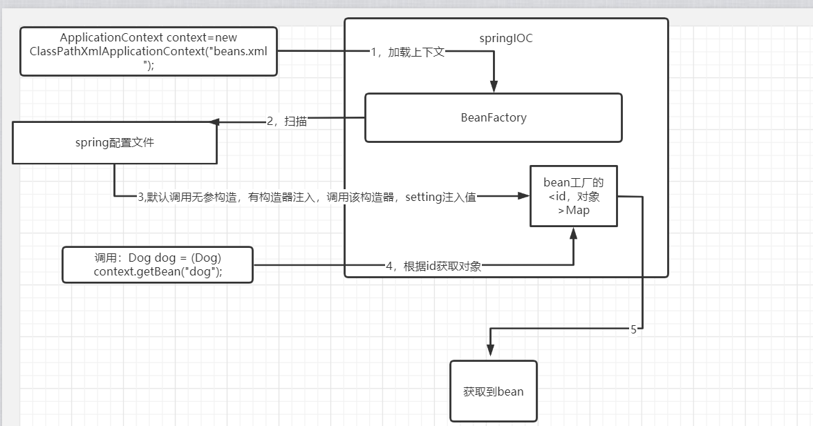

# springIOC



## 手写lower版SpringIOC

### pom.xml

```
<dependency>
      <groupId>org.jsoup</groupId>
      <artifactId>jsoup</artifactId>
      <version>1.10.2</version>
    </dependency>
    <!-- https://mvnrepository.com/artifact/commons-io/commons-io -->
    <dependency>
      <groupId>commons-io</groupId>
      <artifactId>commons-io</artifactId>
      <version>2.8.0</version>
    </dependency>
    
<dependency>
      <groupId>org.projectlombok</groupId>
      <artifactId>lombok</artifactId>
      <version>1.18.16</version>
    </dependency>
```


### bean结构（存放bean的配置文件参数和实例对象）

```
@NoArgsConstructor
@AllArgsConstructor
@Data
public class Bean {
    private String id;
    private Object object;
    private String cla;
    private Map<String,Object> properties;
}
```

### 工厂接口

```
public interface BeanFactory {
    public Object getBean(String id) throws ClassNotFoundException, IllegalAccessException, InstantiationException, NoSuchFieldException, NoSuchMethodException, InvocationTargetException, Exception;
}
```

### 加载配置文件（位置在classPath下）

```
public class LoadBean {
    protected static Map<String,Bean> load(String path) throws Exception {
        Map<String,Bean> res=new HashMap<>();
        Document document=null;
        try {
            InputStream resourceAsStream = LoadBean.class.getClassLoader().getResourceAsStream(path);
            String string = IOUtils.toString(resourceAsStream, "utf-8");
            document=Jsoup.parse(string);
        } catch (IOException e) {
            e.printStackTrace();
        }
        Elements beans = document.getElementsByTag("bean");
        for(Element node:beans){
            String id=node.attr("id");
            String cls=node.attr("class");
            Map<String,Object> properties=new HashMap<>();
            for(Element attr:node.getElementsByTag("property")){
                    String pro=attr.attr("name");
                    Object value=attr.attr("value");
                    properties.put(pro, value);
                    System.out.println("属性"+pro+"--"+value);

            }
            res.put(id,new Bean(id, Class.forName(cls).newInstance(),cls, properties));

        }
        valueGive(res);
        return res;
    }
    //装配属性
    public static void valueGive(Map<String,Bean> context)throws Exception{
        for (String key:context.keySet()){
            Bean bean=context.get(key);
            if(bean.getProperties().size()!=0){
                Object o=bean.getObject();
                Class c=Class.forName(bean.getCla());
               for(Field field:c.getFields()){
                   Object o1 = bean.getProperties().get(field.getName());
                   Method method = c.getMethod("set" + field.getName().substring(0, 1).toUpperCase() + field.getName().substring(1), Object.class);
                   method.invoke(o,o1);
               }
            }
        }
    }
}
```

### 模仿ClassPathXmlApplicationContext

```
public class MyClassPathXmlContent implements BeanFactory {
    private Map<String,Bean> context=new HashMap<>();
    public MyClassPathXmlContent(String path) throws Exception {
        context=LoadBean.load(path);
    }
    @Override
    public Object getBean(String id) throws Exception {
        return context.get(id).getObject();
    }
}
```

### MyBeans.xml配置文件（只能有setting注入，并且不能引用注入，只能value注入）

```
<?xml version="1.0" encoding="UTF-8"?>
<beans xmlns="http://www.springframework.org/schema/beans"
       xmlns:xsi="http://www.w3.org/2001/XMLSchema-instance"
       xmlns:context="http://www.springframework.org/schema/context"
       xsi:schemaLocation="http://www.springframework.org/schema/beans
 https://www.springframework.org/schema/beans/spring-beans.xsd http://www.springframework.org/schema/context https://www.springframework.org/schema/context/spring-context.xsd">
    <context:component-scan base-package="com.lwf"></context:component-scan>
<bean id="user" class="com.lwf.pojo.Users">
    <property name="name" value="周永日"/>
    <property name="age" value="18"/>
</bean>
<!--    测试自写springIOC-->
    <bean id="panda" class="com.lwf.pojo.Panda">
        <property name="name" value="熊猫"/>
        <property name="age" value="2"/>
        <property name="city" value="四川"/>
    </bean>
</beans>
```

## springIOC pom.xml

```
 <!-- 添加Spring框架的核⼼依赖 -->
    <dependency>
      <groupId>org.springframework</groupId>
      <artifactId>spring-context</artifactId>
      <version>5.2.4.RELEASE</version>
    </dependency>
```


## 加载配置文件

***beans.xml***

```
<?xml version="1.0" encoding="UTF-8"?>
<beans xmlns="http://www.springframework.org/schema/beans"
       xmlns:xsi="http://www.w3.org/2001/XMLSchema-instance"
       xmlns:context="http://www.springframework.org/schema/context"
       xsi:schemaLocation="http://www.springframework.org/schema/beans
 https://www.springframework.org/schema/beans/spring-beans.xsd http://www.springframework.org/schema/context https://www.springframework.org/schema/context/spring-context.xsd">
    <context:component-scan base-package="com.lwf"></context:component-scan>
<bean name="user" class="com.lwf.pojo.Users">
    <property name="name" value="永日"/>
    <property name="age" value="18"/>
</bean>
    <bean id="userService" class="com.lwf.service.impl.UserServiceIMPL" >
        <property name="users" ref="user"></property>
    </bean>
    <bean id="dog" class="com.lwf.pojo.Dog">
        <constructor-arg name="name" value="金毛"/>
        <constructor-arg name="age" value="2"/>
    </bean>
<!--    静态工厂传入工厂class和工厂方法-->
    <bean id="userS1" class="com.lwf.UserStaticFactory"  factory-method="getUserService"/>
    <bean id="factory" class="com.lwf.UserFactory">
        <property name="userService" ref="userService"/>
    </bean>
<!--    非静态工厂传入factory-bean，值为工厂bean的id-->
    <bean id="userS2" factory-bean="factory" factory-method="getUserService"/>
<!--    测试自写springIOC-->
    <bean id="panda" class="com.lwf.pojo.Panda">
        <property name="name" value="熊猫"/>
        <property name="age" value="2"/>
        <property name="city" value="四川"/>
    </bean>
</beans>
```

***加载单个文件***

```
 //ApplicationContext context=new ClassPathXmlApplicationContext("beans.xml");
        ApplicationContext context=new FileSystemXmlApplicationContext("C:\\Users\\lwf\\IdeaProjects\\11_21SpringIOC\\src\\main\\resources\\beans.xml");
```

***多个***

```
// 同时加载多个资源⽂件
ApplicationContext ac = new
ClassPathXmlApplicationContext("spring.xml","dao.xml");
```

***一个配置文件引入其他配置文件***

```
<?xml version="1.0" encoding="UTF-8"?>
<beans xmlns="http://www.springframework.org/schema/beans"
 xmlns:xsi="http://www.w3.org/2001/XMLSchema-instance"
 xsi:schemaLocation="http://www.springframework.org/schema/beans
 https://www.springframework.org/schema/beans/spring-beans.xsd">

 <!--导⼊需要包含的资源⽂件-->
 <import resource="service.xml"/>
 <import resource="dao.xml"/>
</beans>
```

```
// 加载总的资源⽂件
ApplicationContext ac = new ClassPathXmlApplicationContext("spring.xml");
```

##  Bean 对象实例化

### 构造器实例化

***bean在上下文中先通过构造器初始化，再通过setting设置值，这就造成：***

```
class A{
public A(B b){
this.b=b;
}
private B b;
}

class B{
public B(A a){
this.a=a;
}
private A a;
}
```

构造时，构造A时B不存在

***默认构造器***

```
<?xml version="1.0" encoding="UTF-8"?>
<beans xmlns="http://www.springframework.org/schema/beans"
 xmlns:xsi="http://www.w3.org/2001/XMLSchema-instance"
 xsi:schemaLocation="http://www.springframework.org/schema/beans
 https://www.springframework.org/schema/beans/spring-beans.xsd">
 <bean id="userService" class="com.xxxx.service.UserService"></bean>
</beans>
```

```
ApplicationContext ac = new ClassPathXmlApplicationContext("spring.xml");
UserService userService = (UserService) ac.getBean("userService");
userService.test();
```

***多参数构造器***

```
<bean id="panda" class="com.lwf.pojo.Panda">
        <property name="name" value="熊猫"/>
        <property name="age" value="2"/>
        <property name="city" value="四川"/>
    </bean>
```

```
ApplicationContext context=new ClassPathXmlApplicationContext("beans.xml");
        Panda panda = (Panda) context.getBean("panda");
        System.out.println(panda.toString());
```

### 静态工厂

```
<!--    静态工厂传入工厂class和工厂方法-->
    <bean id="userS1" class="com.lwf.UserStaticFactory"  factory-method="getUserService"/>
    
```

### 普通工厂

```
<bean name="user" class="com.lwf.pojo.Users">
    <property name="name" value="罗某"/>
    <property name="age" value="18"/>
</bean>
    <bean id="userService" class="com.lwf.service.impl.UserServiceIMPL" >
        <property name="users" ref="user"></property>
    </bean>
<bean id="factory" class="com.lwf.UserFactory">
        <property name="userService" ref="userService"/>
    </bean>
```

## 值装配

### setting(设置器)

***必须有set方法，不然会报错，property的name属性值决定set方法名：例如下列配置信息***

> 必须有setName,setAge方法，spring不检查属性名字。比如setName是给uname设置值得也可以装配上。

```
<bean name="user" class="com.lwf.pojo.Users">
    <property name="name" value="罗某"/>
    <property name="age" value="18"/>
</bean>
```

**可以解决上面构造器bean相互依赖出错的情况**

> 空构造构造出对象，再相互引用，再setting设置属性值

### @Value注解

使用：import org.springframework.beans.factory.annotation.Value;

**该注解注入值，直接在双引号内写入值**

```
@Component("dog")
@Data
@NoArgsConstructor
public class Dog {
    @Value("二哈")
    private String name;
    @Value("2")
    private Integer age;

    public Dog(String name, Integer age) {
        System.out.println("gog全参");
        this.name = name;
        this.age = age;
    }
}
```

**使用配置文件**

resources/text.properties

```
panda.name=金虎
panda.age=2
panda.city=大连
zoo.name=上海动物园
zoo.locate=上海
zoo.information=有钱你就来
```

```
@Component
@PropertySource(value = "classpath:text.properties")
@Configuration
@Data
public class Zoo {
    @Value("${zoo.name}")
    private String name;
    @Value("${zoo.locate}")
    private String locate;
    @Value("${zoo.information}")
    private String infomation;
}
```

非@Value设置值

```
@Data
@Component
@ConfigurationProperties(prefix = "panda")//前缀，属性值匹配后缀
@PropertySource(value = "classpath:text.properties")//指定配置文件
public class Panda {
    private String name;
    private Integer age;
    private String city;
}
```


## 自动装配

开启注解扫描

```
<context:component-scan base-package="com.lwf"></context:component-scan>
```

###  @Resource注解

@Resource注解实现⾃动注⼊（反射）

> *  默认根据属性字段名称查找对应的bean对象 （属性字段的名称与bean标签的id属性值相等） 
>
> * 如果属性字段名称未找到，则会通过类型（Class类型）查找
>
> * 属性可以提供set⽅法，也可以不提供set⽅法 
>
> * 注解可以声明在属性级别 或 set⽅法级别 
>
> * 可以设置name属性，name属性值必须与bean标签的id属性值⼀致；
>
> * 如果设置了name属性值， 就只会按照name属性值查找bean对象 
>
> * 当注⼊接⼝时，如果接⼝只有⼀个实现则正常实例化；如果接⼝存在多个实现，则需要使⽤name 属性指定需要被实例化的bean对象

```
/**
* @Resource注解实现⾃动注⼊（反射）
* 默认根据属性字段名称查找对应的bean对象 （属性字段的名称与bean标签的id属性值相等）
*/
public class UserService {
 @Resource
 private UserDao userDao; // 属性字段的名称与bean标签的id属性值相等
 public void setUserDao(UserDao userDao) {
 this.userDao = userDao;
 }
 public void test() {
 // 调⽤UserDao的⽅法
 userDao.test();
 }
}
```

```
/**
* @Resource注解实现⾃动注⼊（反射）
* 如果属性字段名称未找到，则会通过类型（Class类型）查找
*/
public class UserService {
 @Resource
 private UserDao ud; // 当在配置⽂件中属性字段名（ud）未找到，则会查找对应的
class（UserDao类型）
 public void setUd(UserDao ud) {
 this.ud = ud;
 }
 public void test() {
 // 调⽤UserDao的⽅法
 ud.test();
 }
}
```

```
/**
* @Resource注解实现⾃动注⼊（反射）
* 属性可以提供set⽅法，也可以不提供set⽅法
*/
public class UserService {
 @Resource
 private UserDao userDao; // 不提供set⽅法
 public void test() {
 // 调⽤UserDao的⽅法
 userDao.test();
 }
}
```

```
/**
* @Resource注解实现⾃动注⼊（反射）
* 注解可以声明在属性级别 或 set⽅法级别
*/
public class UserService {
 private UserDao userDao;
 @Resource // 注解也可设置在set⽅法上
 public void setUserDao(UserDao userDao) {
 this.userDao = userDao;
 }
 public void test() {
 // 调⽤UserDao的⽅法
 userDao.test();
 }
}
```

```
/**
* @Resource注解实现⾃动注⼊（反射）
* 可以设置name属性，name属性值必须与bean的id属性值⼀致；
* 如果设置了name属性值，就只会按照name属性值查找bean对象
*/
public class UserService {
 @Resource(name = "userDao") // name属性值与配置⽂件中bean标签的id属性值⼀致
 private UserDao ud;
 public void test() {
 // 调⽤UserDao的⽅法
 ud.test();
 }
}
```


### @Autowired注解

> * 默认通过类型（Class类型）查找bean对象  与属性字段的名称⽆关 
>
> * 属性可以提供set⽅法，也可以不提供set⽅法
>
> * 注解可以声明在属性级别 或 set⽅法级别 
>
> * 可以添加@Qualifier结合使⽤，通过value属性值查找bean对象（value属性值必须要设置，且值 要与bean标签的id属性值对应）

```
/**
* @Autowired注解实现⾃动化注⼊
* 默认通过类型（Class类型）查找bean对象 与属性字段的名称⽆关
*/
public class UserService {
 @Autowired
 private UserDao userDao; // 默认通过类型（Class类型）查找bean对象 与属性字段
的名称⽆关
 public void setUserDao(UserDao userDao) {
 this.userDao = userDao;
 }
 public void test() {
 // 调⽤UserDao的⽅法
 userDao.test();
 }
}
```

```
/**
* @Autowired注解实现⾃动化注⼊
* 属性可以提供set⽅法，也可以不提供set⽅法
*/
public class UserService {
 @Autowired
 private UserDao userDao; // 不提供set⽅法
 public void test() {
 // 调⽤UserDao的⽅法
 userDao.test();
 }
}
```

```
/**
* @Autowired注解实现⾃动化注⼊
* 注解可以声明在属性级别 或 set⽅法级别
*/
public class UserService {
 private UserDao userDao;
 @Autowired// 注解可以声明在set⽅法级别
 public void setUserDao(UserDao userDao) {
 this.userDao = userDao;
 }
 public void test() {
 // 调⽤UserDao的⽅法
 userDao.test();
 }
}
```

```
/**
* @Autowired注解实现⾃动化注⼊
* 可以添加@Qualifier结合使⽤，通过value属性值查找bean对象
 value属性值必须要设置，且值要与bean标签的id属性值对应
*/
public class UserService {
 @Autowired
 @Qualifier(value="userDao") // value属性值必须要设置，且值要与bean标签的id属
性值对应
 private UserDao userDao;
 public void test() {
 userDao.test();
 }
}
```


## 业务分层注解（控制器，服务，数据访问层，pojo层）

使用注解避免庞大的xml文档：

> 下面注解类似@Component，注解扫描器自动将类名（***首字母转小写***）作为bean的id
>
> 也可以：@Component("beanID")自定义bean的id

```
Spring IOC 扫描器
 作⽤：bean对象统⼀进⾏管理，简化开发配置，提⾼开发效率
 1、设置⾃动化扫描的范围
 如果bean对象未在指定包范围，即使声明了注解，也⽆法实例化
 2、使⽤指定的注解（声明在类级别） bean对象的id属性默认是 类的⾸字⺟⼩写
 Dao层：
 @Repository
 Service层：
 @Service
 Controller层：
 @Controller
 任意类：
 @Component
 注：开发过程中建议按照指定规则声明注解
```

