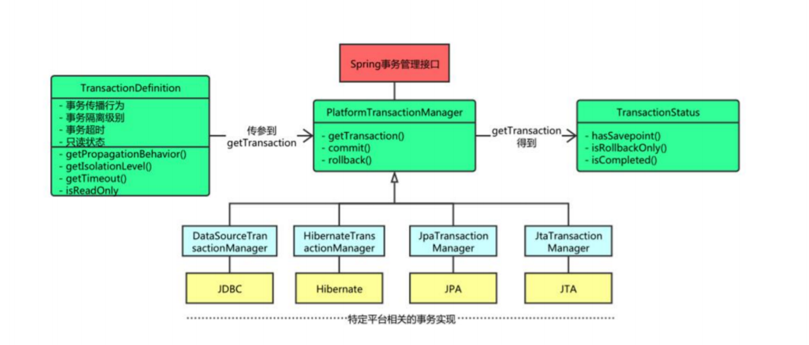
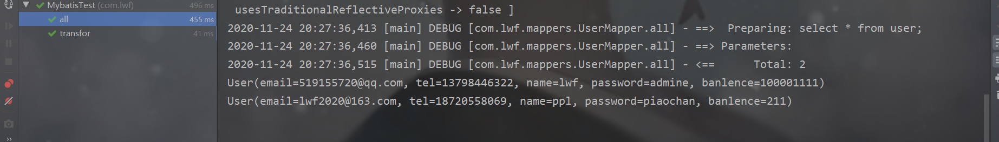
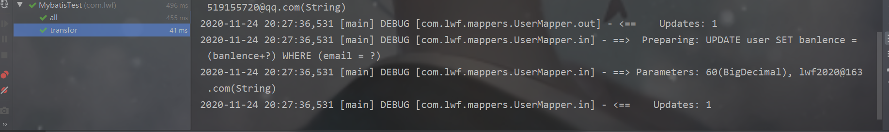
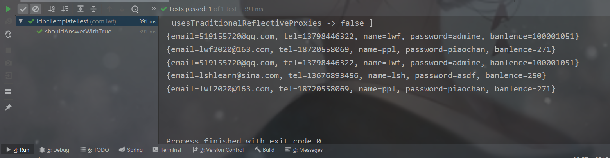

# spring整合mybatis（事务），JdbcTemplate

## 事务

 ***事务的四⼤特性（ACID）***

**原⼦性（Atomicity）** 

共⽣死，要么全部成功，要么全部失败！ 

**⼀致性（Consistency）** 

事务在执⾏前后，数据库中数据要保持⼀致性状态。（如转账的过程 账户操作后数据必须保持 ⼀致） 

**隔离性（Isolation）**

 事务与事务之间的执⾏应当是相互隔离互不影响的。（多个⻆⾊对统⼀记录进⾏操作必须保证没 有任何⼲扰），当然没有影响是不可能的，为了让影响级别降到最低，通过隔离级别加以限制： 

1. READ_UNCOMMITTED （读未提交） 隔离级别最低的⼀种事务级别。在这种隔离级别下，会引发脏读、不可重复读和幻读。 
2. READ_COMMITTED （读已提交） 读到的都是别⼈提交后的值。这种隔离级别下，会引发不可重复读和幻读，但避免了脏 读。 
3.  REPEATABLE_READ （可重复读） 这种隔离级别下，会引发幻读，但避免了脏读、不可重复读。 
4. SERIALIZABLE （串⾏化） 最严格的隔离级别。在Serializable隔离级别下，所有事务按照次序依次执⾏。 脏读、不可重复读、幻读都不会出现。 持久性（Durability） 事务提交完毕后，数据库中的数据的改变是永久的。

**持久性（Durability）** 

事务提交完毕后，数据库中的数据的改变是永久的。

## spring事务

​       Spring 事务管理的实现有许多细节，如果对整个接⼝框架有个⼤体了解会⾮常有利于我们理解事务， 下⾯通过讲解 Spring 的事务接⼝来了解 Spring 实现事务的具体策略。

```
public interface PlatformTransactionManager(){
 // 由 TransactionDefinition 得到 TransactionStatus 对象
 TransactionStatus getTransaction(TransactionDefinition definition) throws
TransactionException;
 // 提交
 void commit(TransactionStatus status) throws TransactionException;
 // 回滚
 void rollback(TransactionStatus status) throws TransactionException;
}
```

​       Spring 并不直接管理事务，⽽是提供了多种事务管理器，他们将事务管理的职责委托给 Hibernate 或者 JTA 等持久化机制所提供的相关平台框架的事务来实现。 Spring 事务管理器的接口org.springframework.transaction.PlatformTransactionManager，通 过这个接⼝，Spring 为各个平台如 JDBC、Hibernate 等都提供了对应的事务管理器，但是具体的实现 就是各个平台⾃⼰的事情了。



> **JDBC事务**
>
> 如果应⽤程序中直接使⽤ JDBC 来进⾏持久化，此时使⽤ DataSourceTransactionManager 来处理事 务边界。为了使⽤DataSourceTransactionManager，需要使⽤如下的 XML 将其装配到应⽤程序的上 下⽂定义中：
>
> ```
> <bean id="transactionManager"
> class="org.springframework.jdbc.datasource.DataSourceTransactionManager">
>  <property name="dataSource" ref="dataSource" />
> </bean>
> ```
>
> 实际上，DataSourceTransactionManager 是通过调⽤ java.sql.Connection 来管理事务，⽽后者是 通过 DataSource 获取到的。通过调⽤连接的 commit() ⽅法来提交事务，同样，事务失败则通过调⽤ rollback() ⽅法进⾏回滚。
>
> **Hibernate 事务**
>
> 如果应⽤程序的持久化是通过 Hibernate 实现的，那么你需要使⽤ HibernateTransactionManager。对于 Hibernate3，需要在 Spring 上下⽂定义中添加如下的声明：
>
> ```
> <bean id="transactionManager"
> class="org.springframework.orm.hibernate3.HibernateTransactionManager">
>  <property name="sessionFactory" ref="sessionFactory" />
> </bean>
> ```
>
> sessionFactory 属性需要装配⼀个 Hibernate 的 session ⼯⼚，HibernateTransactionManager 的 实现细节是它将事务管理的职责委托给 org.hibernate.Transaction 对象，⽽后者是从 Hibernate Session 中获取到的。当事务成功完成时，HibernateTransactionManager 将会调⽤ Transaction 对象 的 commit() ⽅法，反之，将会调⽤ rollback() ⽅法。
>
>  **Java 持久化 API 事务（JPA）**
>
> Hibernate 多年来⼀直是 Java 持久化标准，但是现在 Java 持久化 API 作为真正的 Java 持久化标准进 ⼊⼤家的视ᰀ。如果你计划使⽤ JPA 的话，那你需要使⽤ Spring 的 JpaTransactionManager 来处理事 务。你需要在 Spring 中这样配置 JpaTransactionManager：
>
> ```
> <bean id="transactionManager"
> class="org.springframework.orm.jpa.JpaTransactionManager">
>  <property name="sessionFactory" ref="sessionFactory" />
> </bean>
> ```
>
> JpaTransactionManager 只需要装配⼀个 JPA 实体管理⼯⼚ （javax.persistence.EntityManagerFactory 接⼝的任意实现）。 JpaTransactionManager 将与由⼯⼚ 所产⽣的 JPA EntityManager 合作来构建事务。
>
> ***Java 原⽣ API 事务***
>
> 如果应⽤程序没有使⽤以上所述的事务管理，或者是跨越了多个事务管理源（⽐如两个或者是多个不 同的数据源），此时需要使⽤ JtaTransactionManager：
>
> ```
> <bean id="transactionManager"
> class="org.springframework.transaction.jta.JtaTransactionManager">
>  <property name="transactionManagerName" value="java:/TransactionManager" />
> </bean>
> ```
>
> JtaTransactionManager 将事务管理的责任委托给 javax.transaction.UserTransaction 和 javax.transaction.TransactionManager 对象，其中事务成功完成通过 UserTransaction.commit() ⽅ 法提交，事务失败通过 UserTransaction.rollback() ⽅法回滚。

## spring mybatis事务

**使用到：mysql.properties, log4j.properties,spring.xml, mybatis.xml, UserMapper.xml**

### 导包

```
<!-- 添加Spring框架的核⼼依赖 -->
    <dependency>
      <groupId>org.springframework</groupId>
      <artifactId>spring-context</artifactId>
      <version>5.2.4.RELEASE</version>
    </dependency>
    <!--Spring AOP-->
    <dependency>
      <groupId>org.aspectj</groupId>
      <artifactId>aspectjweaver</artifactId>
      <version>1.8.9</version>
    </dependency>
    <!-- spring 测试环境 -->
    <dependency>
      <groupId>org.springframework</groupId>
      <artifactId>spring-test</artifactId>
      <version>5.2.4.RELEASE</version>
      <scope>test</scope>
    </dependency>
<!-- spring事务 -->
    <dependency>
      <groupId>org.springframework</groupId>
      <artifactId>spring-tx</artifactId>
      <version>5.2.4.RELEASE</version>
    </dependency>
    <!-- mysql 驱动包 -->
    <dependency>
      <groupId>mysql</groupId>
      <artifactId>mysql-connector-java</artifactId>
      <version>8.0.19</version>
    </dependency>
    <!-- c3p0 连接池 -->
    <dependency>
      <groupId>com.mchange</groupId>
      <artifactId>c3p0</artifactId>
      <version>0.9.5.5</version>
    </dependency>
    <!-- mybatis -->
    <dependency>
      <groupId>org.mybatis</groupId>
      <artifactId>mybatis</artifactId>
      <version>3.5.3</version>
    </dependency>
    <!-- 添加mybatis与Spring整合的核心包 -->
    <dependency>
      <groupId>org.mybatis</groupId>
      <artifactId>mybatis-spring</artifactId>
      <version>2.0.3</version>
    </dependency>
    <!-- 日志打印相关的jar -->
    <dependency>
      <groupId>org.slf4j</groupId>
      <artifactId>slf4j-log4j12</artifactId>
      <version>1.7.2</version>
    </dependency>
    <dependency>
      <groupId>org.slf4j</groupId>
      <artifactId>slf4j-api</artifactId>
      <version>1.7.2</version>
    </dependency>
```

### 核心配置文件

**配置步骤：**

> 下面全部按步骤拷贝就可对springIOC，AOP，mybatis初步整合，mybatis的增删改使用事务。
>
> 后期整合ssm和这个基本不变，就是加spring mvc的依赖和注解扫描，把配置文件的加载交给应用服务器（tomcat或jetty），在web.xml里加载spring配置文件。

* 注解扫描

  ```
   <context:component-scan base-package="com.lwf" />
  ```

* 开启aop

  ```
  <aop:aspectj-autoproxy/>
  ```

* 数据源（这里使用阿里巴巴的c3p0，还可以用apache的Dbcp数据库连接池），但是apache在空闲时不会回收资源

  ```
   <!-- 配置 c3p0 数据源 -->
      <bean id="dataSource" class="com.mchange.v2.c3p0.ComboPooledDataSource">
          <!-- property标签的value属性对应的是jdbc.properties中的值 -->
          <property name="driverClass" value="${jdbc.driver}"></property>
          <property name="jdbcUrl" value="${jdbc.url}"></property>
          <property name="user" value="${jdbc.user}"></property>
          <property name="password" value="${jdbc.password}"></property>
      </bean>
  ```

* 配置事务管理器：有     JDBC：DataSourceTransactionManager；Hibernate：HibernateTransactionManager；JPA：JPATransactionManager；JTA：JtaTransactionManager。可以从中选择最适合的

  ```
   <!-- 配置事务管理器 -->
      <bean id="txManager"
            class="org.springframework.jdbc.datasource.DataSourceTransactionManager">
          <property name="dataSource" ref="dataSource"></property>
      </bean>
  ```

* 配置mybatis

  ```
  <!-- 配置 sqlSessionFactory -->
      <bean id="sqlSessionFactory" class="org.mybatis.spring.SqlSessionFactoryBean">
          <property name="dataSource" ref="dataSource"></property>
          <property name="configLocation" value="classpath:mybatis.xml" />
          <property name="mapperLocations" value="classpath:mapper/*.xml" />
      </bean>
      <!-- 配置扫描器 -->
      <bean id="mapperScanner"
            class="org.mybatis.spring.mapper.MapperScannerConfigurer">
      <!-- 扫描com.lwf.dao这个包以及它的子包下的所有映射接口类 -->
          <property name="basePackage" value="com.lwf.mappers" />
          <property name="sqlSessionFactoryBeanName" value="sqlSessionFactory" />
      </bean>
  ```

  ### 注解和配置文件（两种开启事务）

  **注解**

  1. 开启事务注解

     ```
     <!--    开启事务注解-->
         <tx:annotation-driven transaction-manager="txManager"/>
     ```

  2. 使用，@Transactional注解，放在要使用事务的方法上，手动设置aop切入点

     > 1.propagation_required
     > spring默认的事务方式，如果当前存在事务，沿用当前事务，不存在事务，开启一个事务
     > 2.propagation_suports
     > 以当前事务方式运行，当前没事务，不开启新的事务
     > 3.propagation_mandatory
     > 强制要有事务，以当前事务方式运行，当前不存在事务，抛出异常
     > 4.propagation_requires_new
     > 总是开启一个新的事务，当前存在事务，将当前事务挂起
     > 7.propagation_not_supported
     > 以非事务方式运行，如存在事务，讲当前事务挂起
     > 6.propagation_never
     > 以非事务方式运行，如果当前存在事务，则抛出异常
     > 7.propagation_nested
     > 嵌套事务，如果当前存在事务，则在嵌套事务中执行，如果没事务，则以required方式运行

     ```
     @Service
     public class UserService {
         @Autowired
         private UserMapper userMapper;//mybatis
         public List<User> allMybatis(){
             return userMapper.all();
         }
         public User queryByEmail(String email){
             return userMapper.queryByEmail(email);
         }
          @Transactional(propagation = Propagation.REQUIRED)
         public boolean out(String email, BigDecimal decimal){return userMapper.out(email,decimal );}
         @Transactional(propagation = Propagation.REQUIRED)
         public boolean in(String email, BigDecimal decimal){return userMapper.in(email,decimal );}
         @Transactional(propagation = Propagation.REQUIRED)
         public boolean transfor(String from,String to,BigDecimal money){
             boolean out = userMapper.out(from, money);
             boolean in = userMapper.in(to, money);
             if(in&&out){
                 return true;
             }
             return false;
         }
     }
     ```

     

  **配置文件**

  1. 设置事务增强

     ```
     <!-- 设置事物增强 -->
         <tx:advice id="txAdvice" transaction-manager="txManager">
             <tx:attributes>
                 <tx:method name="add*" propagation="REQUIRED" />
                 <tx:method name="insert*" propagation="REQUIRED" />
                 <tx:method name="update*" propagation="REQUIRED" />
                 <tx:method name="delete*" propagation="REQUIRED" />
             </tx:attributes>
         </tx:advice>
     ```

  2. 设置事务插入那些切入点

     ```
      <!-- aop 切面配置 -->
         <aop:config>
     <!-- 为com.lwf.service包下所有访问修饰符的方法织入事务操作 -->
             <aop:pointcut id="servicePointcut" expression="execution(* com.lwf.service..*.*(..))" />
             <!-- 切入点绑定事务 -->
             <aop:advisor advice-ref="txAdvice" pointcut-ref="servicePointcut" />
         </aop:config>
     ```

     

### 测试

```
@RunWith(SpringJUnit4ClassRunner.class)
@ContextConfiguration(locations = {"classpath:spring.xml"})
public class MybatisTest {
    @Autowired
    private UserService userService;
    @Autowired
    UserMapper userMapper;
    @Test
    public void transfor(){
          userService.transfor("519155720@qq.com","lwf2020@163.com",new BigDecimal(60));
    }
    @Test
    public void all(){
     userService.allMybatis().forEach(System.out::println);
    }
}
```





## spring JdbcTemplate事务

**使用到:mysql.properties    log4j.properties   spring.xml**

```
<?xml version="1.0" encoding="UTF-8"?>
<beans xmlns="http://www.springframework.org/schema/beans"
       xmlns:xsi="http://www.w3.org/2001/XMLSchema-instance"
       xmlns:context="http://www.springframework.org/schema/context"
       xmlns:aop="http://www.springframework.org/schema/aop"
       xmlns:tx="http://www.springframework.org/schema/tx"
       xsi:schemaLocation="http://www.springframework.org/schema/beans
http://www.springframework.org/schema/beans/spring-beans.xsd
http://www.springframework.org/schema/context
http://www.springframework.org/schema/context/spring-context.xsd
http://www.springframework.org/schema/aop
http://www.springframework.org/schema/aop/spring-aop.xsd
http://www.springframework.org/schema/tx
http://www.springframework.org/schema/tx/spring-tx.xsd">
    <!-- Spring扫描注解的配置 -->
    <context:component-scan base-package="com.lwf" />
<!--    <context:annotation-config/>-->
    <aop:aspectj-autoproxy/>

    <!-- 加载properties 配置⽂件 -->
    <context:property-placeholder location="mysql.properties" />
    <!-- 配置 c3p0 数据源 -->
    <bean id="dataSource" class="com.mchange.v2.c3p0.ComboPooledDataSource">
        <!-- property标签的value属性对应的是jdbc.properties中的值 -->
        <property name="driverClass" value="${jdbc.driver}"></property>
        <property name="jdbcUrl" value="${jdbc.url}"></property>
        <property name="user" value="${jdbc.user}"></property>
        <property name="password" value="${jdbc.password}"></property>
    </bean>
    <!-- 配置JdbcTemplate实例，并注⼊⼀个dataSource数据源-->
    <bean id="jdbcTemplate" class="org.springframework.jdbc.core.JdbcTemplate">
        <property name="dataSource" ref="dataSource"></property>
    </bean>

    <!-- 配置事务管理器 -->
    <bean id="txManager"
          class="org.springframework.jdbc.datasource.DataSourceTransactionManager">
        <property name="dataSource" ref="dataSource"></property>
    </bean>
<!--    开启事务注解-->
    <tx:annotation-driven transaction-manager="txManager"/>
<!--&lt;!&ndash;    配置文件开启事务&ndash;&gt;-->
<!--    &lt;!&ndash; 设置事物增强 &ndash;&gt;-->
<!--    <tx:advice id="txAdvice" transaction-manager="txManager">-->
<!--        <tx:attributes>-->
<!--            <tx:method name="add*" propagation="REQUIRED" />-->
<!--            <tx:method name="insert*" propagation="REQUIRED" />-->
<!--            <tx:method name="update*" propagation="REQUIRED" />-->
<!--            <tx:method name="delete*" propagation="REQUIRED" />-->
<!--        </tx:attributes>-->
<!--    </tx:advice>-->
<!--    &lt;!&ndash; aop 切面配置 &ndash;&gt;-->
<!--    <aop:config>-->
<!--        <aop:pointcut id="servicePointcut" expression="execution(*-->
<!--com.lwf.service..*.*(..))" />-->
<!--        <aop:advisor advice-ref="txAdvice" pointcut-ref="servicePointcut" />-->
<!--    </aop:config>-->
</beans>
```

### 导包

```
<!-- 添加Spring框架的核⼼依赖 -->
    <dependency>
      <groupId>org.springframework</groupId>
      <artifactId>spring-context</artifactId>
      <version>5.2.4.RELEASE</version>
    </dependency>
    <!--Spring AOP-->
    <dependency>
      <groupId>org.aspectj</groupId>
      <artifactId>aspectjweaver</artifactId>
      <version>1.8.9</version>
    </dependency>
    <!-- spring 测试环境 -->
    <dependency>
      <groupId>org.springframework</groupId>
      <artifactId>spring-test</artifactId>
      <version>5.2.4.RELEASE</version>
      <scope>test</scope>
    </dependency>
    <!-- spring jdbc -->
    <dependency>
      <groupId>org.springframework</groupId>
      <artifactId>spring-jdbc</artifactId>
      <version>5.2.4.RELEASE</version>
    </dependency>
    <!-- spring事务 -->
    <dependency>
      <groupId>org.springframework</groupId>
      <artifactId>spring-tx</artifactId>
      <version>5.2.4.RELEASE</version>
    </dependency>
    <!-- mysql 驱动包 -->
    <dependency>
      <groupId>mysql</groupId>
      <artifactId>mysql-connector-java</artifactId>
      <version>8.0.19</version>
    </dependency>
    <!-- c3p0 连接池 -->
    <dependency>
      <groupId>com.mchange</groupId>
      <artifactId>c3p0</artifactId>
      <version>0.9.5.5</version>
    </dependency>
 <!-- 日志打印相关的jar -->
    <dependency>
      <groupId>org.slf4j</groupId>
      <artifactId>slf4j-log4j12</artifactId>
      <version>1.7.2</version>
    </dependency>
    <dependency>
      <groupId>org.slf4j</groupId>
      <artifactId>slf4j-api</artifactId>
      <version>1.7.2</version>
    </dependency>
```

### 核心配置文件

配置步骤：

> 下面全部按步骤拷贝就可对springIOC，AOP，jdbctemplate初步整合，jdbctemplate的增删改使用事务。
>
> 后期整合和这个基本不变，就是加spring mvc的依赖和注解扫描，把配置文件的加载交给应用服务器（tomcat或jetty），在web.xml里加载spring配置文件。

* 注解扫描

  ```
   <context:component-scan base-package="com.lwf" />
  ```

* 开启aop

  ```
  <aop:aspectj-autoproxy/>
  ```

* 数据源（这里使用阿里巴巴的c3p0，还可以用apache的Dbcp数据库连接池），但是apache在空闲时不会回收资源

  ```
   <!-- 配置 c3p0 数据源 -->
      <bean id="dataSource" class="com.mchange.v2.c3p0.ComboPooledDataSource">
          <!-- property标签的value属性对应的是jdbc.properties中的值 -->
          <property name="driverClass" value="${jdbc.driver}"></property>
          <property name="jdbcUrl" value="${jdbc.url}"></property>
          <property name="user" value="${jdbc.user}"></property>
          <property name="password" value="${jdbc.password}"></property>
      </bean>
  ```

* 配置事务管理器：有     JDBC：DataSourceTransactionManager；Hibernate：HibernateTransactionManager；JPA：JPATransactionManager；JTA：JtaTransactionManager。可以从中选择最适合的

  ```
   <!-- 配置事务管理器 -->
      <bean id="txManager"
            class="org.springframework.jdbc.datasource.DataSourceTransactionManager">
          <property name="dataSource" ref="dataSource"></property>
      </bean>
  ```

* 配置JdbcTemplate实例

  ```
  <!-- 配置JdbcTemplate实例，并注⼊⼀个dataSource数据源-->
      <bean id="jdbcTemplate" class="org.springframework.jdbc.core.JdbcTemplate">
          <property name="dataSource" ref="dataSource"></property>
      </bean>
  ```

  ### 注解和配置文件（两种开启事务）

   **注解**

    1. 开启事务注解

       ```
       <!--    开启事务注解-->
           <tx:annotation-driven transaction-manager="txManager"/>
       ```

    2. 使用，@Transactional注解，放在要使用事务的方法上，手动设置aop切入点

       > 1.propagation_required
       > spring默认的事务方式，如果当前存在事务，沿用当前事务，不存在事务，开启一个事务
       > 2.propagation_suports
       > 以当前事务方式运行，当前没事务，不开启新的事务
       > 3.propagation_mandatory
       > 强制要有事务，以当前事务方式运行，当前不存在事务，抛出异常
       > 4.propagation_requires_new
       > 总是开启一个新的事务，当前存在事务，将当前事务挂起
       > 7.propagation_not_supported
       > 以非事务方式运行，如存在事务，讲当前事务挂起
       > 6.propagation_never
       > 以非事务方式运行，如果当前存在事务，则抛出异常
       > 7.propagation_nested
       > 嵌套事务，如果当前存在事务，则在嵌套事务中执行，如果没事务，则以required方式运行

       ```
       @Repository
       public class UserDao {
           @Autowired
           private JdbcTemplate jdbcTemplate;
           public List<Map<String, Object>> queryAll(){
               List<Map<String, Object>> maps = jdbcTemplate.queryForList("select * from user");
               return maps;
           }
           @Transactional(propagation = Propagation.REQUIRED)
           public Integer insert(User user){
               Integer update = jdbcTemplate.update("insert into user values(?,?,?,?,?)",user.getEmail(),user.getTel(),user.getName(),user.getPassword(),user.getBanlence());
               return update;
           }
       ```
       
       

    **配置文件**

    1. 设置事务增强

       ```
       <!-- 设置事物增强 -->
           <tx:advice id="txAdvice" transaction-manager="txManager">
               <tx:attributes>
                   <tx:method name="add*" propagation="REQUIRED" />
                   <tx:method name="insert*" propagation="REQUIRED" />
                   <tx:method name="update*" propagation="REQUIRED" />
                   <tx:method name="delete*" propagation="REQUIRED" />
               </tx:attributes>
           </tx:advice>
       ```

    2. 设置事务插入那些切入点

       ```
        <!-- aop 切面配置 -->
           <aop:config>
       <!-- 为com.lwf.dao包下所有访问修饰符的方法织入事务操作 -->
               <aop:pointcut id="servicePointcut" expression="execution(* com.lwf.dao..*.*(..))" />
               <!-- 切入点绑定事务 -->
               <aop:advisor advice-ref="txAdvice" pointcut-ref="servicePointcut" />
           </aop:config>
       ```

### 测试

```
@RunWith(SpringJUnit4ClassRunner.class)
@ContextConfiguration(locations = {"classpath:spring.xml"})
public class JdbcTemplateTest
{
    @Autowired
    UserDao userDao;
    @Test
    public void shouldAnswerWithTrue()
    {
        userDao.queryAll().forEach(System.out::println);
        userDao.insert(new User("lshlearn@sina.com","13676893456","lsh","asdf",new BigDecimal(250)));
        userDao.queryAll().forEach(System.out::println);
    }
}
```



## 附录(总配置文件)

### 数据库

```sql
create database spring;
use spring;
create table user(
email varchar(17) primary key,
tel char(11) not null,
name varchar(20),
password varchar(15) not null
);
```


### **全局配置**包含注解和xml配置：resources/spring.xml

```
<?xml version="1.0" encoding="UTF-8"?>
<beans xmlns="http://www.springframework.org/schema/beans"
       xmlns:xsi="http://www.w3.org/2001/XMLSchema-instance"
       xmlns:context="http://www.springframework.org/schema/context"
       xmlns:aop="http://www.springframework.org/schema/aop"
       xmlns:tx="http://www.springframework.org/schema/tx"
       xsi:schemaLocation="http://www.springframework.org/schema/beans
http://www.springframework.org/schema/beans/spring-beans.xsd
http://www.springframework.org/schema/context
http://www.springframework.org/schema/context/spring-context.xsd
http://www.springframework.org/schema/aop
http://www.springframework.org/schema/aop/spring-aop.xsd
http://www.springframework.org/schema/tx
http://www.springframework.org/schema/tx/spring-tx.xsd">
    <!-- Spring扫描注解的配置 -->
    <context:component-scan base-package="com.lwf" />
<!--    <context:annotation-config/>-->
    <aop:aspectj-autoproxy/>

    <!-- 加载properties 配置⽂件 -->
    <context:property-placeholder location="mysql.properties" />
    <!-- 配置 c3p0 数据源 -->
    <bean id="dataSource" class="com.mchange.v2.c3p0.ComboPooledDataSource">
        <!-- property标签的value属性对应的是jdbc.properties中的值 -->
        <property name="driverClass" value="${jdbc.driver}"></property>
        <property name="jdbcUrl" value="${jdbc.url}"></property>
        <property name="user" value="${jdbc.user}"></property>
        <property name="password" value="${jdbc.password}"></property>
    </bean>
    <!-- 配置JdbcTemplate实例，并注⼊⼀个dataSource数据源-->
    <bean id="jdbcTemplate" class="org.springframework.jdbc.core.JdbcTemplate">
        <property name="dataSource" ref="dataSource"></property>
    </bean>

    <!-- 配置事务管理器 -->
    <bean id="txManager"
          class="org.springframework.jdbc.datasource.DataSourceTransactionManager">
        <property name="dataSource" ref="dataSource"></property>
    </bean>
<!--    开启事务注解-->
    <tx:annotation-driven transaction-manager="txManager"/>
<!--    配置文件开启事务-->
<!--    &lt;!&ndash; 设置事物增强 &ndash;&gt;-->
<!--    <tx:advice id="txAdvice" transaction-manager="txManager">-->
<!--        <tx:attributes>-->
<!--            <tx:method name="add*" propagation="REQUIRED" />-->
<!--            <tx:method name="insert*" propagation="REQUIRED" />-->
<!--            <tx:method name="update*" propagation="REQUIRED" />-->
<!--            <tx:method name="delete*" propagation="REQUIRED" />-->
<!--        </tx:attributes>-->
<!--    </tx:advice>-->
<!--    &lt;!&ndash; aop 切面配置 &ndash;&gt;-->
<!--    <aop:config>-->
<!--        <aop:pointcut id="servicePointcut" expression="execution(*-->
<!--com.lwf.service..*.*(..))" />-->
<!--        <aop:advisor advice-ref="txAdvice" pointcut-ref="servicePointcut" />-->
<!--    </aop:config>-->
    <!-- 配置 sqlSessionFactory -->
    <bean id="sqlSessionFactory" class="org.mybatis.spring.SqlSessionFactoryBean">
        <property name="dataSource" ref="dataSource"></property>
        <property name="configLocation" value="classpath:mybatis.xml" />
        <property name="mapperLocations" value="classpath:mapper/*.xml" />
    </bean>
    <!-- 配置扫描器 -->
    <bean id="mapperScanner"
          class="org.mybatis.spring.mapper.MapperScannerConfigurer">
    <!-- 扫描com.lwf.dao这个包以及它的子包下的所有映射接口类 -->
        <property name="basePackage" value="com.lwf.mappers" />
        <property name="sqlSessionFactoryBeanName" value="sqlSessionFactory" />
    </bean>
</beans>
```

### 日志：resources/log4j.properties

```
log4j.rootLogger=info, Console
# Console
log4j.appender.Console=org.apache.log4j.ConsoleAppender
log4j.appender.Console.layout=org.apache.log4j.PatternLayout
log4j.appender.Console.layout.ConversionPattern=%d [%t] %-5p [%c] - %m%n
log4j.logger.java.sql.ResultSet=INFO
log4j.logger.org.apache=INFO
log4j.logger.com.lwf.mappers=DEBUG
log4j.logger.java.sql.Connection=DEBUG
log4j.logger.java.sql.Statement=DEBUG
log4j.logger.java.sql.PreparedStatement=DEBUG
```

### 数据库配置：resources/mysql.properties

```
# 驱动名
jdbc.driver=com.mysql.cj.jdbc.Driver
# 数据库连接
jdbc.url=jdbc:mysql://localhost:3306/spring?useUnicode=true&characterEncoding=utf8&serverTimezone=GMT%2B8&useSSL=false
# 数据库用
jdbc.user=root
# 数据库用
jdbc.password=admine
```

### mybatis配置文件:resources/mybatis.xml

```
<?xml version="1.0" encoding="UTF-8" ?>
<!DOCTYPE configuration
        PUBLIC "-//mybatis.org//DTD Config 3.0//EN"
        "http://mybatis.org/dtd/mybatis-3-config.dtd">
<configuration>
    <!-- 定义类别名 -->
    <typeAliases>
        <package name="com.lwf.pojo"/>
    </typeAliases>
</configuration>
```

### mapper文件:resources/mapper/UserMapper.xml

```
<?xml version="1.0" encoding="UTF-8" ?>
<!DOCTYPE mapper
        PUBLIC "-//mybatis.org//DTD Mapper 3.0//EN"
        "http://mybatis.org/dtd/mybatis-3-mapper.dtd">
<mapper namespace="com.lwf.mappers.UserMapper">
    <update id="out">
        UPDATE user SET banlence = (banlence-#{param2}) WHERE (email = #{param1})
    </update>
    <update id="in">
        UPDATE user SET banlence = (banlence+#{param2}) WHERE (email = #{param1})
    </update>

    <select id="all" resultType="User">
        select * from user;
    </select>
    <select id="queryByEmail" resultType="com.lwf.pojo.User">
        select * from user where email=#{email}
    </select>
</mapper>
```

