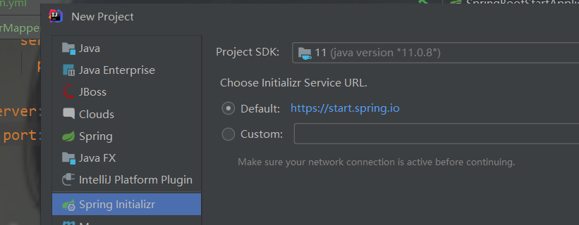
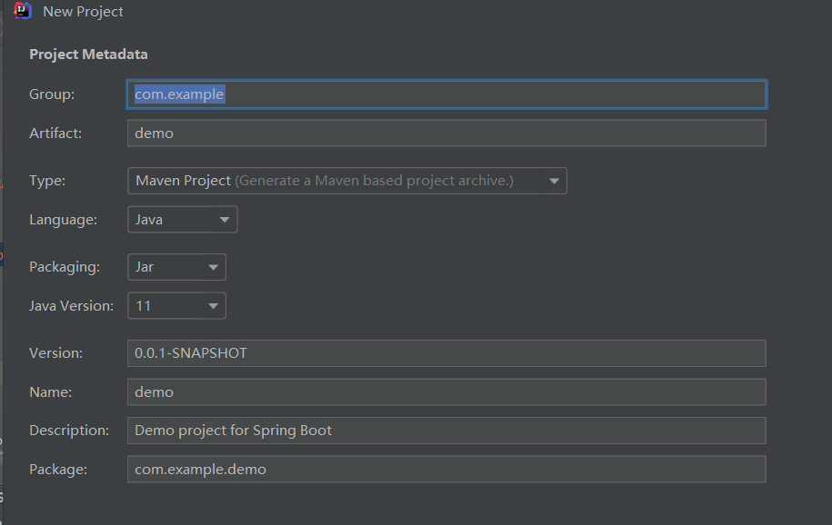
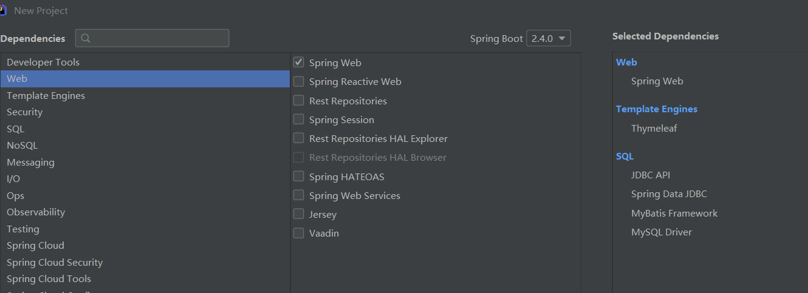
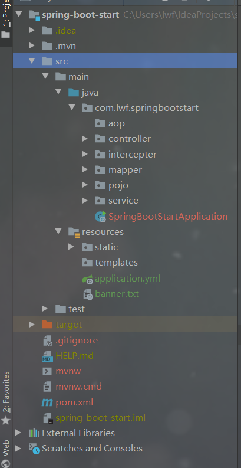
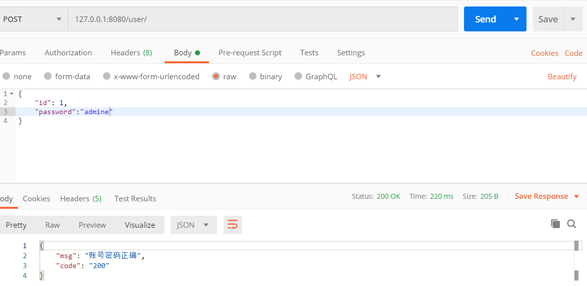

# spring boot 初探

​       随着动态语⾔流⾏(Ruby、Scala、NodeJs等)，Java 开发变得相对笨重，配置繁琐，开发效率低下， 部署流程复杂，以及第三⽅集成难度也相对较⼤，针对该环境，Spring Boot 被开发出来，其使⽤“习惯 ⼤于配置⽬标”,借助Spring Boot 能够让项⽬快速运⾏起来，同时借助 Spring Boot 可以快速创建 web 应⽤并独⽴进⾏部署(jar包 war 包⽅式，内嵌 servlet 容器)，同时借助 Spring Boot 在开发应⽤时可以 不⽤或很少去进⾏相关 xml 环境配置，简化了开发，⼤⼤提⾼项⽬开发效率。 

​       Spring Boot 是由 Pivotal 团队提供的全新框架，其设计⽬的是⽤来简化 Spring 应⽤的初始搭建以及 开发过程。该框架使⽤了特定的⽅式来进⾏配置，从⽽使开发⼈员不再需要定义样板化的配置。通过这 种⽅式，让 Spring Boot在蓬勃发展的快速应⽤开发领域 (rapid application development) 成为领导 者。

## 特点

​        创建独⽴ Spring 应⽤程序、嵌⼊式 Tomcat、Jetty 容器、⽆需部署 WAR 包、简化 Maven 及 Gradle 配置、尽可能⾃动化配置 Spring、直接植⼊产品环境下的实⽤功能，⽐如度量指标、健康检查及扩展配 置、⽆需代码⽣成及 XML 配置等，同时 Spring Boot 不仅对 web 应⽤程序做了简化，还提供⼀系列的 依赖包来把其它⼀些⼯作做成开箱即⽤。

## 构建springBoot项目

1. 使用idea

   > 
   >
   > **next**
   >
   > 
   >
   > **修改Group(域名倒写)，Artifact(项目名),点击next**
   >
   > 
   >
   > **勾选右侧6个依赖,就可以使用springBoot操作Mybatis，在Thymeleaf页面上展示或修改信息**
   >
   > **等待maven构建好项目**
   >
   > 最后项目结构为：
   >
   >  

2. 使用maven构建简单web环境

   > **maven依赖**
   >
   > ```
   > <parent>
   >  <groupId>org.springframework.boot</groupId>
   >  <artifactId>spring-boot-starter-parent</artifactId>
   >  <version>2.2.2.RELEASE</version>
   > </parent>
   > <dependencies>
   >  <dependency>
   >  <groupId>org.springframework.boot</groupId>
   >  <artifactId>spring-boot-starter-web</artifactId>
   >  </dependency>
   > </dependencies>
   > ```
   >
   > ​     Spring Boot 的项⽬必须要将 parent 设置为 Spring Boot 的 parent，该 parent 包含了⼤量默认的配 置，简化程序的开发。
   >
   > **maven插件**
   >
   > ```
   > <plugin>
   >  <groupId>org.springframework.boot</groupId>
   >  <artifactId>spring-boot-maven-plugin</artifactId>
   > </plugin>
   > ```
   >
   > **代码**
   >
   > 注意：mvc各层（controller,service,dao,pojo)包与启动程序须在同一包下
   >
   > ```
   > /*
   > springBoot启动程序，类名为Artifact(项目名)+Application.java
   > */
   > @SpringBootApplication
   > public class SpringBootStartApplication {
   > 
   >     public static void main(String[] args) {
   >         SpringApplication.run(SpringBootStartApplication.class, args);
   >     }
   > 
   > }
   > ```
   >
   > 控制器
   >
   > ```
   > @RestController//控制器返回json数据 @Controller 默认返回视图
   > @RequestMapping("/user")
   > public class UserController {
   >     //j2ee注解，相当于spring注解@AutoWire 和@Qualifier()组合
   >     @Resource
   >     private UserService userService;
   >     @RequestMapping("/hello")
   >     public Map<String,String> hello(){
   >         Map<String,String> map=new HashMap<>();
   >         map.put("name", "lwf");
   >         return map;
   >     }
   >     @RequestMapping(value = "/",method = RequestMethod.GET)
   >     public List<User> users(){
   >         return userService.queryAll();
   >     }
   >     @RequestMapping(value = "/",method = RequestMethod.POST)
   >     public  Map<String,String> login( @RequestBody User user){
   >         return userService.login(user.getId(), user.getPassword());
   >     }
   > }
   > 
   > 
   > ```



## 配置文件：application.properties(或application.yml)

application.properties:在resources下，application.properties和application.yml只能存在一个

```
#jdbc
spring.datasource.driver-class-name=com.mysql.cj.jdbc.Driver
spring.datasource.username=root
spring.datasource.password=admine
spring.datasource.url=jdbc:mysql://localhost:3306/springboot?useUnicode=true&characterEncoding=utf8&serverTimezone=GMT%2B8&useSSL=false
#事务
spring.transaction.rollback-on-commit-failure=true
spring.aop.auto=true
```

application.yml：流行的写法，层次分明

```
spring:
#数据库
  datasource:
    driver-class-name: com.mysql.cj.jdbc.Driver
    username: root
    password: admine
    url: jdbc:mysql://localhost:3306/springboot?useUnicode=true&characterEncoding=utf8&serverTimezone=GMT%2B8&useSSL=false
#aop
  aop:
    auto: true
#事务设置提交失败就回滚
  transaction:
    rollback-on-commit-failure: true
#设置项目context
  mvc:
    servlet:
      path: /
#设置端口
server:
  port: 8080
```

## 事务

**开启事务**

启动类加注解：@EnableTransactionManagement

```
@EnableTransactionManagement
@SpringBootApplication
public class SpringBootStartApplication {

    public static void main(String[] args) {
        SpringApplication.run(SpringBootStartApplication.class, args);
    }

}
```

在需要开启的地方加@Transactional(propagation = Propagation.REQUIRED)：这里是查询不需要加事务，这里只是示范

```
@Transactional(propagation = Propagation.REQUIRED)
    public Map<String,String> login(Integer id,String password){
        Map<String,String> map=new HashMap<>();
        User user=queryOne(id);
        if(user==null){
            map.put("code", "400");
            map.put("msg", "账号不存在");

            return map;
        }
        if(user.getPassword().equals(password)){
            map.put("code", "200");
            map.put("msg", "账号密码正确");
        }else {
            map.put("code", "400");
            map.put("msg", "密码错误");
        }
        return map;
    }
```

