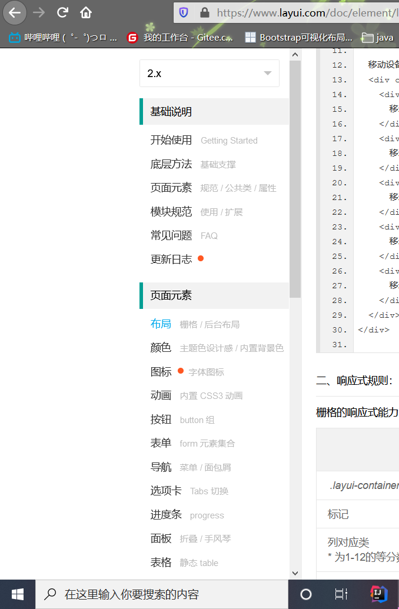
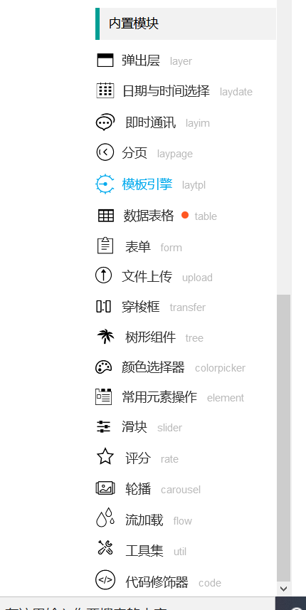
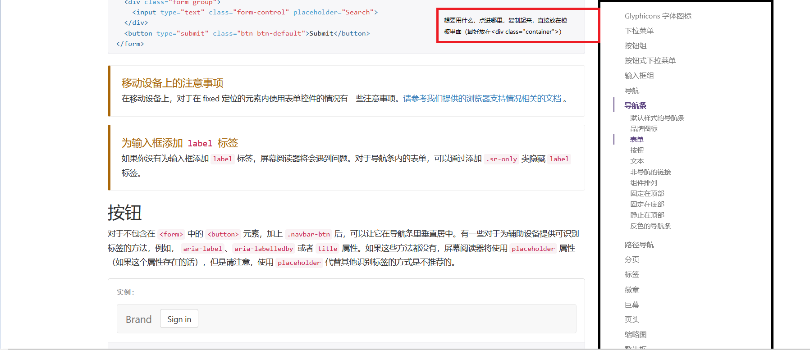
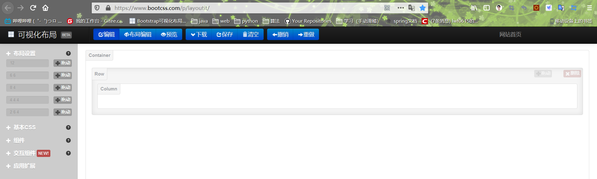
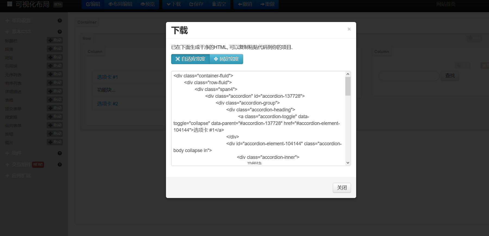

# Layui

<hr>

## 下载

<a href="https://www.layui.com/">layui官网</a>


## 资源引入

> 将解压后**layui-v2.5.6\layui-v2.5.6下的layui**文件夹放入项目根路径即可

**html头：**

```
<head>
		<meta charset="utf-8" />
		<title>数据绑定</title>
		<link rel="stylesheet"  type="text/css" href="layui/css/layui.css"/>
		<script src="./layui/layui.js" type="text/javascript"></script>
	</head>
```

## 模板文件

```
<!DOCTYPE html>
<html>
	<head>
		<meta charset="utf-8" />
		<title></title>
		<link rel="stylesheet"  type="text/css" href="layui/css/layui.css"/>
		<script src="./layui/layui.js" type="text/javascript"></script>
	</head>
	<body>
		
	</body>
</html>
```

## 使用

> **为了丰富网页布局，简化 HTML/CSS 代码的耦合，并提升多终端的适配能力，layui 在 2.0  的版本中引进了自己的一套具备响应式能力的栅格系统。我们将容器进行了 12 等分，预设了 4*12 种 CSS  排列类，它们在移动设备、平板、桌面中/大尺寸四种不同的屏幕下发挥着各自的作用**。
>
> **超过12格将转下一行。**
>
> 一、栅格布局规则：
>
> ------
>
> | 1.   | 采用 *layui-row* 来定义行，如：*<div class="layui-row"></div>* |
> | ---- | ------------------------------------------------------------ |
> | 2.   | 采用类似 *layui-col-md** 这样的预设类来定义一组列（column），且放在行（row）内。其中：                                                变量*md* 代表的是不同屏幕下的标记（可选值见下文）                  变量*** 代表的是该列所占用的12等分数（如6/12），可选值为 1 - 12                  如果多个列的“等分数值”总和等于12，则刚好满行排列。如果大于12，多余的列将自动另起一行。 |
> | 3.   | 列可以同时出现最多四种不同的组合，分别是：*xs*（超小屏幕，如手机）、*sm*（小屏幕，如平板）、*md*（桌面中等屏幕）、*lg*（桌面大型屏幕），以呈现更加动态灵活的布局。 |
> | 4.   | 可对列追加类似 *layui-col-space5*、 *layui-col-md-offset3* 这样的预设类来定义列的间距和偏移。 |
> | 5.   | 最后，在列（column）元素中放入你自己的任意元素填充内容，完成布局！ |

### 使用文档：<a href="https://www.layui.com/doc/element/layout.html">layui文档</a>



**layui与bootstrap一样，拥有4层结构：**由大到小（包含）

> **容器**：class属性为**layui-container**的*div*
>
> ​       **行**：class为**layui-row**的**div**
>
> ​            **列**：class为layui-col-md*
>
> ​                  **组件**：图标，按钮导航栏等
>
> 栅格的响应式能力，得益于CSS3媒体查询（Media Queries）的强力支持，从而针对四类不同尺寸的屏幕，进行相应的适配处理
>
> |                             | 超小屏幕 (手机<768px)    | 小屏幕 (平板≥768px)                                    | 中等屏幕 (桌面≥992px) | 大型屏幕 (桌面≥1200px) |
> | --------------------------- | ------------------------ | ------------------------------------------------------ | --------------------- | ---------------------- |
> | *.layui-container*的值      | auto                     | 750px                                                  | 970px                 | 1170px                 |
> | 标记                        | xs                       | sm                                                     | md                    | lg                     |
> | 列对应类 * 为1-12的等分数值 | layui-col-xs*            | layui-col-sm*                                          | layui-col-md*         | layui-col-lg*          |
> | 总列数                      | 12                       |                                                        |                       |                        |
> | 响应行为                    | 始终按设定的比例水平排列 | 在当前屏幕下水平排列，如果屏幕大小低于临界值则堆叠排列 |                       |                        |

### 模块

> D:\layui-v2.5.6\layui-v2.5.6\layui\lay\modules下js文件，可以理解为java中的packet（包）。约有20个

#### 引入

> 1. 使用js文件常用引入方式：
>
>    ```
>    <script src="layui/lay/modules/layer.js"></script>
>    <script type="text/javascript">
>    layer.msg("前端菜鸟");
>    </script>
>    
>    ```
>
>    
>
> 2. 使用layui引入：
>
>    ```
>    <script type="text/javascript">
>    layui.use('模块名', function(){
>    调用模块;
>    });
>    
>    
>    layui.use('layer',function(){
>    				layer.msg("前端菜鸟");
>    			});
>    			
>    </script>
>    ```
>
>    
>
>    

#### 模块

 

 #### 作为后端，有必要了解的（与前后端交互有关）

##### form

> 表单操作：<a href="https://www.layui.com/doc/modules/form.html">详情见官网</a>

##### table（我认为最重要的，请求数据绑定表格）

> ```
> <!DOCTYPE html>
> <html>
> 	<head>
> 		<meta charset="utf-8" />
> 		<title>数据绑定</title>
> 		<link rel="stylesheet"  type="text/css" href="layui/css/layui.css"/>
> 		<script src="./layui/layui.js" type="text/javascript"></script>
> 		
> 	</head>
> 	<body>
> 		<table id="demp"></table>
> 		<script type="text/javascript">
> layui.use('table', function(){
>  var table = layui.table;
>  // 执⾏渲染
>  table.render({
>  elem: '#demo' // 指定原始表格元素选择器（推荐id选择器）
>  ,url: 'user.json' // 数据接⼝
>  ,height: 315 // 容器⾼度
>  ,page:true // 开启分⻚
>  ,cols: [[ // 设置表头
>  {field: 'id', title: 'ID'}
>  ,{field: 'username', title: '⽤户名'}
>  ,{field: 'sex', title: '性别'}
>  ]]
>  }); 
> });
> </script>
> </html>
> ```
>
> 下面是目前 table 模块所支持的全部参数一览表，我们对重点参数进行了的详细说明，你可以点击下述表格最右侧的“示例”去查看
>
> | 参数          | 类型           | 说明                                                         | 示例值                                                       |
> | ------------- | -------------- | ------------------------------------------------------------ | ------------------------------------------------------------ |
> | elem          | String/DOM     | 指定原始 table 容器的选择器或 DOM，方法渲染方式必填          | "#demo"                                                      |
> | cols          | Array          | 设置表头。值是一个二维数组。方法渲染方式必填                 | [详见表头参数](https://www.layui.com/doc/modules/table.html#cols) |
> | url（"接口"） | -              | 异步数据接口相关参数。其中 url 参数为必填项                  | [详见异步接口](https://www.layui.com/doc/modules/table.html#async) |
> | width         | Number         | 设定容器宽度。table容器的默认宽度是跟随它的父元素铺满，你也可以设定一个固定值，当容器中的内容超出了该宽度时，会自动出现横向滚动条。 | 1000                                                         |
> | height        | Number/String  | 设定容器高度                                                 | [详见height](https://www.layui.com/doc/modules/table.html#height) |
> | cellMinWidth  | Number         | （layui 2.2.1 新增）全局定义所有常规单元格的最小宽度（默认：60），一般用于列宽自动分配的情况。其优先级低于表头参数中的 minWidth | 100                                                          |
> | done          | Function       | 数据渲染完的回调。你可以借此做一些其它的操作                 | [详见done回调](https://www.layui.com/doc/modules/table.html#done) |
> | data          | Array          | 直接赋值数据。既适用于只展示一页数据，也非常适用于对一段已知数据进行多页展示。 | [{}, {}, {}, {}, …]                                          |
> | totalRow      | Boolean        | 是否开启合计行区域。layui 2.4.0 新增                         | false                                                        |
> | page          | Boolean/Object | 开启分页（默认：false） 注：从 layui 2.2.0 开始，支持传入一个对象，里面可包含 [laypage](https://www.layui.com/doc/modules/laypage.html#options) 组件所有支持的参数（jump、elem除外） | {theme: '#c00'}                                              |
> | limit         | Number         | 每页显示的条数（默认：10）。值务必对应 limits 参数的选项。               注意：*优先级低于 page 参数中的 limit 参数* | 30                                                           |
> | limits        | Array          | 每页条数的选择项，默认：[10,20,30,40,50,60,70,80,90]。               注意：*优先级低于 page 参数中的 limits 参数* | [30,60,90]                                                   |
> | loading       | Boolean        | 是否显示加载条（默认：true）。如果设置 false，则在切换分页时，不会出现加载条。该参数只适用于 url 参数开启的方式 | false                                                        |
> | title         | String         | 定义 table 的大标题（在文件导出等地方会用到）layui 2.4.0 新增 | "用户表"                                                     |
> | text          | Object         | 自定义文本，如空数据时的异常提示等。注：layui 2.2.5 开始新增。 | [详见自定义文本](https://www.layui.com/doc/modules/table.html#text) |
> | autoSort      | Boolean        | 默认 true，即直接由 table 组件在前端自动处理排序。               若为 false，则需自主排序，通常由服务端直接返回排序好的数据。               注意：该参数为 layui 2.4.4 新增 | [详见监听排序](https://www.layui.com/doc/modules/table.html#onsort) |
> | initSort      | Object         | 初始排序状态。用于在数据表格渲染完毕时，默认按某个字段排序。 | [详见初始排序](https://www.layui.com/doc/modules/table.html#initSort) |
> | id            | String         | 设定容器唯一 id。id  是对表格的数据操作方法上是必要的传递条件，它是表格容器的索引，你在下文诸多地方都将会见识它的存在。                值得注意的是：从 layui 2.2.0 开始，该参数也可以自动从 *<table id="test"></table>* 中的 id 参数中获取。 | test                                                         |
> | skin（等）    | -              | 设定表格各种外观、尺寸等                                     | [详见表格风格](https://www.layui.com/doc/modules/table.html#skin) |
>
> ​      cols - 表头参数一览表    
>
> ​        相信我，在你还尚无法驾驭 layui table  的时候，你的所有焦点都应放在这里，它带引领你完成许多可见和不可见甚至你无法想象的工作。如果你采用的是方法渲染，cols  是一个二维数组，表头参数设定在数组内；如果你采用的自动渲染，表头参数的设定应放在 *<th>* 标签上      
>
> | 参数         | 类型           | 说明                                                         | 示例值                                                       |
> | ------------ | -------------- | ------------------------------------------------------------ | ------------------------------------------------------------ |
> | field        | String         | 设定字段名。字段名的设定非常重要，且是表格数据列的唯一标识   | username                                                     |
> | title        | String         | 设定标题名称                                                 | 用户名                                                       |
> | width        | Number/String  | 设定列宽，若不填写，则自动分配；若填写，则支持值为：数字、百分比               请结合实际情况，对不同列做不同设定。 | 200 30%                                                      |
> | minWidth     | Number         | 局部定义当前常规单元格的最小宽度（默认：60），一般用于列宽自动分配的情况。其优先级高于基础参数中的 cellMinWidth | 100                                                          |
> | type         | String         | 设定列类型。可选值有：                              normal（常规列，无需设定）                checkbox（复选框列）                radio（单选框列，layui 2.4.0 新增）                numbers（序号列）                space（空列） | 任意一个可选值                                               |
> | LAY_CHECKED  | Boolean        | 是否全选状态（默认：false）。必须复选框列开启后才有效，如果设置 true，则表示复选框默认全部选中。 | true                                                         |
> | fixed        | String         | 固定列。可选值有：*left*（固定在左）、*right*（固定在右）。一旦设定，对应的列将会被固定在左或右，不随滚动条而滚动。                         注意：*如果是固定在左，该列必须放在表头最前面；如果是固定在右，该列必须放在表头最后面。* | left（同 true） right                                        |
> | hide         | Boolean        | 是否初始隐藏列，默认：false。layui 2.4.0 新增                | true                                                         |
> |              |                |                                                              |                                                              |
> | totalRow     | Boolean/Object | 是否开启该列的自动合计功能，默认：false。              当开启时，则默认由前端自动合计当前行数据。从 layui 2.5.6 开始： 若接口直接返回了合计行数据，则优先读取接口合计行数据，格式如下：              `codelayui.code{  "code": 0,  "msg": "",  "count": 1000,  "data": [{}, {}]  "totalRow": {    "score": "666"    ,"experience": "999"  }}              `                              如上，在 totalRow 中返回所需统计的列字段名和值即可。                 另外，totalRow 字段同样可以通过 parseData 回调来解析成为 table 组件所规定的数据格式。 | true                                                         |
> | totalRowText | String         | 用于显示自定义的合计文本。layui 2.4.0 新增                   | "合计："                                                     |
> | sort         | Boolean        | 是否允许排序（默认：false）。如果设置 true，则在对应的表头显示排序icon，从而对列开启排序功能。                              注意：*不推荐对值同时存在“数字和普通字符”的列开启排序，因为会进入字典序比对*。比如：*'贤心' > '2' > '100'*，这可能并不是你想要的结果，但字典序排列算法（ASCII码比对）就是如此。 | true                                                         |
> | unresize     | Boolean        | 是否禁用拖拽列宽（默认：false）。默认情况下会根据列类型（type）来决定是否禁用，如复选框列，会自动禁用。而其它普通列，默认允许拖拽列宽，当然你也可以设置 true 来禁用该功能。 | false                                                        |
> | edit         | String         | 单元格编辑类型（默认不开启）目前只支持：*text*（输入框）     | text                                                         |
> | event        | String         | 自定义单元格点击事件名，以便在 [tool](https://www.layui.com/doc/modules/table.html#ontool) 事件中完成对该单元格的业务处理 | 任意字符                                                     |
> | style        | String         | 自定义单元格样式。即传入 CSS 样式                            | background-color: #5FB878; color: #fff;                      |
> | align        | String         | 单元格排列方式。可选值有：*left*（默认）、*center*（居中）、*right*（居右） | center                                                       |
> | colspan      | Number         | 单元格所占列数（默认：1）。一般用于多级表头                  | 3                                                            |
> | rowspan      | Number         | 单元格所占行数（默认：1）。一般用于多级表头                  | 2                                                            |
> | templet      | String         | 自定义列模板，模板遵循 [laytpl](https://www.layui.com/doc/modules/laytpl.html) 语法。这是一个非常实用的功能，你可借助它实现逻辑处理，以及将原始数据转化成其它格式，如时间戳转化为日期字符等 | [详见自定义模板](https://www.layui.com/doc/modules/table.html#templet) |
> | toolbar      | String         | 绑定工具条模板。可在每行对应的列中出现一些自定义的操作性按钮 | [详见行工具事件](https://www.layui.com/doc/modules/table.html#onrowtool) |
>
> 下面是一些方法渲染和自动渲染的配置方式：

# BootStrap

<hr>

## 下载

bootstrap官网下载：<a href="https://www.bootcss.com/">去官网</a>

Jquery：<a href="https://jquery.com/download/">下载</a>

## 资源引入：

> 拷⻉ dist/css 中的 bootstrap.min.css 到项⽬ css 中
>
> 拷⻉ dist/js 中的 bootstrap.min.js 到项⽬的 js 中
>
> 引入jquery

```
<!-- Bootstrap -->
    <link type="text/css" href="css/bootstrap.min.css" rel="stylesheet">

    <!-- HTML5 shim 和 Respond.js 是为了让 IE8 支持 HTML5 元素和媒体查询（media queries）功能 -->
    <!-- 警告：通过 file:// 协议（就是直接将 html 页面拖拽到浏览器中）访问页面时 Respond.js 不起作用 -->
    <!--[if lt IE 9]>
      <script src="https://cdn.jsdelivr.net/npm/html5shiv@3.7.3/dist/html5shiv.min.js"></script>
      <script src="https://cdn.jsdelivr.net/npm/respond.js@1.4.2/dest/respond.min.js"></script>
    <![endif]-->
  </head>
  <body>

    <!-- jQuery (Bootstrap 的所有 JavaScript 插件都依赖 jQuery，所以必须放在前边) -->
    <script src="js/jquery-3.5.1.min.js"></script>
    <!-- 加载 Bootstrap 的所有 JavaScript 插件。你也可以根据需要只加载单个插件。 -->
    <script src="js/bootstrap.min.js"></script>
```

## 空白模板

```
<!DOCTYPE html>
<html lang="zh-CN">
  <head>
    <meta charset="utf-8">
    <meta http-equiv="X-UA-Compatible" content="IE=edge">
    <meta name="viewport" content="width=device-width, initial-scale=1">
    <!-- 上述3个meta标签*必须*放在最前面，任何其他内容都*必须*跟随其后！ -->
    <title>Bootstrap 101 Template</title>

    <!--  -->
    <link href="https://cdn.jsdelivr.net/npm/bootstrap@3.3.7/dist/css/bootstrap.min.css" rel="stylesheet">

    <!-- HTML5 shim 和 Respond.js 是为了让 IE8 支持 HTML5 元素和媒体查询（media queries）功能 -->
    <!-- 警告：通过 file:// 协议（就是直接将 html 页面拖拽到浏览器中）访问页面时 Respond.js 不起作用 -->
    <!--[if lt IE 9]>
      <script src="https://cdn.jsdelivr.net/npm/html5shiv@3.7.3/dist/html5shiv.min.js"></script>
      <script src="https://cdn.jsdelivr.net/npm/respond.js@1.4.2/dest/respond.min.js"></script>
    <![endif]-->
  </head>
  <body>
    <h1>你好，世界！</h1>

    <!-- jQuery (Bootstrap 的所有 JavaScript 插件都依赖 jQuery，所以必须放在前边) -->
    <script src="https://cdn.jsdelivr.net/npm/jquery@1.12.4/dist/jquery.min.js"></script>
    <!-- 加载 Bootstrap 的所有 JavaScript 插件。你也可以根据需要只加载单个插件。 -->
    <script src="https://cdn.jsdelivr.net/npm/bootstrap@3.3.7/dist/js/bootstrap.min.js"></script>
  </body>
</html>
```

## 使用



> 想用什么组件直接从官网复制黏贴到模板html，修改为自己的样式:
>
> [bootstrap文档]: https://v3.bootcss.com/components/

嫌麻烦的可以使用可视化布局，在将代码拷贝到html中：<a href="https://www.bootcss.com/p/layoutit/">可视化布局</a>



>  最外面是容器：有两种
>
> ```
> //自适应
> <div class="container-fluid">
> 	
> </div>
> //固定
> <div class="container">
> 	
> </div>
> ```
>
> 布局设置(放容器内) : 一行布局，bootstr一行12格，这里有5种方案：12格，6+6格，8+4格，4+4+4格，2+6+4格；每一部分放一个基本css，组件或交换组件



<hr/>