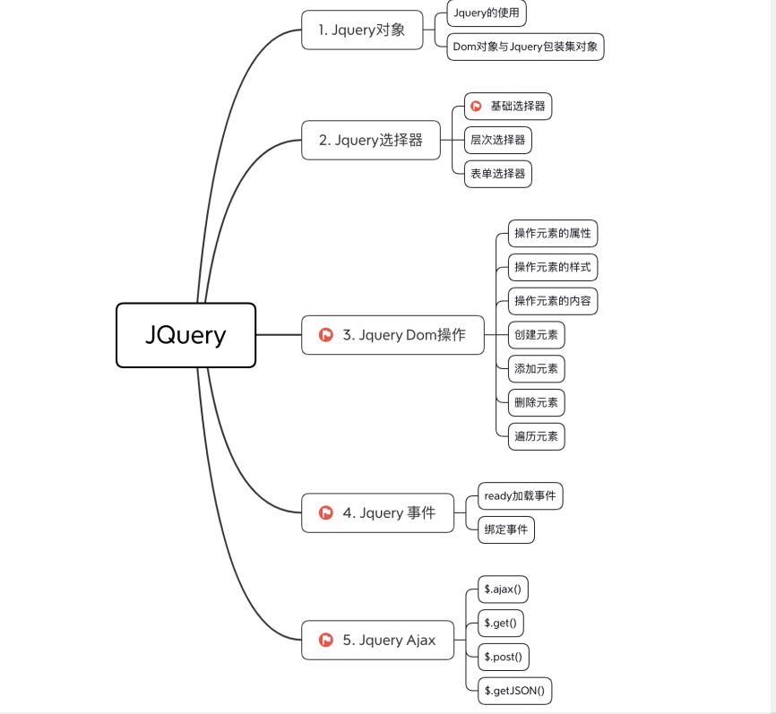
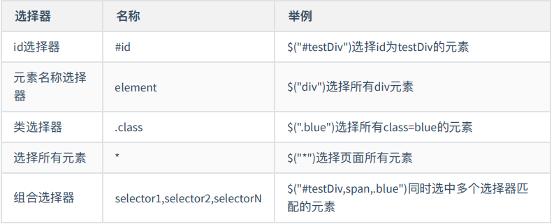
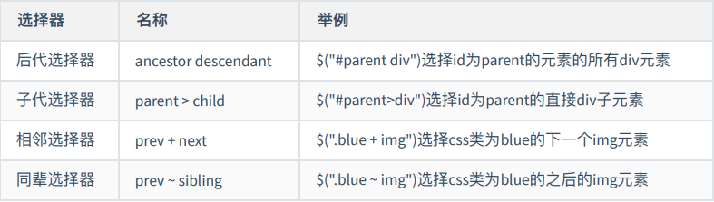
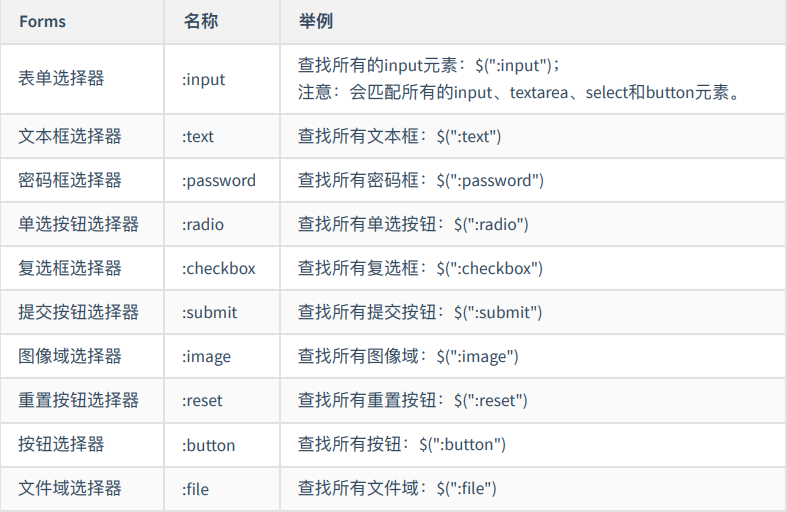
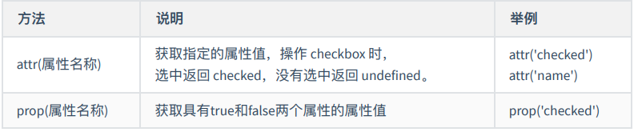
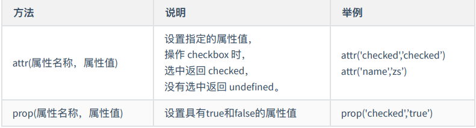
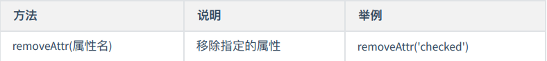
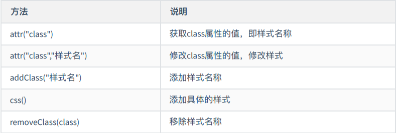
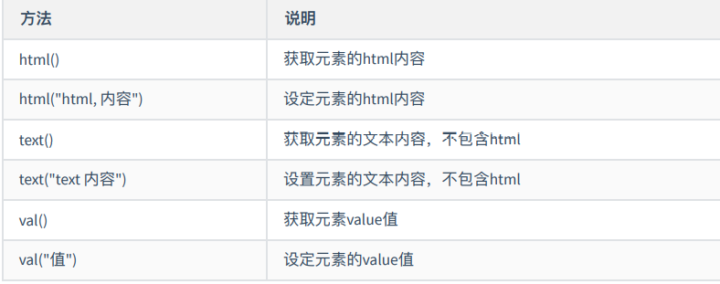
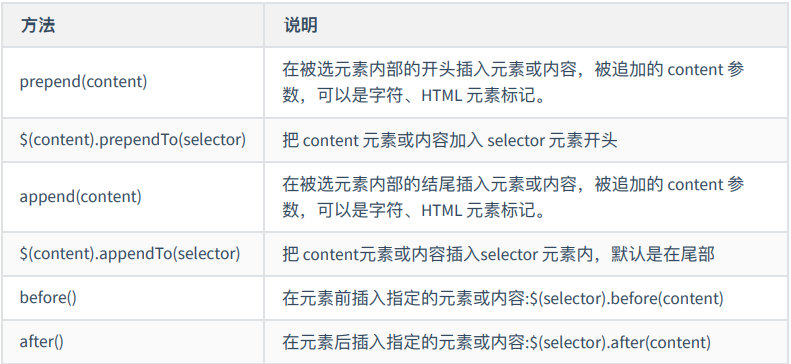

# JQuery



## 引入

> jQuery 2.x has the same API as jQuery 1.x, but does not support Internet Explorer 6, 7,or 8. (不⽀持 ie6 7 8,如果需要下载 1.X) 
>
> （1）完整版 : jquery-2.1.4.js -->学习版本(学习源码 向⾼⼿学习是最好学习⽅法) 
>
> （2）压缩版 : jquery-2.1.4.min.js -->开发版本(压缩版，减少传输)

```
<script src="js/jquery-3.4.1.js" type="text/javascript" ></script>
```

>  $ 符号在 jQuery 中代表对 jQuery 对象的引⽤， "jQuery"是核⼼对象。通过该对象可以获取jQuery对 象，调⽤jQuery提供的⽅法等。只有jQuery对象才能调⽤jQuery提供的⽅法。

$ <==> jQuery

##  Jquery包装集对象

> 原始的 Dom 对象只有 DOM 接⼝提供的⽅法和属性，通过js代码获取的对象都是 Dom 对象；⽽通过 jQuery 获取的对象是 jQuery 包 装集对象，简称jQuery对象，只有jQuery对象才能使⽤jQuery提供的⽅法。
>
>  **Dom对象** 
>
> javascript 中获取 Dom 对象，Dom 对象只有有限的属性和⽅法： 
>
> ```
> var div = document.getElementById("testDiv");
> var divs = document.getElementsByTagName("div");
> ```
>
> **Jquery包装集对象** 
>
> 可以说是 Dom 对象的扩充。在 jQuery 的世界中将所有的对象， ⽆论是⼀个还是⼀组，都封装成⼀个 jQuery 包装集，⽐如获取包含⼀个元素的 jQuery 包装集： 
>
> ```
> var jQueryObject = $("#testDiv");
> ```
>
> **Dom对象 转 Jquery对象** 
>
> Dom 对象转为 jQuery 对象，只需要利⽤ $() ⽅法进⾏包装即可
>
> ```
> var domDiv = document.getElementById('mydiv'); // 获取Dom对象
> mydiv = $(domDiv);
> ```
>
>  **Jquery对象 转 Dom对象**
>
> ```
> // 第⼀种⽅式 获取jQuery对象
> var jqueryDiv = jQuery('#mydiv');
> // 第⼆种⽅式 获取jQuery对象
> jqueryDiv = $('#mydiv');
> var dom = jqueryDiv[0]; // 将以获取的jquery对象转为dom
> ```
>
> 

## 选择器

### 基本选择器



```
<style type="text/css">
 .blue{
 background: blue;
 }
</style>
<body>
 <div id="mydiv1">id选择器1<span>span中的内容</span></div>
 <div id="mydiv2" class="blue">元素选择器</div>
 <span class="blue">样式选择器</span>
</body>
<script src="js/jquery-3.4.1.js" type="text/javascript" charset="utf-8"></script>
<script type="text/javascript">
 // id选择器
 console.log("======id====");
 var idSelecter = $('#mydiv1');
 console.log(idSelecter.html());
 console.log(idSelecter.text());
 // 元素选择器
 console.log("======name====");
 var nameSe = $('div'); // 有多个div元素
 nameSe.each(function(){
 // this是dom对象，$(this)是jquery对象
 console.log($(this).text());
 });
 // 类选择器，class
 console.log("======class====");
 var classSe = $('.blue'); // 有多个class=blue的元素
 classSe.each(function(){
 console.log($(this).text());
 });
 // 通⽤选择器：*
 console.log("======所有元素====");
 var all = $("*");
 console.log(all.length);
 // 组合选择器
 console.log("======组合====");
 var unionSe = $('span, .blue,div');
 unionSe.each(function(){
 console.log($(this).text());
 });
</script>
```

### 层次选择器



```
<!DOCTYPE html>
<html>
 <head>
 <meta charset="utf-8">
 <title>层次选择器</title>
 <script src="js/jquery-3.4.1.js" type="text/javascript"></script>
 <style type="text/css">
 .testColor{
 background: green;
 }
 .gray{
 background: gray;
 }
 </style>
 </head>
 <body>
 <div id="parent">层次择器
 <div id="child" class="testColor">⽗选择器
 <div class="gray">⼦选择器</div>
 
 
 </div>
 <div>
 选择器2<div>选择器2中的div</div>
 </div>
 </div>
 </body>
 <script type="text/javascript">
 console.log("=========后代选择器-选择所有后代=====");
 var ancestorS = $('#parent div');
 ancestorS.each(function(){
 console.log($(this).text());
 });

 console.log("=========⼦代选择器-选择⼉⼦辈=====");
 var child = $('#parent>div');
 child.each(function(){
 console.log($(this).text());
 });

 console.log("=========相邻选择器=====");
 var pre_next = $(".gray + img");
 console.log(pre_next.length);

 console.log("=========同辈选择器,其后，（弟弟）=====");
 var pre_siblings = $(".gray ~ img");
 console.log(pre_siblings.length);
 </script>
</html>
```

### 表单选择器



## Jquery Dom操作

### 属性获取



```
<form action="" id="myform">
 <input type="checkbox" name="ch" checked="checked"/> aa
 <input type="checkbox" name="ch" /> bb
</form>

<script type="text/javascript">
 var ch = $("input[type='checkbox']")
 console.log(ch)
 ch.each(function(idx, em){
 console.log(idx + "-" + $(em) + "=" + this)
 console.log($(em).attr('checked') + "==" + $(em).prop('checked'))
 console.log('--------------')
 })
</script>
```

### 属性设置



### 属性移除



### 样式操作



```
1）css({‘样式名’:’样式值’,’样式名2’:’样式值2’})
例：css({"background-color":"red","color":"#fff"});
2）css(“样式名”,”样式值”)
例：css('color','white')
```

### 元素内容



### 添加元素



```
 <body>
 <h3>prepend()⽅法前追加内容</h3>
 <h3>prependTo()⽅法前追加内容</h3>
 <h3>append()⽅法后追加内容</h3>
 <h3>appendTo()⽅法后追加内容</h3>
 <span class="red">男神</span>
 <span class="blue">偶像</span>
 <div class="green">
 <span >⼩鲜⾁</span>
 </div>
 </body>
</html>
<script type="text/javascript">
 var str ="<span id='mydiv' style='padding: 8px;width: 180px;backgroundcolor:#ADFF2F;'>动态创建span</span>";
 // 1、使⽤prepend前加内容
 $("body").prepend(str);

 // 2、使⽤prependTo前加内容
 $("<b>开头</b>").prependTo('body');

 // 3、使⽤append后加内容
 $("body").append(str);
 // $("div").append($('.red')); // 当把已存在的元素添加到另⼀处的时候相当于移动

 // 4、使⽤appendTo后追加内容
 $(str).appendTo('body');
 // $('.blue').appendTo("div");
</script>
```

### 删除元素

```
<script type="text/javascript">
 // 删除所选元素 或指定的⼦元素
  $("span").remove();
 // 删除样式为blue的span
  $("span.blue").remove();
 // 清空元素
 $("span").empty();
 $(".green").empty();
</script>
```

### 遍历元素

> each() $(selector).each(function(index,element)) :遍历元素 参数 function 为遍历时的回调函数， index 为遍历元素的序列号，从 0 开始。 element是当前的元素，此时是dom元素。

```
 <script type="text/javascript">
 $('span').each(function (idx , e) {
 console.log(idx + " ---> " + $(e).text());
 })
 </script>
```

## 事件

**ready加载事件** 

> ready()类似于 onLoad()事件 ready()可以写多个，按顺序执⾏ $(document).ready(function(){})等价于$(function(){})

**bind()绑定事件**

> eventType ：是⼀个字符串类型的事件类型，就是你所需要绑定的事件。
>
>  这类类型可以包括如下： blur, focus, focusin, focusout, load, resize, scroll, unload, click, dblclick     mousedown, mouseup, mousemove, mouseover, mouseout, mouseenter mouseleave,change, select, submit, keydown, keypress, keyup, error
>
>  [, eventData]：传递的参数，格式：{名:值,名2:值2} 
>
> handler(eventObject)：该事件触发执⾏的函数

**普通事件**

```
<script type="text/javascript">
 $(function(){
 /*$("#test").bind("click",function(){
 alert("世界会向那些有⽬标和远⻅的⼈让路！！");
 });*/
 /*
 * js的事件绑定
 ele.onclick=function(){};
 * */
 // 等同于上⾯的放⽅法
 $("#test").click(function(){
 alert("世界会向那些有⽬标和远⻅的⼈让路！！");
 });
 /*
 1.确定为哪些元素绑定事件
 获取元素
 2.绑定什么事件（事件类型）
 第⼀个参数：事件的类型
 3.相应事件触发的，执⾏的操作
 第⼆个参数：函数
 * */
 $("#btntest").bind('click',function(){
 // $(this).attr('disabled',true);
 $(this).prop("disabled",true);
 })
 });
 </script>
```

**绑定多个事件**

```
<script type="text/javascript">
 $(function(){
 // 绑定click 和 mouseout事件
 /*$("h3").bind('click mouseout',function(){
 console.log("绑多个事件");
 });*/
 // 链式编程
 $("h3").bind('click',function(){
 alert("链式编程1");
 }).bind('mouseout',function(){
 $("#slowDiv").show("slow");//让slowDiv显示
 });
 /*$("#test").click(function(){
 console.log("点击⿏标了....");
 }).mouseout(function () {
 console.log("移出⿏标了...");
 });*/
 $("#test").bind({
 click:function(){
 alert("链式编程1");
 },
 mouseout:function(){
 $("#slowDiv").show("slow");
 }
 });
 });
</script>
```

## ajax

jquery 调⽤ ajax ⽅法： 

格式：$.ajax({}); 

参数：

>  type：请求⽅式 GET/POST 
>
> url：请求地址 url 
>
> async：是否异步，默认是 true 表示异步 
>
> data：发送到服务器的数据 
>
> dataType：预期服务器返回的数据类型 
>
> contentType：设置请求头 
>
> success：请求成功时调⽤此函数 
>
> error：请求失败时调⽤此函数 get请求

```
<script type="text/javascript">
			$(function(){
				$.getJSON("js/info.json",function(dat){
					console.log(dat);
					$("#div2").append(JSON.stringify(dat));
				});
				$.ajax({
					url:"http://127.0.0.1:9095/allPanda",
					type:"get",
					dataType:"json",
					success:function(data){
						$("#div1").text("");
						console.log(data.length);
						for(var i=0;i<data.length;i++){
							$("#div1").append("<div>"+data[i].name+","+data[i].age+","+data[i].city+"</div>");
						}
					}
				});
				
			});
			
		</script>
```

