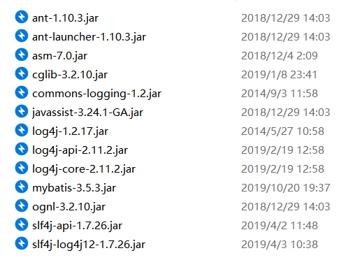

# Mybatis逆向工程

## 导包

导入Mybatis所需包



还有**mybatis-generator-core-1.3.2.jar**包

## 配置文件

1.加入Mybatis核心配置文件

2.mybatis-generator配置文件

```
<?xml version="1.0" encoding="UTF-8"?>

<!DOCTYPE generatorConfiguration SYSTEM "http://mybatis.org/dtd/mybatis-generator-config_1_0.dtd" PUBLIC "-//mybatis.org//DTD MyBatis Generator Configuration 1.0//EN">

-<generatorConfiguration>

<!--本context连接的内容-->


-<context id="Oracle">

<!--数据库连接信息-->


<jdbcConnection password="TIGER" userId="SCOTT" connectionURL="jdbc:oracle:thin:@localhost:1521:XE" driverClass="oracle.jdbc.driver.OracleDriver"> </jdbcConnection>

<!--JavaBean生成的位置-->


<javaModelGenerator targetProject="项目src绝对路径：E:/Code/src" targetPackage="javaBean全限定包名：com.lwf.POJO"> </javaModelGenerator>

<!--xml配置文件生成的位置-->


-<sqlMapGenerator targetProject="项目src绝对路径：E:/Code/src" targetPackage="Mapper全限定包名：com.lwf.Mapper">

<property value="true" name="enableSubPackages"/>

</sqlMapGenerator>

<!--Mapper接口生成的位置-->


<javaClientGenerator targetProject="项目src绝对路径：E:/Code/src" targetPackage="Mapper全限定包名：com.lwf.Mapper" type="XMLMAPPER"> </javaClientGenerator>

<!--逆向工程的表,可有多个-->


<table tableName="STUDENT"> </table>

</context>

</generatorConfiguration>
```

## 生成程序

运行生成javabean，xml，接口

```

import org.mybatis.generator.api.MyBatisGenerator;
import org.mybatis.generator.config.Configuration;
import org.mybatis.generator.config.xml.ConfigurationParser;
import org.mybatis.generator.internal.DefaultShellCallback;

import java.io.File;
import java.util.ArrayList;
import java.util.List;

public class Util {

    public static void main(String[] args) throws Exception {
        List<String> warnings = new ArrayList<>();
        boolean overwrite = true;
        try {
            //指定 逆向工程配置文件
            File configFile = new File("resources/generatorConfig.xml");
            ConfigurationParser cp = new ConfigurationParser(warnings);
            Configuration config = cp.parseConfiguration(configFile);
            DefaultShellCallback callback = new DefaultShellCallback(overwrite);
            MyBatisGenerator myBatisGenerator = new MyBatisGenerator(config,
                    callback, warnings);
            myBatisGenerator.generate(null);
        } catch (Exception e) {
            e.printStackTrace();
        }

    }
}

```

