# 学习资料和网站推荐

## github仓库

>    1.    spring boot项目学习代码：<a href="https://github.com/lwfqw/SpringAll">springAll</a> ，同类的还有<a href="https://github.com/lwfqw/springboot-learning-example">spring boot实例</a>，但是这个不完整
>
>    
>
>    ```
>      spring boot 项目，很适合看着学，是变秃变强的捷径之一，包含Spring Boot、Spring Boot & Shiro、Spring Cloud，Spring Boot & Spring Security & Spring Security OAuth2，仓库名就是：spring all。
>       众所周知，学框架就是要先敲代码，后学原理。这个仓库只包含代码，且短小简洁，由上而下，循序渐进，你们自己慢慢体会
>    ```
>
>    2. java全栈笔记：<a href="https://github.com/lwfqw/JavaAllianceNotes">点这里</a>
>
>       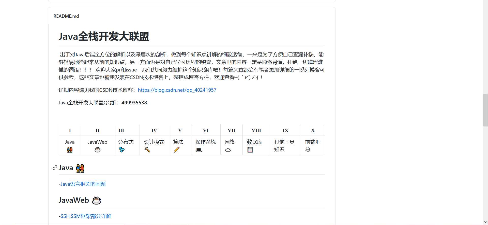
>
>    3. java面试知识，包含基础知识，还有很多技术的使用总结，例如：sql，linux，shell，docker，reids的使用总结笔记，很适合绝大多数人读。<a href="https://github.com/lwfqw/JavaGuide">点这里</a>
>
>          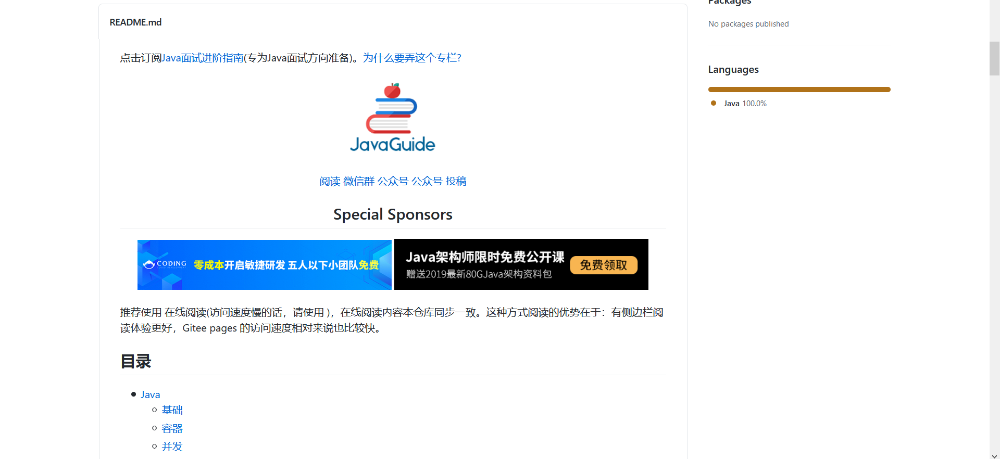
>
>    4. 对于学大数据的：
>
>          python 从入门到精通：<a href="https://github.com/lwfqw/Python-100-Days">点这里</a>

 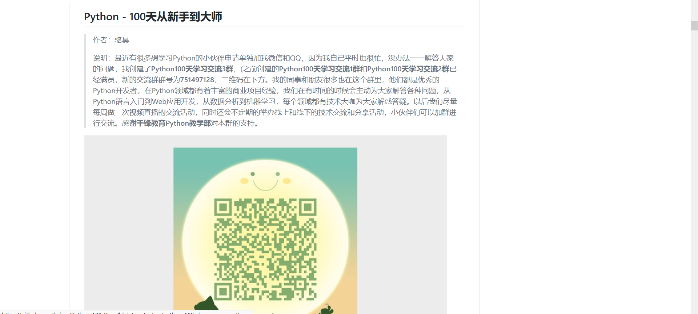

 java大数据进阶：<a href="https://github.com/lwfqw/God-Of-BigData">点这里</a>

 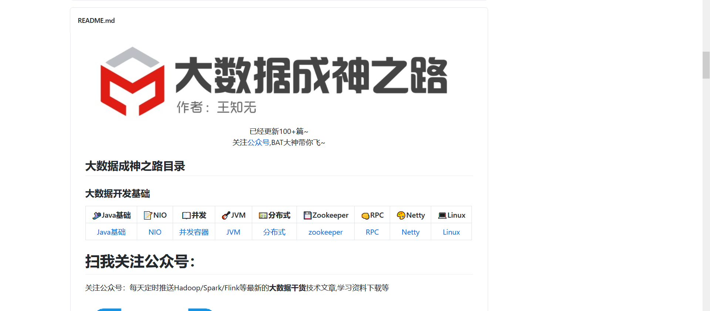

***github资源分享就到此为止了，接下来，总结一些学习网站。***     

我的github，上面的应有尽有,还有我所有上课代码作业:<a href="https://github.com/lwfqw?tab=repositories">lwfqw</a>

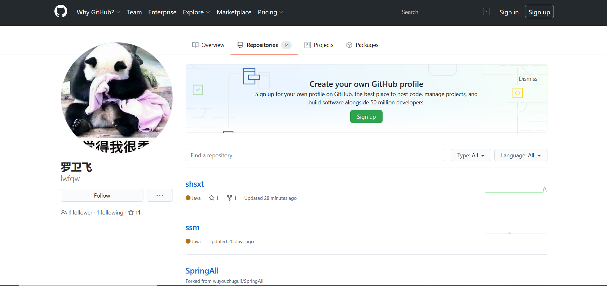

## 网站
* 菜鸟教程：基础的啥都有，编程必备<a href="https://www.runoob.com/">菜鸟教程</a>
  
  > 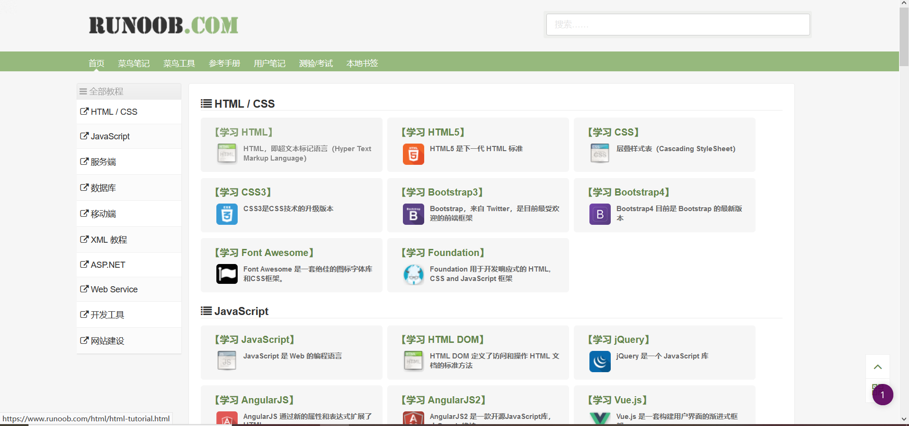
* w3cSchool:前端编程当字典来用<a href="https://www.w3school.com.cn/w3c/w3c_china.asp">w3c</a>
  
  > 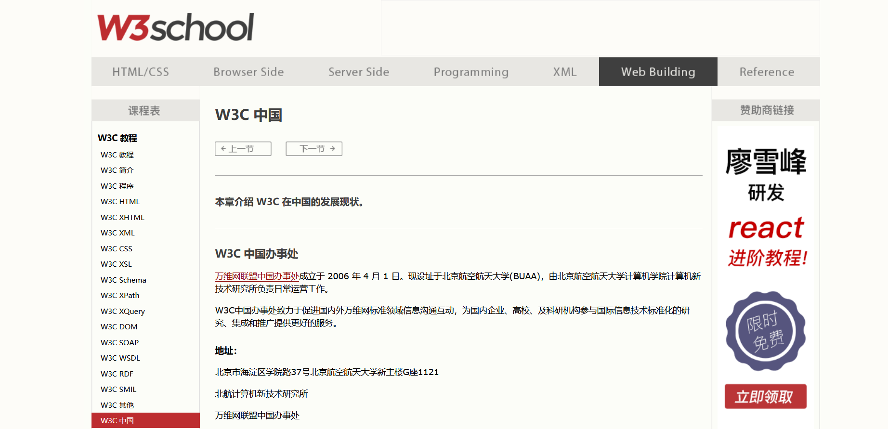

* spring全家桶，各种技术中文文档<a href="https://www.docs4dev.com/docs/zh">技术文档</a>

  > 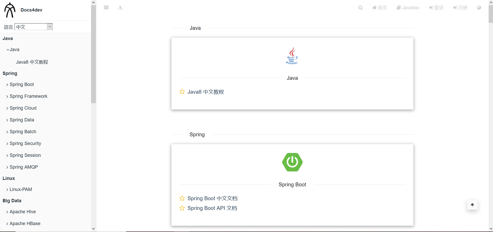
  >
  > 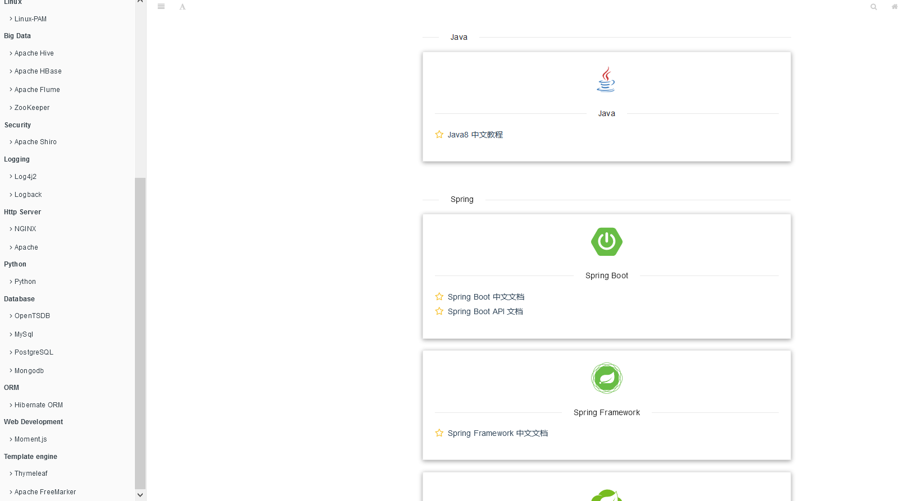

* java全栈知识实战练习<a href="https://how2j.cn/">how2j</a>

  > 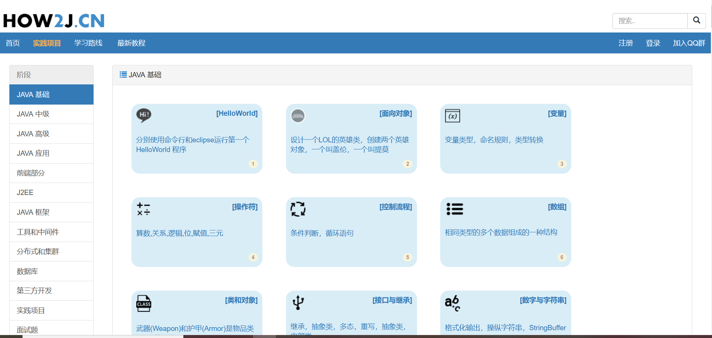

* <a href="http://www.phperz.com/special.html">所有编程语言资料</a>

  > 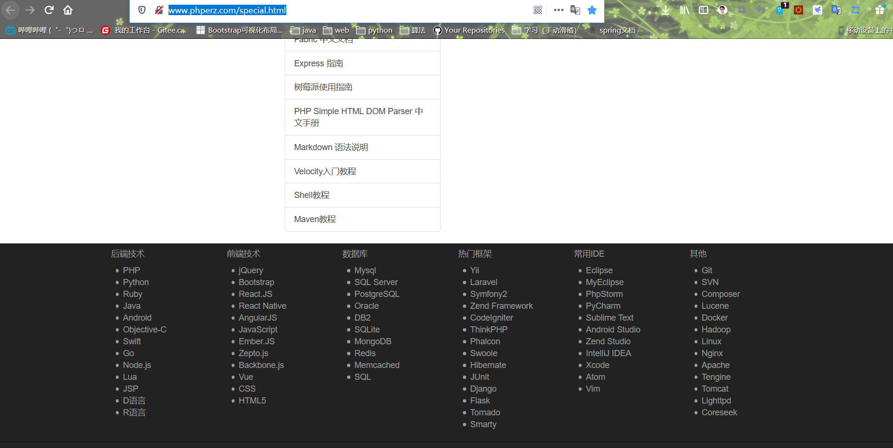

* <a href="">我的csdn博客</a>:我的个人博客，大家可以多多指正

  > 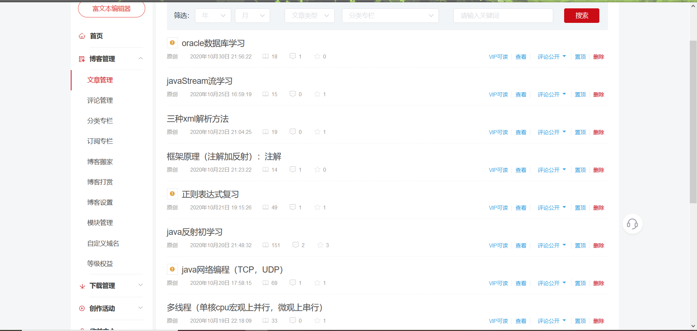

* <a href="https://www.lanqiao.cn/courses/">实验楼</a>：各种技术做试验的地方，不过我只做过大数据的实验

  > 

最后算法的就不写了，不想水字数了